# 符号互动理论
在我们的日常表达中，包含着两类完全不同的符号互动，一类是“给予”的表达，另一类是“流露”的表达
给予是主动的，而流露是被动的

在符号互动过程中，给予是容易操纵的，流露则不太容易控制。有个成语叫察言观色，观色比察言更能获得有效信息。在符号互动中，信息发送者（说话人）的注意力会更多地放在给予上，
而接收者（受话人）则同时关注两者，甚至天然地更关注流露。这就会造成第一重不对称——说话人与受话人之间的信息不对称，受话人明显处于优势地位
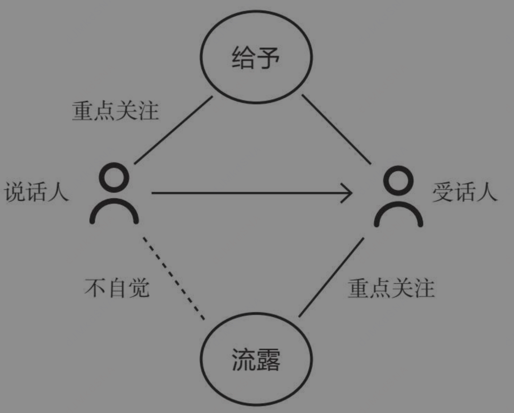

# 意义漂移理论
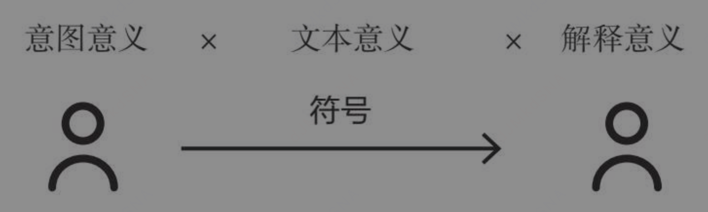


## 常见意义漂移场景分类

1.指代对象漂移
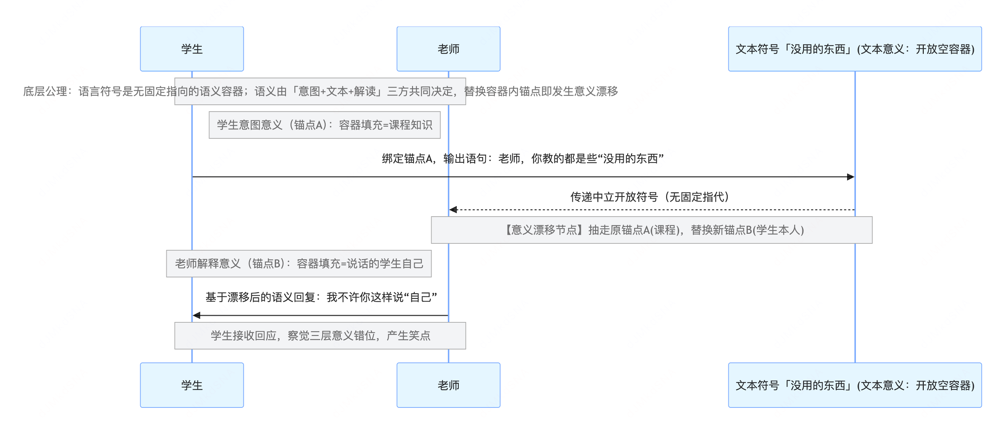

核心：词语原本指向 A 事物，被解读 / 曲解为 B 事物
```aidl

学生：老师教的都是没用的东西
老师：我不许你这么说自己

```


2.感情语义偏移
核心：词语原本是褒义 / 中性，被解读成贬义，或反过来反转色彩
```aidl
朋友 A：你这次方案做得挺有想法。（中性偏褒：创意亮眼）
朋友 B：怎么？你是说我想法太离谱、不切实际呗？
```

3.范围边界漂移
核心：原本限定小范围的概念，被扩大 / 缩小边界，语义跟着变
```aidl
老师：班里没人交作业。（指当天全班绝大多数人）
学生：不对啊，我同桌交了，你说错了。
```

4.语境场景漂移
核心：在 A 场景下的合理表达，被剥离原有语境放到 B 场景，语义彻底改变
```aidl
情侣私下打闹：你真是个小笨蛋（亲昵撒娇）
旁人在公开场合复述这句话，就漂移成了公开贬低对方智商
```

5.因果逻辑漂移
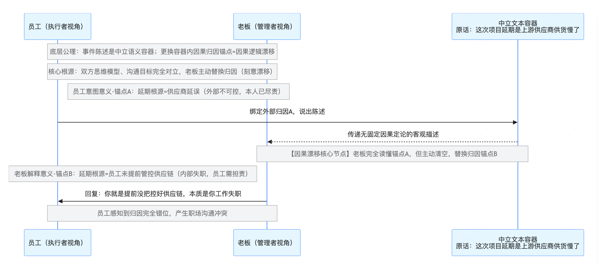
核心：说话人归因于原因 A，听者强行归因于原因 B，事件的意义完全改变
```aidl
员工：这次项目延期是上游供应商供货慢了。（归因外部供应链）
领导解读：你就是提前没把控好供应链，本质是你工作失职。
```
员工执行者思维：只看不可控外部变量，习惯区分 “我能控制 / 我控制不了”，出问题第一时间拆分客观阻碍；
管理者全局思维：只看人能干预的可控变量，默认所有外部风险都属于员工前置管控职责范围，天然会向内找人为漏洞。


## 避免意义漂移方法
1.沟通前
主动锁锚，从根源杜绝负面漂移
```aidl
防范对象漂移
防范感情语义偏移
防范范围边界漂移
防范语境场景漂移
防范因果逻辑漂移
```

2.沟通中
快速识别漂移，及时校准语义
```aidl
①是不是对方换掉了我说的指代？（对象漂移）
②是不是对方改变了概念范围、褒贬评价？（尺度漂移）
③是不是对方脱离了我的说话场景、更换事件归因？（背景漂移）
```

3.区分漂移意图，针对性应对
```aidl
无意识漂移（对方无恶意，只是认知 / 视角不同）:补充背景、补充限定词，重新对齐语义，无需对抗

有意识正向漂移（玩梗、缓和气氛）:顺势配合，轻松承接，不较真抠字面意思

有意识负面漂移（刻意偷换概念、追责、抬杠、断章取义）:职场上下级（老板刻意因果漂移追责）：不反驳情绪，只补客观证据、完整前置动作,平级 / 亲友刻意抬杠偷换语义：直接点破锚点错位，终止无效拉扯
```

## 语境—语用—语义
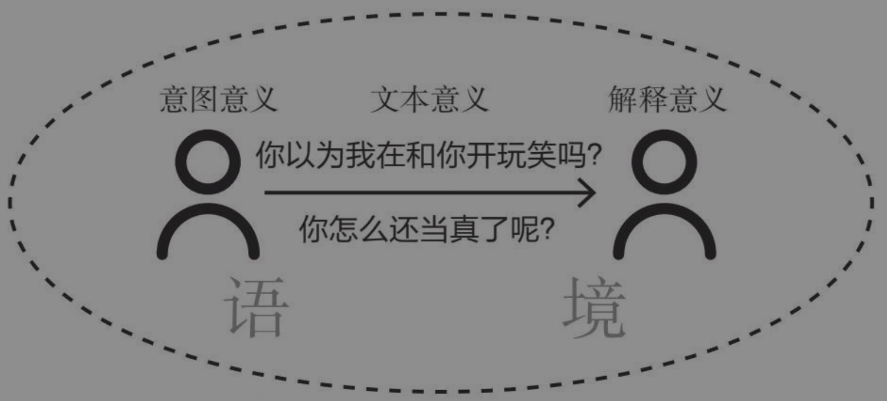
虽然符号有无限衍义特征，但那是一种潜在特性，日常生活中的表意行为，是一种“封闭漂流”。这个封闭漂流的空间被称为语义场

# 三角测量理论
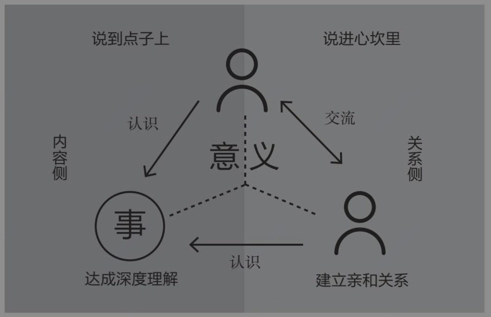

## 关系侧
为什么有些话就能说到别人的心坎里
[打破预期，顺应张力]

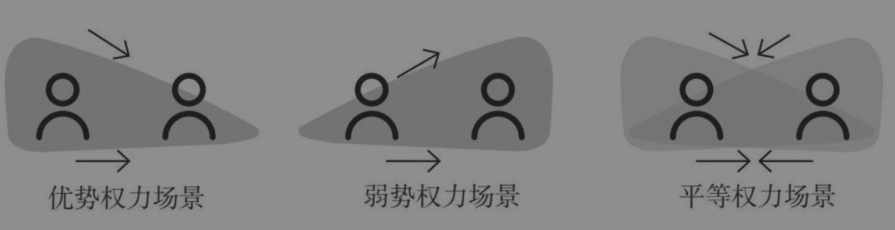
### 优势关系

### 劣势关系

### 平等关系
策略性友善，无意识冒犯=》策略性冒犯，无意识友善，冒犯朝向自己，善意就对准了他人

## 内容侧

### 三个世界
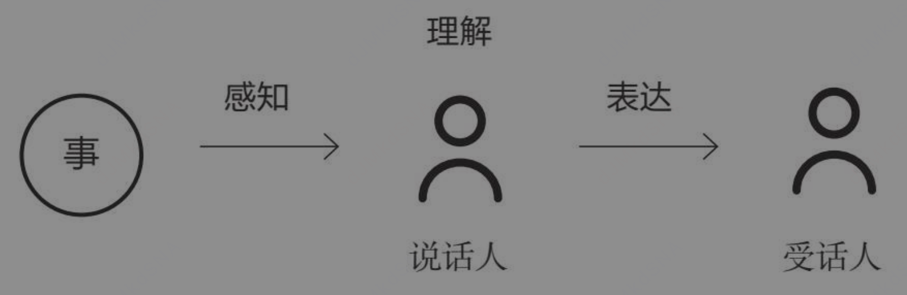
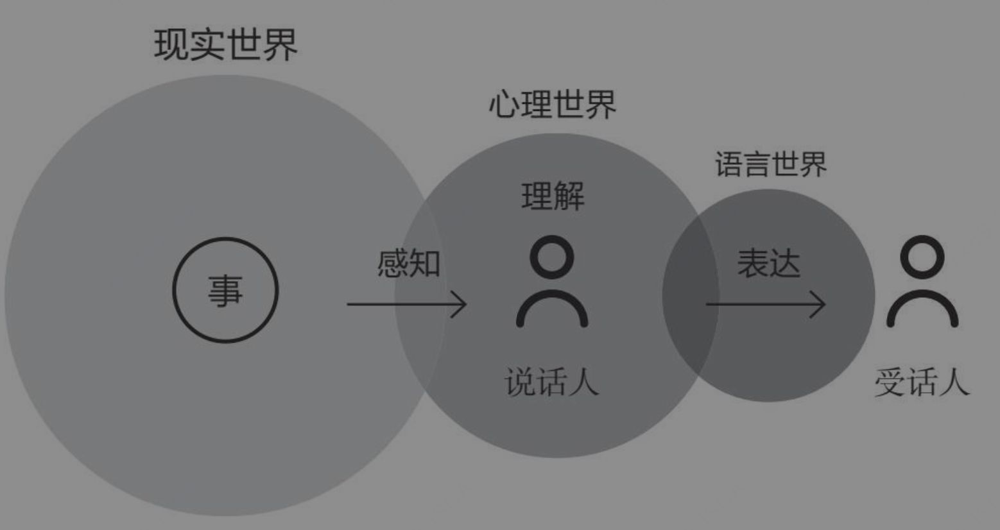
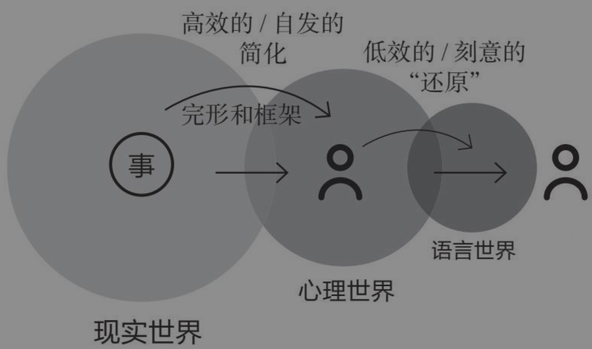
```aidl
我们可以发现心理世界与语言世界的落差所在：在心理世界得到“总之”非常容易，我们的观念系统就是由无数个“总之”构成的。
但在语言世界，“总之”有一个更正式的名字，叫结论（或结果），根据这个世界的法则，结论（或结果）必须和前提（或起因）结伴出现，
并被一种叫推理或经过的东西关联起来，还必须受一种叫逻辑或常识的东西约束。最终，这些东西共同构成了我们言说的主要内容：论题和故事。
```
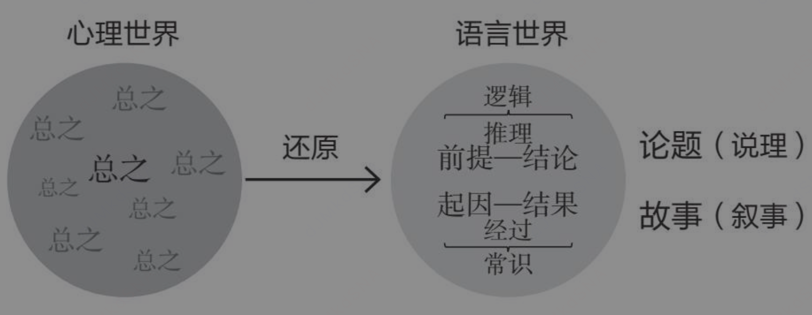
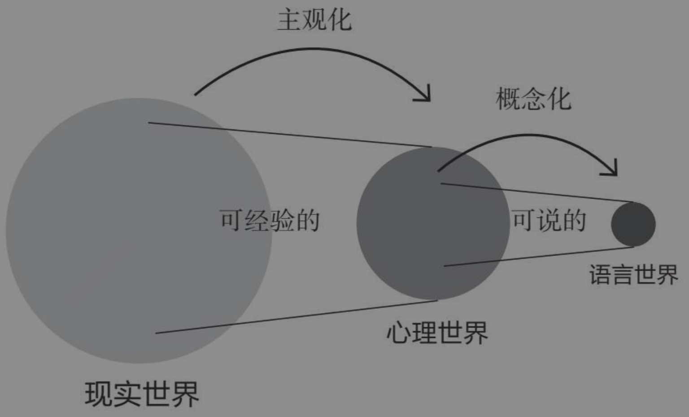
主观经验是对客观对象的简化把握，抽象概念则是对经验范畴的进一步压缩

## 关系侧和内容侧错配问题
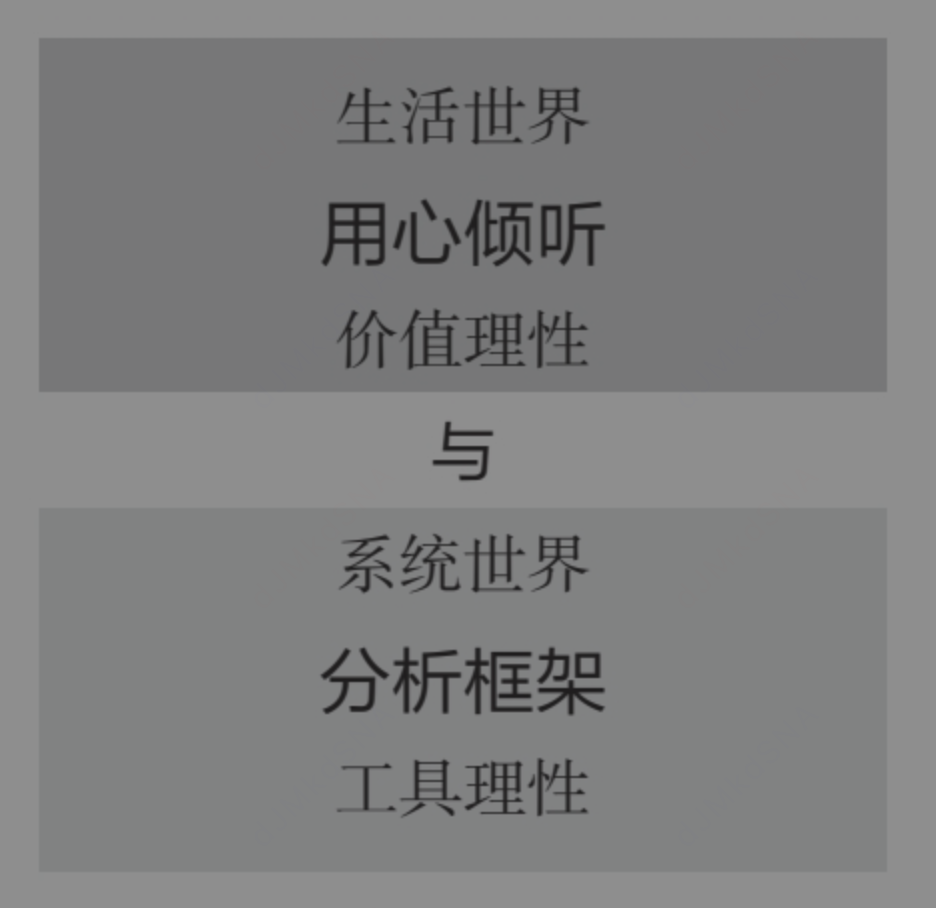
工具理性的系统世界（比如公司职场）和以价值理性为主导的生活世界（比如个人家庭）

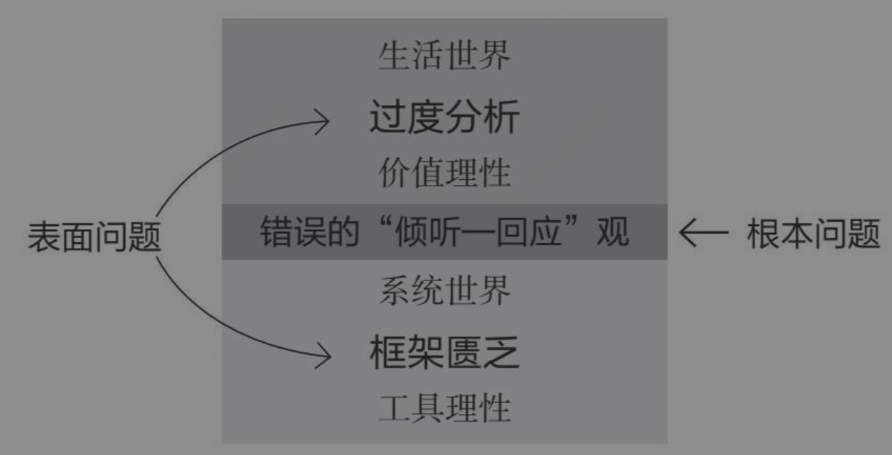
我们的麻烦只在于以下两点,在系统世界的专业领域中缺乏足够多的分析框架；在生活世界中又过多地使用了系统世界中的倾听策略——该分析的时候不能好好分析，不该分析的时候又瞎分析。

在系统世界—工具理性的场景下，往往[侧重内容]，你需要在脑子里预埋框架，用框架过滤、挑拣重点信息，化繁为简。

在生活世界—价值理性的场景下，比如在亲密关系中，你要[侧重于关系]，心无旁骛、不带成见地全然倾听，并引导对方充分表达自己。
对方与你交流的最重要目的之一，就是让自己被看见、被听到，至于你具体听到了什么，反倒是次要的
# 抽象之梯理论
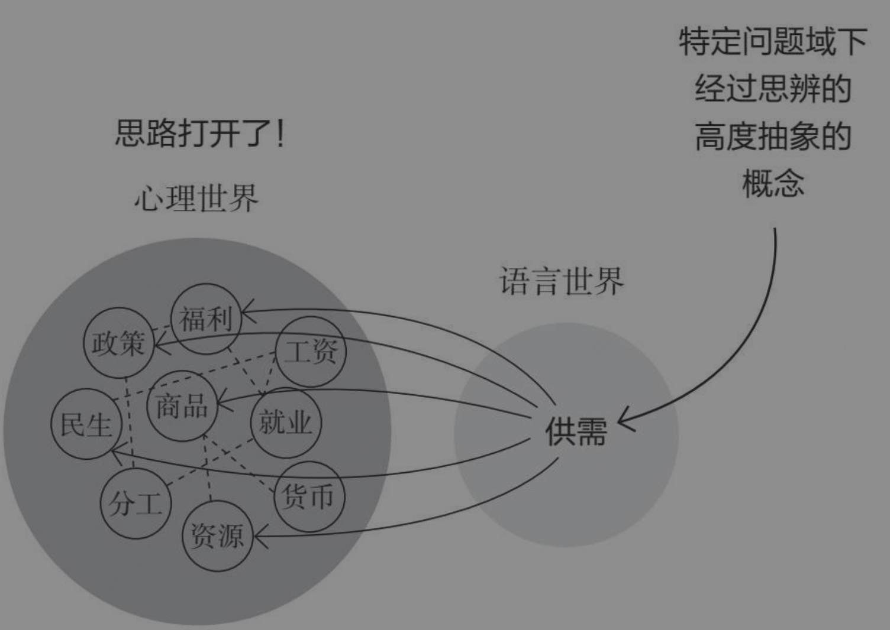
一个人的表达能力很强，是因为他的信息处理能力很强，更具体地说，是指他的“符号加工能力”很强。意思是：相比其他人，他不仅掌握了更多的基本概念，
而且能更有意识地、更无碍地把经验拽进符号世界，利用这些基本概念进行整理加工，从而在相同的智力条件、阅历水平下，具备更强的感受、理解和表达能力

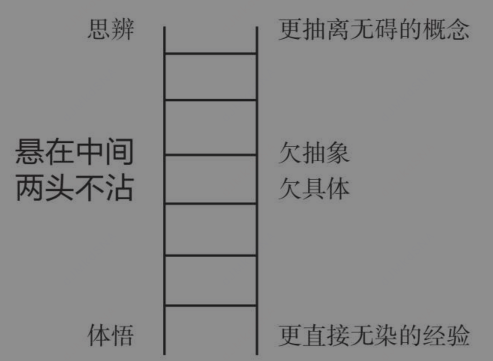
我们使用的每一个概念都处于抽象之梯之上。好的写作教材会告诉你，要[想办法让自己的语言停留在上或下的其中一端，避免悬于中间]
也就是说，要么使用最抽象、最具概括力的表达，要么描述最具体、最精微的经验事件
从真实的经验出发，从基本的概念推演，在这个梯子爬上爬下的你会发现：原有的概念是一种廉价的“方便”，概念可以更基本；原有的经验也许是一种粗糙的“幻觉”，经验总是可以更精微

# 问题之锤理论
爱因斯坦曾说：“如果只给我一小时解决一道难题，且这难题的解答攸关我的性命，那我一定会先花55分钟找出恰当的问题

问题模糊 = 所有努力全部无效
绝大多数人习惯直接上手解决 “表面症状”，而非根源问题

错误的问题，只会得到错误答案
你提问的方向，直接锁定所有思路边界

定义问题本质是筛选变量、排除干扰
复杂问题里混杂大量无关信息：情绪、表象、次要矛盾。
长时间梳理问题，本质是区分：什么是核心矛盾、什么是外部干扰、哪些条件固定不变、哪些可以调整

答案是终点，而精准定义问题，才是找到正确路径的起点。

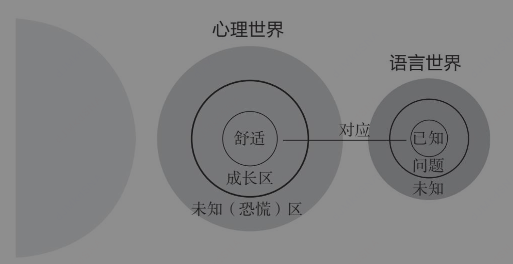

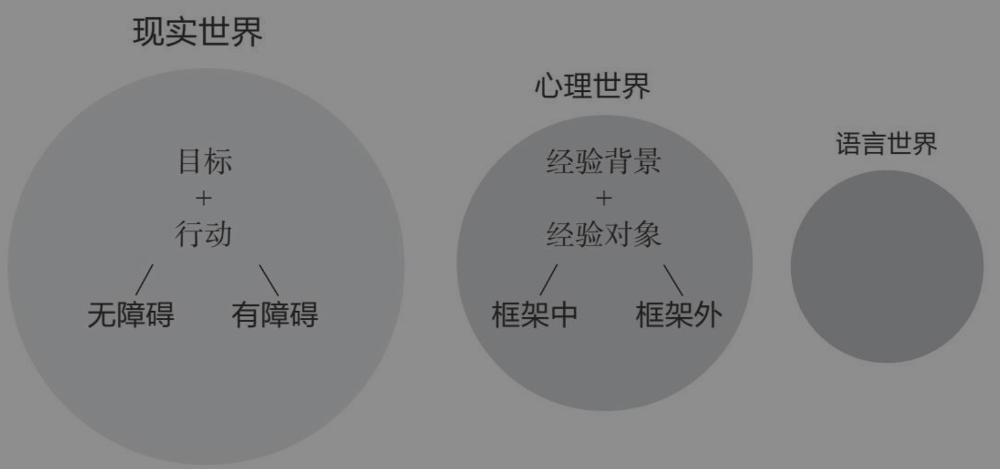

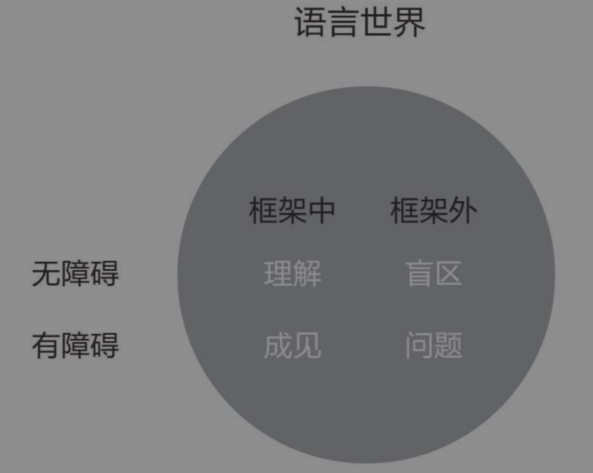

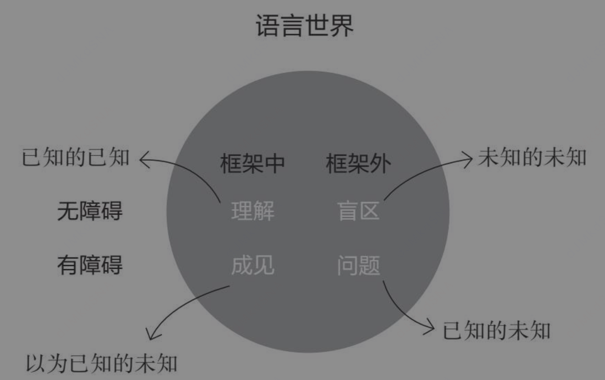
## 理解
一个经验对象，如果既能被心理框架容纳，又不在现实世界中表现为障碍，那便是理解。理解是“已知的已知

## 问题
如果这个经验对象和已有心理框架产生冲突，并且妨碍我们在现实世界达成目标，那便是问题。问题是我们明确“已知的未知”。

```aidl
问题意识之所以重要，是因为“问题”是揭示盲区和成见的唯一中介。
通过问题，我们才能发现那些“原来认为自己理解的不理解——成见”和“原来认为不是障碍的障碍——盲区”。

正是成见和盲区制造了问题——我们总以为自己知道，不知道还有不知道的东西，一旦它们刺入日常生活，我们便会感到迷惑、错愕和惊异，我们必须在语言世界中，
通过对问题的探究来反向追溯、澄清它们。在逻辑上，我们永远只能通过“已知的未知”，以它为中介，抵达“未知的已知”（以为自己已知的未知）和“未知的未知”。
因此，问题是唯一的线索。
```

```aidl
如何才能提出一个好问题?
答案是 [针对差异性现象发问] , 好的问题必须面向具体的差异现象，而非某种含混不清的困惑经验.

人有两个无法突破的认知短板：
1.看不见自己的盲区
我们的成见、缺失的知识、默认的错误假设，都藏在认知框架内部，属于 “你不知道自己不知道” 的东西。单纯凭空空想、笼统发问，只会在原有认知里打转，找不到突破点。
2.人唯一能稳定捕捉的认知抓手：对比差异
大脑识别世界的基础方式是对比。没有差别，就没有感知。
我们无法直接观测 “我的认知漏洞”，但能清晰观测两件事、两种结果、两种行为、两种场景的不同，差异是客观、可观测的外部信号

差异性现象，精准锁定认知盲区的核心机制:
1. 差异制造「认知冲突」，强迫原有框架失效
2. 微妙差异 = 高价值盲区
3. 差异自带边界，让问题具备可解答性
```

```aidl
所谓成长，就是舒适区的扩张，这个扩张的本质，是问题域的双向膨胀，我们不断地追问，给出回答，使得原本已知域/舒适区中的成见被识别出来，
未知域/恐慌区中的盲区被辨认出来，它们被包含进一个巨大的问题空间
```
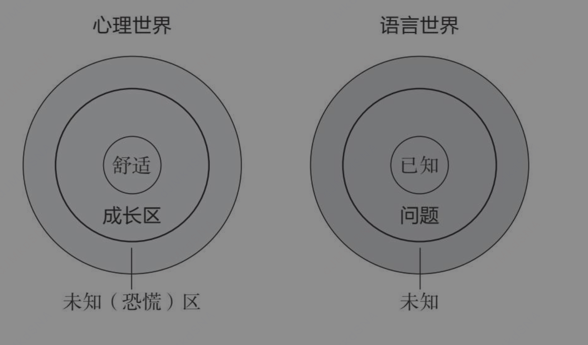
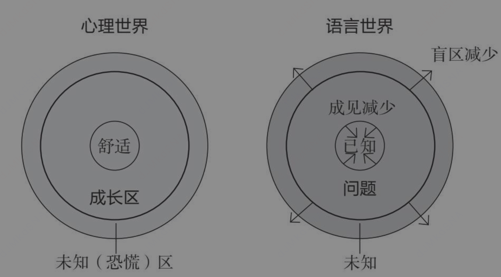

```aidl
我们真正的麻烦，不是问题太多，而是问题太少。准确地说，在符号世界中成为命题的问题太少，会导致现实世界中成为事实的问题太多
```
## 成见
成见是“以为已知的未知”

## 盲区
我们没有意识到它在妨碍，未知的未知

# 语境推论游戏理论
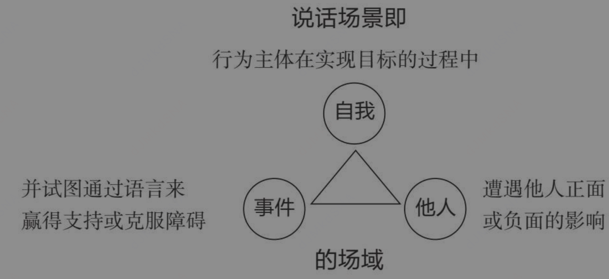
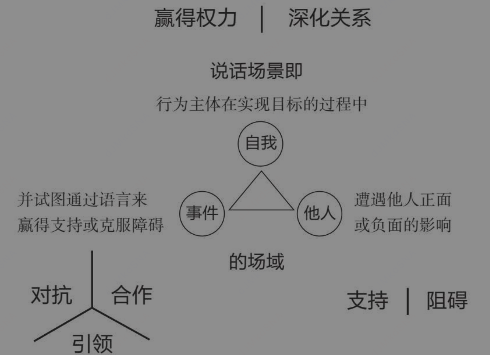
```aidl
目标:
一个能够自主设定目标的理性动物参与社会交往，背后大致有两个目标——赢得权力，或是深化关系。
1.权力游戏是基于工具理性的社会活动，通过展现实力而赢得权力，以此来建立某种差序关系。
2.深化关系则是一种反思性的、基于价值理性的活动。比如，你希望修复你与家人的关系，想要向心仪的女生吐露心声，
此时你无法靠赢得权力来达成目的——虽然你可以通过出人头地来“修复”和家人的关系，通过炫富来“赢得”异性的青睐，
但你知道，那不是真正意义上的修复与赢得


来自他人的影响:
他人”可以是一个，也可以是一群，可以在场，也可以不在场，可以在当下，也可以来自过去的记忆或未来的期许——一群不在场的他人总是在记忆的深渊中凝视你，
这并不是什么神秘体验。影响有很多种表现形式，可以是无意的忽视、恶意的对立、殷切的期盼或是真诚的祝福。说话人体验到的莫名的紧张、
隐秘的自卑以及存在感被剥夺，都是影响导致的
```

语言游戏本质上是一个给出和索要理由的推论游戏
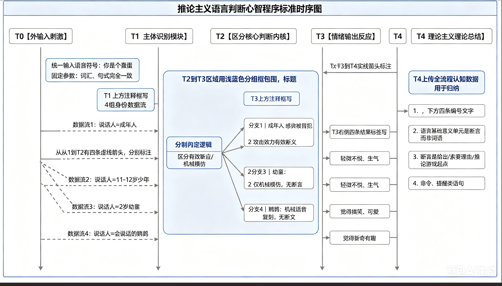
## 关于断言的积分游戏
在推论主义的思路下，语言交往可以被理解为一种围绕着断言展开的“积分游戏”
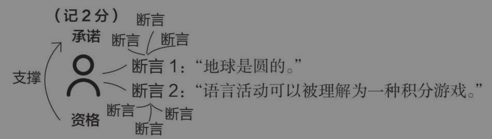
```aidl
给出断言，才能在‘给出和索要理由的推论游戏’中走出第一步”的意思是，只要你以成年人的身份，在语言世界中交出一句断言，对一个人的主观看法也好，
对一个对象的具体描述也罢，无论内容是什么，是真是假，它首先被他人理解为一种特定的“交往姿态”，在这种姿态下，其他人会默认你认同自己的判断，
相信自己说的话，并且为它的真实性负责，我们通常把这种姿态叫作“承诺"

因为向他人展示了这个姿态，我们就进入了语言规范的世界，正式成为语言游戏的玩家。

“资格”和前面讲过的“承诺”一样，总是处于危险中的、有待于事后判断的。一旦我后续提供的其他断言证成了“语言活动可以被理解为一种积分游戏”，
我的承诺与资格积分将双双上涨；若提供的理由不足以支撑这些断言，则会遭到扣分

在语言活动中，相信的优先级总是高于质疑，这符合我们的日常经验：我在此处断言“语言活动可以被理解为一种积分游戏”，并给出了一系列为之辩护的说法，你接不接受？
事实上，如果你没有听过更好的理论，那么你会暂时接受，并期待可能到来的反驳和质疑——潜在的挑战时刻在场，这种机制保障了我们认识和表达的有效性
```
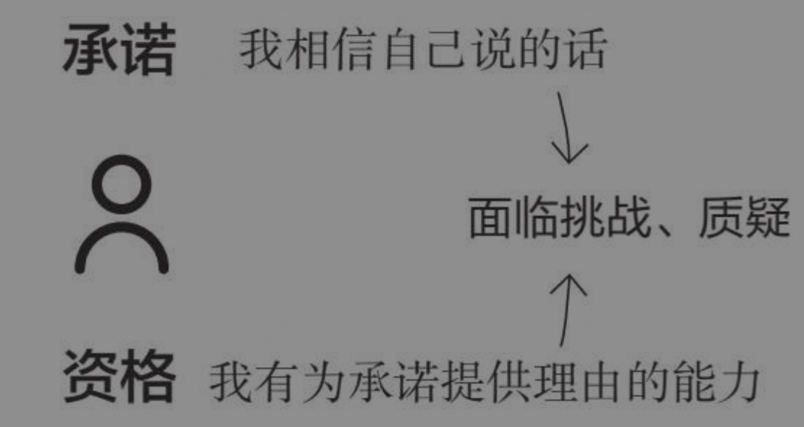
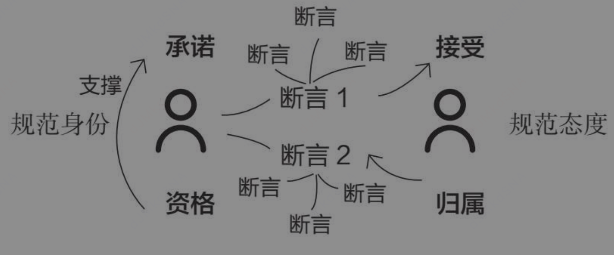
```aidl
当我们作为受话人参与语言游戏时，我们同样有两种规范姿态：一种是“接受”，另一种是“归属”。接受很好理解，就是同意这个断言。
但这里的同意并非我们常识意义上的认同，它的实质是受话人将说话人给出的断言当成自己的断言，并且承担给这个断言提供解释的责任。你一定有这样的经验：
在某公开场合赞同一个观点，当别人否认这个观点时，你会自然地认为别人也在反对你，有为之辩护的冲动

归属则是不接受这个断言，归属不是常识意义上的反对，其内涵是将一个承诺归属于说话的那个人——我不接受这个说法，
但我不反对你的话，我等你给出更多理由。这类似于我们平常所说的怀疑、观望、持保留态度
```

```aidl
三四岁的小朋友没有什么理性可言，可以旁若无人地当众表演节目，丝毫没有羞耻感，而理性的成年人往往需要经过大量的心理建设和练习，才能达到类似的自然状态。
需要我们翻转认知的地方是：局促、紧张、不自然是意识到了规范性的表现，恰恰是理性乃至过度理性的结果。
```

## 语言游戏中唯一重要的事
创造强有力的论证，是整个语言游戏中最重要的事。换句话说，我们必须成为“提供理由”的高手。
使一个论证（推论）有效的根本原理是什么？换句话说，一个擅长论证说理的人，他擅长的究竟是什么？
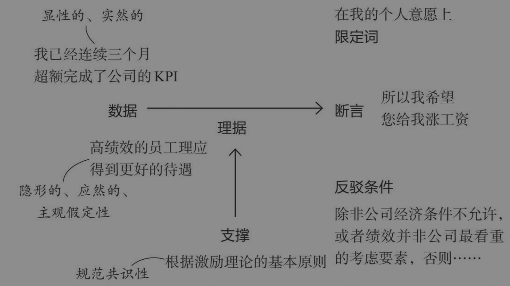
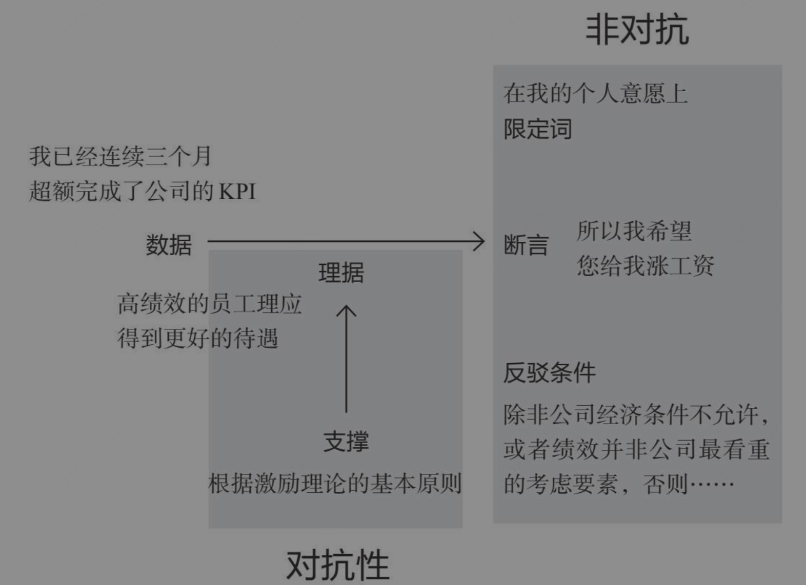
数理B，反限C。
[数理B当然是前提侧的三要素：数据、理据和支撑]。[反限C则是结论侧的三要素，分别是反驳条件、限定词和主张]。
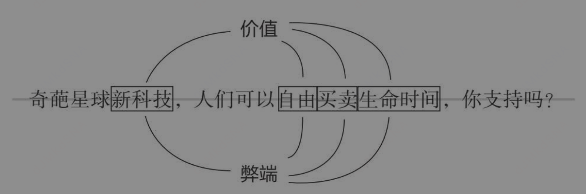
```aidl
（1）“数据大一级压死人”：事实是雄辩的基础。在业绩一塌糊涂的情况下，和老板谈涨工资是个伪命题；在证据确凿的情况下，有些主张是不辩自明或不攻自破的；即便是围绕价值命题的辩论游戏，也必须围绕鲜活的案例和数据展开。正所谓“数据大一级压死人”。
（2）“道理需要支撑”：道理需要规范共识支撑。支撑的重要性仅次于数据，它们是唯二能强力终止质疑的推论元素，理据在事实与主张之间架起桥梁，桥梁的韧性和强度是支撑提供的，我们必须在支撑上花大力气。
（3）“反限让你更强韧”：预先反驳以及自我限定能让论断更具韧性，使其难以被反驳。
```
```aidl
（1）什么是论证？论证有效的原理是什么？为什么有些论证会显得更强？
这个问题帮我们引出了这些知识点：中心路径说服与边缘路径说服；论证的本质是用一个判断来支撑另一个判断的过程，判断是溯因的结果；
我们的判断模式其实很粗糙——若没有更好的理由，当前的理由就会被暂时接受，在这个意义上，一句话之所以被我们认为是“说到了点子上”，
本质上是因为这句话让其他与之竞争的话显得“不在点子上”了。

(2)强力论证的基本结构是什么？
图尔敏论证模型：数理B，反限C。


(3)不同的说理场景，论证活动的侧重点有何不同？对抗场景与非对抗场景，它们分别侧重论证结构的前提侧和结论侧，用前提犀利果敢地进攻，用结论温柔坚定地防守
```

# 中心路径说服与外围路径说服理论
中心路径说服，是我们这里讲的说理论证，是基于论据的说服；外围路径说服，则是透过各种外围因素进行影响，比如洗脑口号、明星代言、意象营造。
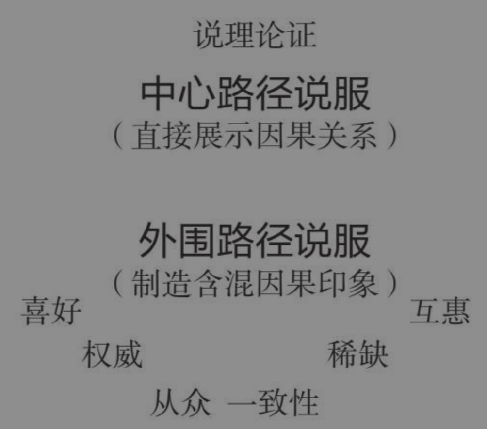
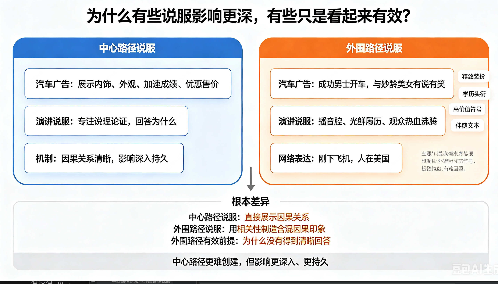
```aidl
公平地说，知识面越宽、对规范理解越深刻的人，越不容易被外围路径说服；圈层段位越高，越注重真材实料。中心路径说服的缺点是创建难度高，优点是一旦创建完成，
它所蕴含的强制力就是无差别的。无论你是何种身份，面对任何身份的人，都可以通过周密的论证获得一种毫无强制性的强制承认，无名之辈皆可一战成名
```


# 为听而说理论
庸俗的倾听和高明的倾听之间的最大差别就在于，前者是“为说而听”，后者是“为听而说”。这不是两种倾听思路，而是两种完全不同的会话结构。

两种会话结构从根本上区分了什么是有意义的谈话和无意义的闲聊。如果双方都把关注点放在自己的语言组织上，非但话题本身无法深入，反而会交互出一个彼此争夺权力的会话场景。

我该如何听”这个问题的答案居然是“你该这样说”，不是如何“听”，而是如何“说”，为了听到更多而“说”。听与说是一体两面的。

在一个具体的交往场景里，如果为了“听到更多”，你必须“说得更多”，那么此时你就应该说得更多，而非刻意压抑自己的表达，如此你反而会因为深入主题而不自觉地给出很多恰到好处的回应，展开一场自然流畅的对话。

## 助人倾听思维模型
为听而说，可为何而听呢？也许仍然只是为了更精彩地说，只是在兜着圈子满足自己的小心思。因此，“为听而说”这个原则，必须服务于“为助人而听”这个目的才能彻底自洽
[重新定义事实，充分关注优势]这是助人倾听—回应的精髓所在，它最终指向的是一种关怀他人的“发展—建设导向的深入理解

```aidl
经验 想法 行为 情感
a.经验指的是被主观阐释的事实，它是一切言说的基础；
b.想法则是当事人给出的主张和判断，言语是想法的伪装或代理；
c.行为指当事人采取的实际行动；
d.情感指包括情绪、心境在内的主观体验。
话语中的行为和情感相对容易被识别，但经验、想法则相当含混，助人倾听的关键便是澄清这种含混
```

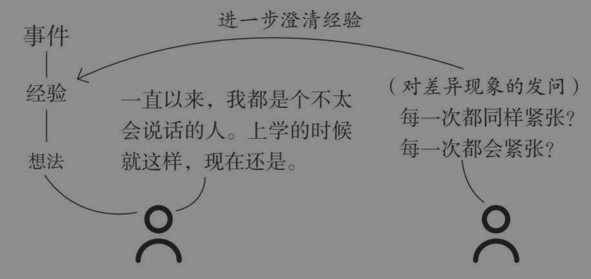
```aidl
我们总认为是某个事实导致我们产生了某种想法，但经验总是事先决定了事实的面貌。一句话灌进你的耳朵里，经过助人倾听思维模型过滤之后，
总是会还原成一个经由主观经验归纳而来的想法；而经验是被建构的，并不可靠，总是有待进一步澄清；一旦被澄清，原本坚固的事实就会变得柔软可塑；
而事实一旦被重新理解，原有的想法就会随之改变。


通过重新定义事实来改变对方的想法，是助人倾听的精髓，我们时刻要朝着这个方向来为听而说、为听而问。如果你有足够多的助人倾听经验，
便很容易听出一种常见的思维模式：某种想法来自过往的不堪经验，而所谓的不堪经验，来自对事件的笼统且错误的诠释，它导致了错误的行为和负面的情绪。


是什么导致了客观事实与主观经验的落差？如果你在心里这么问，你就已经在寻找“弦外之音”了。
弦外之音是那些我们不刻意聚焦就完全捕捉不到的关键信息，这些关键信息主要包括模式和优势。

模式是藏在事实与经验之间的过滤器，无处不在，但并非显而易见。无论在哪个领域，新手与高手之间的最大差距就体现在快速识别模式的能力

把一段论述放在论证模式中理解，把一段心思放在心理学模式中理解。

积极心理学的基本假设就是：所有消极行为背后都有积极因素，所有困境背后都有未利用的资源和机会，所有负面问题背后都有正面价值。

我们常常是“魔鬼观察者”，能敏锐地发现他人身上的缺陷和优势，然后更多地关注他人的缺陷，忽略其优势。
这里的智慧，不仅要求我们听见或看见那些显而易见的优势，还要求我们听见或看见那些隐秘的优势，善于赞美的人应该非常了解两者的差别。

```

```aidl
在批判立场之上，我们首先聚焦的是事实、理据和可能出现的反驳及限定条件，但这些要素在助人倾听立场中是不存在的，与之相对的是经验、想法、可能存在的优势和机会。

在心理学的视野里，一切事实都是经验中的事实、被阐释的事实。倾听者关注经验，是为了提供更多诠释事实的视角。
批判者关注你有没有进行事先的自我批判和限定，主张是否严谨；
助人者则重视补充你可能遗漏掉的资源、优势和机会，主张是否过于严谨。立场的不同直接导致了视野和焦点的不同，进而导致了回应方向的巨大差异。
```
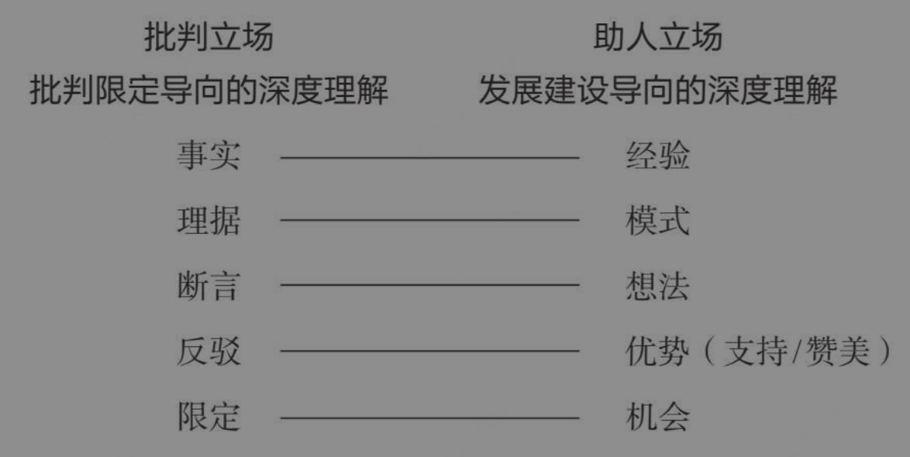

```aidl
将之与批判性思维对立起来，是想通过揭示对立面来提醒你，这种“发展与建设”视角在我们的生活中是极其稀缺的，而人与人交往的死局之一是，我们都希望别人建设性地对待自己，
但自己又总是批判性地对待别人。更要命的是，我们对待他人的方式，总是会迂回地成为我们对待自己方式的镜像，这是倾听他人也是在倾听自我时要意识到的事。
```
## 关键词复问
[话轮转换落空]
关键词复问,映射,每当对方说完一段话，完成一个话轮，并将发言权归属于你之后，你要做的，只是用疑问的语气复述他话里的1~3个词而已。

## 冷场
```aidl
冷场导致的尴尬与恐慌，根本上取决于我们对冷场经验本身的诠释，我们总是认为冷场是尴尬的，是消解自身的身份和资格的，
这使我们显得不堪，预期中的自我应该是游刃有余、八面玲珑的。

我们对冷场最终的克服，不取决于是否掌握了关键词复问这样的技巧，而取决于我们能力的成长、知识面的扩大以及随之而来的自信。
```

# 三阶段框架
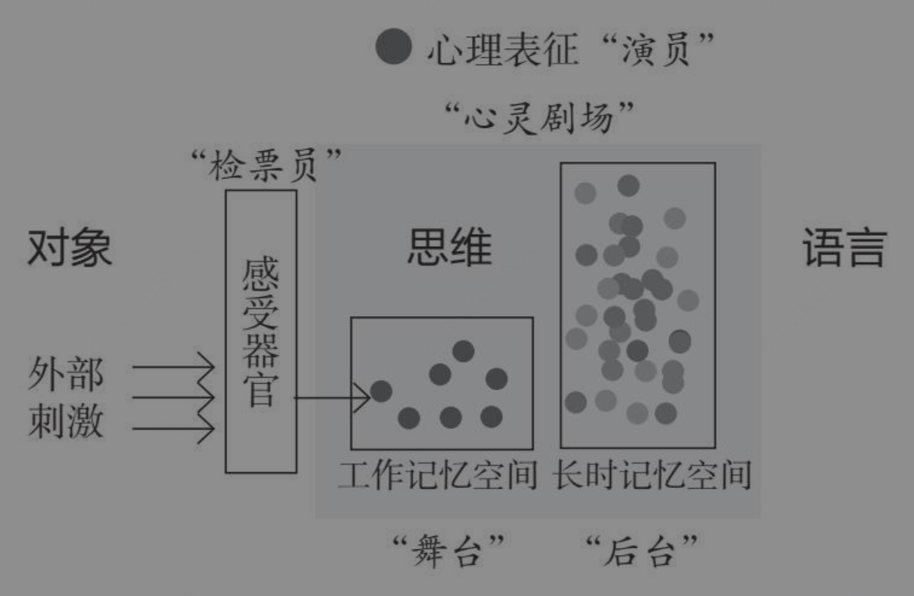
从认知一个对象到产生相应的心理表征，再到将这些心理表征转换成有声的概念符号、组织成有意义的命题，最终将其说出来的能力。
凭借这个能力，我们才能作为符号动物生存于世界。
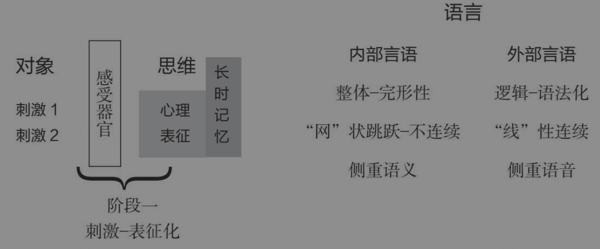
内部言语就是脑子里模糊、含混且活跃的“自言自语”；
外部言语就是我们从嘴里说出来被他人听到的有声话语。
内部言语是有整体感的、网状的、侧重语义的，像是一团由概念碎片拼贴而成的“意义云团”；
外部言语是逻辑语法化的、线性的、连贯的、侧重语音的。
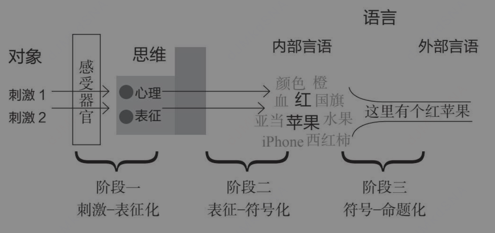
```aidl
第一阶段:外部刺激—心理表征化

第二阶段:心理表征—符号化的阶段

第三阶段:符号—命题化的阶段
```

## 阶段一：刺激-思维阶段
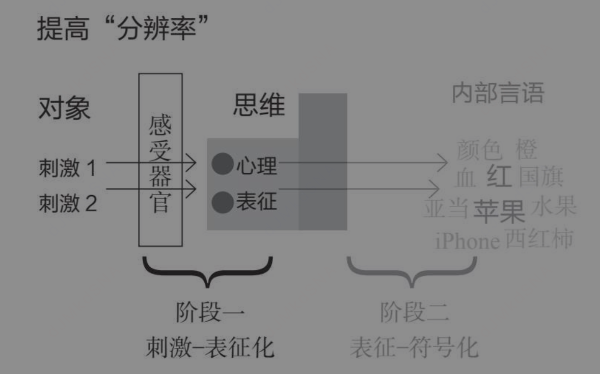
[提高“分辨率”]
```aidl
这个阶段提升的关键在于提高“分辨率”。同样的刺激源，不同的人接收到的刺激是完全不同的。我喜欢听音乐，但我在很长一段时间是“听不见”那些低音贝斯的；
我喜欢看电影，但在系统学习电影知识之前，我几乎意识不到景别、视角以及色调的变化，更别说理解背后的镜头语言了；
```

## 阶段二：思维-内部言语阶段（心理表征-符号化阶段）
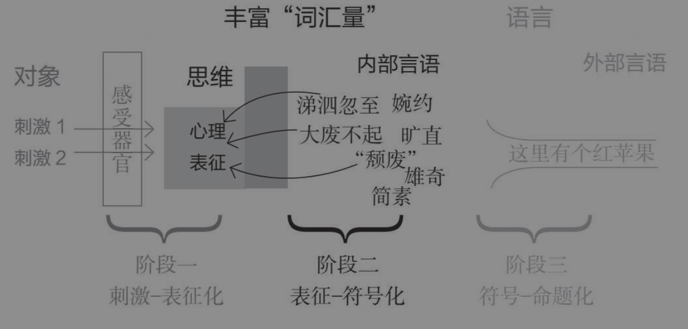
[丰富“词汇量”]
```aidl
阶段二的关键则在于丰富“词汇量”。没有原始材料就没有反思的对象，没有符号材料则没有反思工具。心有所感，意有所动，
我们终究需借助符号来捕捉、指认这些感动，这些被符号化过的心理表征，即我们常说的“念头”“心声”。
```

## 阶段三：内部言语-外部言语阶段（符号-命题化阶段）
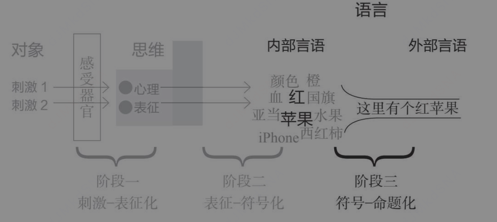
[结构化]
```aidl
从思想网到句子树再到词语串的过程：无中心、无层级网状结构，必须先组织成中心化、层级化的树状结构，才能渐次地展开为线性结构，否则就根本无从安排线性词语串上各个概念的优先级顺序。

这个阶段最大的挑战在于，我们需要将网状的思想内容组织成线性的有声言语，同时还要保证它们能尽可能地还原其源头复杂的、非线性的、多层次的丰富意涵。
由于我们不能一股脑地将那些零散的符号表征塞进那个狭长通道，在此之前，我们要对它们进行一次整编，根据特定的规则安排它们的出场顺序。

大致上，我们能梳理出四种基本关系，我们就是通过这四种基本关系来组织段落和篇章的。它们是因果关系（推论关系）、时间关系（相续/不连续关系）、空间关系（相邻/相离关系）、原型关系（相似/相异关系）。

为什么总有人能给出更高明的解释，阐明更复杂的因果？”根本原因是他处理了更多的惊异，准确地说，是把经验中的惊异符号化为问题，用语言问了出来，然后用语言回答了它。
```
