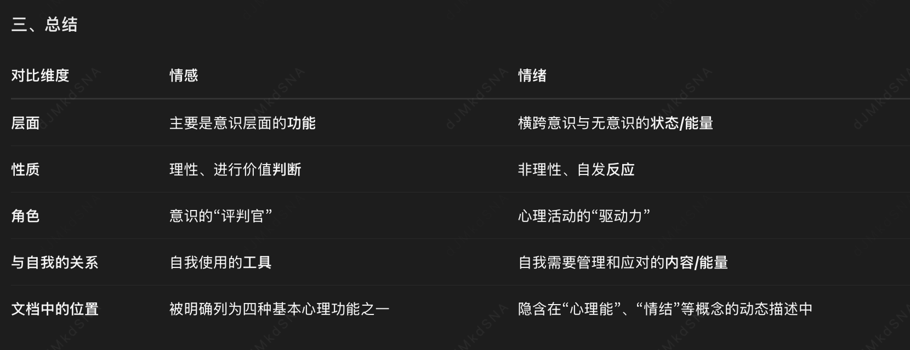
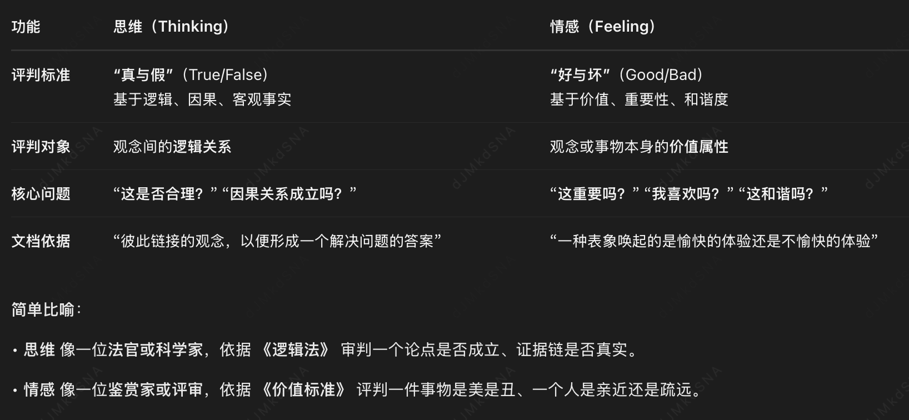
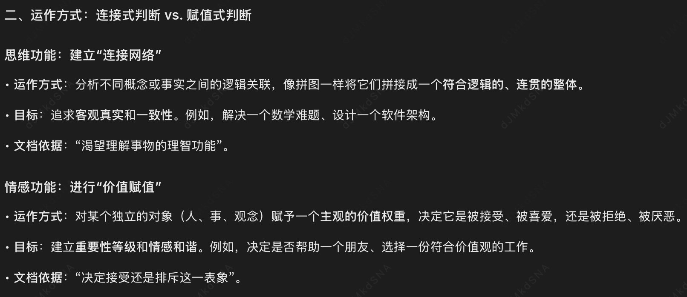
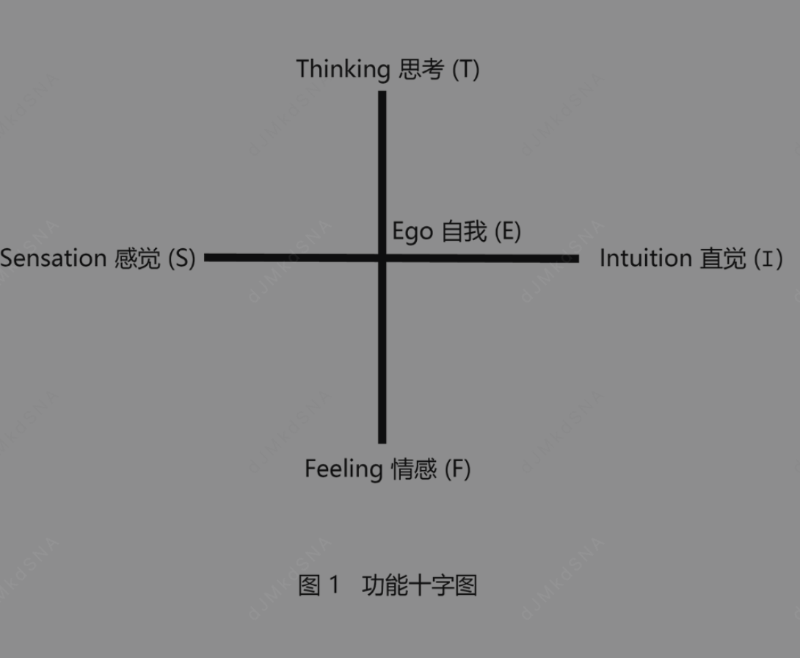
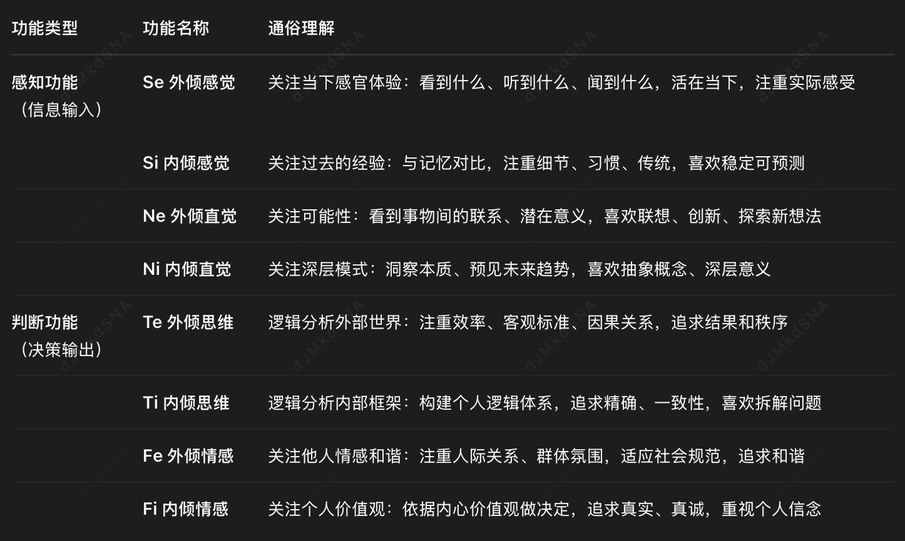
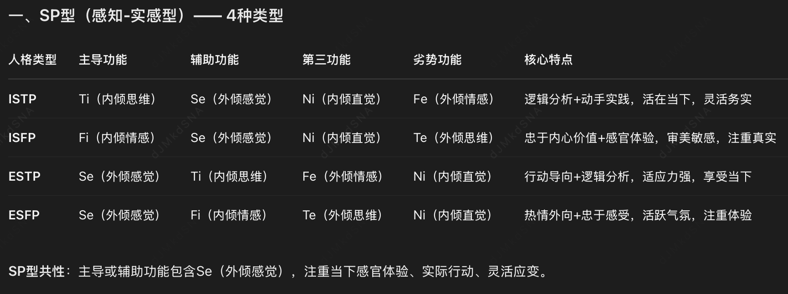
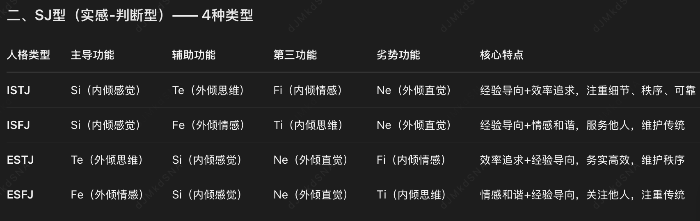
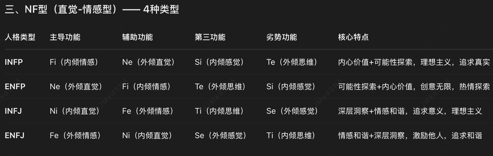
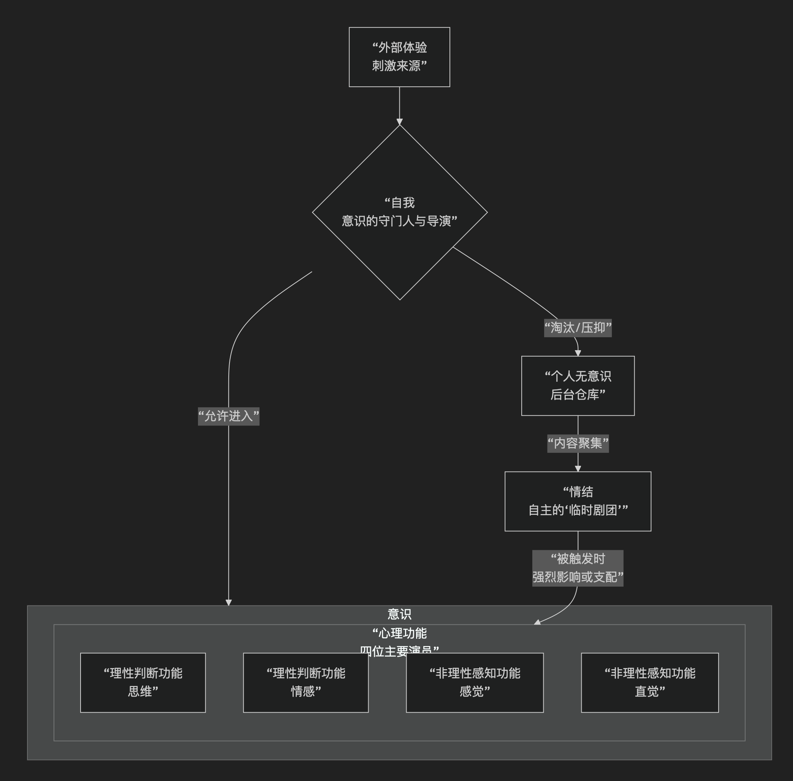
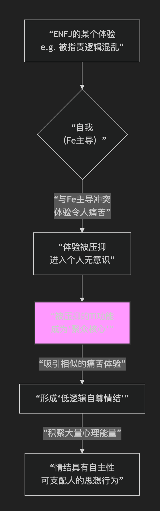

# 领域词汇

## 情绪 vs 情感

# 人格的结构
组成人格要素是什么，彼此如何互相影响，他们与外部世界如何互相影响。人格怎么产生，生命过程中会发生什么变化？
人格结构问题，人格动力问题，人格发展问题。
经验事实高于理论。

## 精神
人不致力于人格的完整，他生来就是完整的人格。他所应该做的，只是在固有的完整人格基础上，最大限度地发展人格的多样性，连贯性，和谐性，不让它破裂成为
彼此分散，各行其事和互相冲突的系统。分裂的人格是扭曲的人格，荣格的工作就是帮助病人恢复他们失去的完整的人格，强化精神使他抵御未来的分裂。

精神由若干不同彼此互相左右的系统和层次组成，[意识，个人无意识，集体无意识]。

## 意识
自觉意识，通过[思维，情感，感觉，直觉]逐渐成长。除了四种心理功能，还有两种心态决定自觉意识的方向，外倾和内倾。
外倾心态使意识定向于外部客观世界，内倾心态使意识定向于内部主观世界。
一个人的意识逐渐富于个性，不同于他人，这就是个性化的过程。个人逐渐变成一个在心理上不可分的，独立的统一体。个性化的目的在于意识的拓展，
一个始终不懂得自己，不懂得周围世界的人不可能是充分个性化的人。意识的个性化过程中，产生了自我。

[人类本能中的最重要功能都是无意识的，这相当于意识是无意识的产物]
## 自我
如果没有一个与意识相关的自我，我们就意识不到任何事情。如果有什么事物，它没有和自我产生关系，那么它就不是意识的一部分。因此，你可以将意识定义为心理事实与自我的关系。

首先是对身体和自身存在的普遍的察觉，其次是记忆资料，由这两部分构成；你对自己所经历的事物有一定概念，而且有一段延续的记忆。这两件事物，是所谓的自我的主要组成部分。
因此，你可以将自我称为心理事实的情结。这个情结具有强大的吸引力，就像一块磁铁；它从那个我们一无所知的黑暗领域，吸引了来自无意识的内容；同时它也吸引了来自外部世界的印象，
当它们与自我联系在一起时，它们就被我们意识到。如果它们没有被吸引，那么它们就不是意识。
[它是一种特定的情结complex]
我们最珍视的、最亲近的宝贵情结，就是我们的自我。它始终是我们专注和欲望的中心，它也绝对是意识必不可少的中心

自我具有高度选择性，想一个[外界感知蒸馏所]，很多理性材料送进自我，只有很少一点被制作出来，达到自觉的水平。我们每天有数不清的体验，但是绝大多数不可能被意识到。
自我在他们达到意识之前就把他们淘汰了。这是重要的功能，如果不这样，会被无数外界的心理内容压到。
自我保证了人格的同一性和连续性，通过对心理材料的选择和淘汰，自我在个体人格中维持了一种聚合性质。自我的存在，让我们感觉到今天的自己和昨天的自己是同一个人。

自我允许哪些东西进入意识哪些东西不进入意识呢？
心理功能占主导地址，情感型，自我会允许较多情绪体验进入意识。思维型，思想比情感更容易被允许进入意识。
高度个性化的人的自我，允许较多的东西成为意识，也部分取决于体验本身的强度。强烈的体验可以攻入自我的大门。

## 个人无意识
[不被自我认可的体验并没有消逝，任何体验过的东西不可能彻底消失]，他们被存储在个人无意识中。他们临近自我，容纳着那些与意识功能和自觉个性化不协调不一致的
心理活动和心理内容。他们也是意识的体验，但是被压抑和忽视，例如痛苦的记忆，无法解决的难题。
那些微弱的不能达成意识，不能存留在意识中的体验，统统存储在个人无意识中。
[个人无意识是你庞大的“云服务器”]
## 情结
[一组一组的心理内容可以聚集在一起，形成一簇心理丛]，称之为情结。他们像完整人格中彼此分离的小人格。他们是自主的，有自己的驱动力，可以强有力的控制我们的思想和行为。
不是人支配着情结，而是情结支配着人。情结由聚众的核心心理要素组成，围绕着心理因素而聚集着大批次要联想。聚合力越大，联系数量越多。

## 集体无意识
它是心理中与个人无意识有区别的一部分，他的存在不取决于后天经验。集体无意识的内容在人一生中从未被意识到。
集体无意识储藏着原始意向，人从他的祖先继承了这些意向，这里继承说的是先天倾向性，采取与祖先相同的方式来把握世界和做出反应。

# 人格的动力
人的人格和精神是相对闭合的完整系统，它是一个独立自足的能量系统。虽然精神要从外部世界包括肉体获得能量，但是能量一旦为精神吸收，就完全属于精神能量而不再是
物理能量。外来能量的命运，取决于一个已经先行存在的能量系统，而不去取决于外部来源的性质。

人的精神领域具有不可渗透性质，只有向内输入能量的通道，经过这些通道，外部世界的新的能量被吸收到精神系统之中。外部世界的能量，主要通过我们所触摸，看见，感受，
听见的一切事物获得。这些内外感觉给我们提供了不断地刺激来源。经过这些刺激，精神得到滋养。正因为如此，人的精神系统总是处在不断变化的状态中，永远不可能达到
绝对平衡的状态，只有相对的稳定。外部环境和身体内部的不断刺激，精神系统的能量不断转移和重新分配。

人不可能时刻准备应付一切可能的偶然事件，新的人生经验会强行进入人的精神病破坏系统的平衡。荣格主张周期性的退回到自己的内心世界回复精神的平衡。

精神不能完全开放，也不能完全封闭，健康稳定的人格在这两种极端之间。

## 心理能
心理活动的动力，像心理世界的"[电量]",精神活动不等于 意识活动，睡觉时没有意识，但是精神活动还在继续。心理能和物理能不是计算对等关系，但是他们存在某种关联。思想和情绪能影响人的生理机能，药物也能影响人的情绪。

## 心理值
当很高的心理值被投入到观念和情感时，意味着观念和情感拥有相当的力量来左右和影响人的行为。投入某一心理要素的心理能量不能绝对测量，但是
可以相对测定。和别人对比每周投入的时间和精力。人的精神在不断做出判断和评价，不同量的心理能被分配到不同心理活动中。被分配给不同心理活动的心里能在量上
是随时发生变化的。今天大量精力在准备考试，明天大量精力准备打网球。

测定心理值的观察方法，只能说明自觉意识的心理值，不能说明无意识的心理值。如果某一意识活动的心理值忽然消失，有没有出现另一个意识活动，根据系统内能量守恒
设想，心理值坑定跑到了无意识中。

无意识的心理值，通过某一情结的聚合力测量。

### 直接观察和分析推论

### 情结表征
真正的情结，伪装的情结

### 情绪反应

### 直觉
直觉在某些人身上特别发达，在另一些人身上可能不发达。我们同一个人关系越亲密，对他的直觉就越敏感准确。

## 等值原则
某一心理要素固有的心理能减退或消失，等值的心理能就会在另一个心理中出现。但有时候，心里能仿佛消失没有转变成其他活动。这时候心理能实际上从意识中自我
转移到个人无意识汇总或者集体无意识中去了。如果一个人性格忽然发生改变，其原因就是心理值的重新分配。

[你花在一件事上的心思少了，省下来的精力一定会投入到另一件事上]
## 均衡原则
为啥心理能偏偏从自我转移到人格面具，没有转移到其他地方呢？因为人格面具需要更多的能量。
整个心理系统的能量分配，趋向于在各种心理结构寻求一种平衡。精神系统不会绝对平衡，人的精神并不是完全封闭的系统，来自外部世界的能量，不断地加入到人的精神中，
新增的能量不断打破平衡。心理能量在各种心理结构中分配越是不公平，一个人越是体验到内心的紧张和冲突。
青年人面对大量涌入的能量，心理能暂时不能达到均衡状态，在心里能的再分配过程中，就会出现情感的爆发。
老年人的宁静，是因为经理各种经验，已经和谐融入到人格中，新鲜的体验不会让他心理能失衡。

当某一心理结构高度发达，在精神系统占据强有力的位置时，他倾向于脱离其他部分独立出来，垄断新获取的能量，还不断从其他心理组织夺取更多的心理能量。
这时候，能力不仅不从较强的心理组织到达较弱的心理组织，反而从较弱的心理组织转移到较强的心理组织，精神就会极度不平衡。过分片面发展的人格往往不稳定。
[整个心理系统的能量分配，趋向于在各种心理结构寻求一种平衡]

## 前行与退行
生命开始时，人就按照先天倾向去面对世界。精神活动是片面的，如果片面性占据太大优势，他们就会把一切经验吸收到自身来。
如果情感占据优势，但是新的情况需要靠思维才能适应，这时候情感就不适合了，心里能在情感的前行就停止了。这时候人会无所适从，主观的心理内容找不到出路
而聚集，精神会十分紧张。

退行，把能量从心理主导那里拿走，使得思维激活成为新的心理功能。当它刚到达意识领域时，形式会有点粗糙，身上还带着地层深处的淤泥，思维功能从无意识存储中
被召唤出来。

## 能量疏导
[根据等值原则，意识层面消失的能量，往往会流入个人无意识]
根据均衡原则，当意识层面过于偏执时，个人无意识会通过制造困扰（如焦虑、梦境）来试图恢复整体平衡

# 心理类型
## 心态
### 外倾 vs 内倾
使意识可以定向为外部心理事实（ectopsychic facts）和内部心理事实（endopsychic facts）两个主要领域。
我对外部心理的理解是，它是[意识内容和环境资料之间的关系系统]。它是一个定向的系统，涉及到我如何处理感官功能赋予我的外部事实。
而另一方面，[内部心理是意识内容与无意识进程之间的关系系统]。

客观:一切物质条件的世界，环境，外界，外部现实。
主观:内在的和个人精神世界。

外倾:心理能被引导到客观外部世界的表象中，被投入到对客观对象，人与物，周围环境的知觉，思维和情感中。外倾是一种客观心态。
内倾:流向主题的心理结构和心理过程，内倾是一种主观心态。

这两种心态彼此互斥，不能同时并存在意识中，一个人有时候外倾，有时候内倾，但是整个人生中，通常有一种心态占据优势，如果客观的倾向占优势，被认为是外倾，
如果主观倾向占优势，就认为是内倾。

内倾喜欢探究和分析内心世界，内向孤僻，关注自己的内心体验。
外倾则把注意力集中在和他人的相互交往中，对周围一切很感兴趣。

一个人或多或少既有内倾，又有外倾，并非整个都是外倾或者内倾。

### 补偿原理
核心原因在于心理补偿机制——人格是一个动态平衡系统，意识层面的过度发展会激发无意识层面的对立倾向进行补偿，以维持整体心理的完整性和平衡性
荣格认为，人的心理结构具有自我调节和平衡的倾向。当意识层面过度偏向某一功能（如外倾）时，无意识层面会发展出相反的功能（内倾）作为补偿，
防止人格走向极端。这种补偿机制类似于身体的自我调节系统——过度兴奋后会自然产生抑制，过度抑制后会自然产生兴奋
一个在意识层面极度外倾的人（社交活跃、行动导向），其无意识层面可能积累了大量被压抑的内倾特质（孤独、沉思、情感深度）
这种无意识的内倾倾向可能在梦境、情绪爆发或心理危机时显现出来
如果意识层面完全忽视这种补偿信号，可能导致心理失衡甚至神经症

## 心理功能
[思维，情感，感觉，直觉是意识的四大功能]。

情感一种价值判断工具，一种表象唤起的是愉快的体验还是不愉快的体验而决定接受还是排斥这一表象。
思维是由彼此链接的观念组成，以便形成一个解决问题的答案，渴望理解事物的理智功能。

思维和情感都是[理性]功能，
因为两者都需要做出判断。思维是两种或更多观念之前有无真是联系做出判断。情感则是就一种观念是愉快还是厌恶还是激动的做出判断。

感觉和直接是[非理性非判断]功能，不是失去理智，而是和理智无关。
感觉是感官知觉，通过感官刺激产生的意识经验，也包括人体内部的感觉，不需要任何判断，他们是非理性功能。
直觉是直接把握到的而不是作为思维和情感的结果产生的经验，也叫第六感，超感，不需要任何判断，他们是非理性功能。

他们不需要任何根据和理由，他们是一种理性状态，作用于个体刺激的变化流动逐渐形成，这种变化流动没有方向和意图。
他没有任何目标，人们感觉到的一切来自当前刺激，人内心深处的直觉则来自未知的刺激。

感觉告诉我们存在某种东西，思维告诉我们他是什么，情感告诉我是否满意，直觉告诉我他来自何处去往何方。

### 非理性功能-感知功能(感觉 vs 直觉)
感觉[有什么]是我通过感官功能对外部事实的认识的总和，感觉是真实的功能
它没有告诉我那是什么，也没有告诉我关于这个事物的其他内容；它只告诉了我这个事物本身，

直觉[过去未来]，包含着时间的概念。事物有它自身的过去，也有它自身的未来。它们从某处来，到某处去，而你看不到它们从何而来，也不知道它们去向何方
它弥补了在现实当中缺少的，无法被感觉、思考或情感所感知到的东西。如果直觉不存在，这样的话，过去就不再真实了，未来也不再像我们想象的那样真实
### 理性功能-判断功能(思维 vs 情感)
思考[这是什么]以它最原始的方式告诉你一个事物是什么。它给事物赋予了名字。它为事物增加了一个概念

情感[什么对我来说最重要]告诉你某件事可接受，还是不可接受。它告诉你什么事物是对你而言是有价值的。假如没有必要的情感反应，你将无法进行觉察，且无法进行统觉

人们认为思考才是理性的功能，而情感是非理性的，甚至是极其不理性的功能，这是非常大的误区。

## 心理功能坐标图

心理功能通常受到个人意志控制,或者说，我们希望它们受其控制，因为我们害怕一切自为（move by itself）的事物。
它们能受到意志力量的指导，我们把这种指导称为意图。但它们也可以以非自发的方式运作，也就是说，它们为你思考，为你情感——它们经常这样做，
而你甚至无法阻止它们。或者说，它们会无意识地发挥作用，以至于你不知道它们做过什么。

当然，人们会有各自的偏重。头脑好的人更喜欢思考各种事物，并通过思考来进行适应（adapt）。而其他人，一部分具有良好的情感功能，他们能成为优秀的社交高手，
他们对价值拥有优异的辨别力；他们是创造情感情境和依靠情感情境生活的真正艺术家。又或者，一个人如果拥有敏锐的客观观察力，他将会主要运用自己优秀的感觉，等等。
占支配地位的功能，赋予每一个人属于他自己的特殊心理类型

在十字型的中心是自我（E），它有一定的能量可供使用，而这个能量就是意志力。
### 思考和情感处于对立状态
在思考型的情况下，意志力可以被引导到思考（T）。然后，我们必须将情感（F）放在下面，
因为在思考作为高等功能的情况下，它是次等功能。这一推论来源于一个事实：当你思考时，你必须排除情感；这就正如当你运用情感时，你必须排除思考。如果你正在思考，
要将情感和感性价值放在一边，因为情感最能让你的思考变得沮丧。另一方面，追求感性价值的人会将思考放在一边，而且他们这样做是对的，这两个不同的功能彼此相互矛盾。

### 感觉和直觉处于对立状态
当你观察事物的物理事实时，你无法同时看到它的“圆角”。当你留意一个主要通过感觉功能来工作的人时，如果你足够细心，你会发现他的眼轴趋向于收敛，并汇集在一个点上。
当你研究那些依赖直觉的人，他们的表达方式和眼神的时候，你会发现他们对于实体事物只瞟一眼——他们根本不看具体的事物，他们的眼光投射到所有的事物之上，
因为他们把所有事物看成是一个整体，然后他们会在所有被他感知到的事物之中，在他的视野之外，获得一个想法，这个想法就是预感。

## 心态和心理功能组合
外倾思维用的是有感官刺激提供给大脑的信息。激发思维的对象是存在外部世界的东西，[归纳思维]，所有的概念和假设来自事实材料基础。
内倾思维是一种主观性思维，除了对外部世界信息进行思考外，还要思维内在精神世界，[演绎思维]，感兴趣的是思维观念本身，

外倾情感，觉得丑美，往往是因为符不符合固有审美，倾向于保守，规范。
内倾情感，在于内在主观条件，往往是原始的，不同寻常和有创造性。

外倾感觉,人所面对的客观现实
内倾感觉，主观现实决定

外倾直觉,外部额世界寻找新可能
内倾直觉，精神现象，

## 个体类型

### Te
### Ti
### Fe
### Fi
### Se
### Si
### Ne
### Ni

# QA
## 思维 情感 感觉 直觉  意识 无意识 情结他们是什么关系和联系?

感觉，思考，情感，直觉
“感觉”作为第一维度，“思考”作为第二维度，“情感”作为第三维度，而“直觉”作为这个分类系统的第四维度
前三维更像是空间的概念，第四维更像是时间的概念,直觉像是时间机器，带我们穿越到过去和未来。

意识是心理的“舞台”，思维、情感、感觉、直觉是登台表演的“四位主要演员”，他们运用不同的技能（理性判断或非理性感知）来演绎剧本（处理内外部经验）。
自我是严格的“导演和守门人”，决定哪位演员在什么时间上场（哪些体验能进入意识）。那些被导演淘汰的剧本和演员（不被自我认可的体验），并不会消失，
而是被存放在庞大的“后台仓库”——个人无意识中。在仓库里，这些内容会基于相似的主题（如痛苦、恐惧）聚集起来，形成具有自主意识的“临时剧团”——情结。
这些情结会自己排练，并时常试图冲上舞台，干扰甚至绑架正常的演出。

筛选与储存（舞台与后台）：外部体验（A）涌入，自我（B）作为导演进行筛选。被允许的体验进入意识（C）舞台，由四位演员（心理功能）演绎；被淘汰的体验则流入个人无意识（I）仓库。
情结的形成（仓库内的组织）：在个人无意识（I）中，带有强烈情绪色彩的相似体验聚集起来，形成情结（J）。
情结的反扑（后台干扰前台）：当外界事件触碰到某个情结（J）时，它会携带巨大心理能量，强行闯入意识（C）舞台，干扰甚至支配四位演员的表演（心理功能），表现为我们无法自控的情绪爆发或非理性行为。
能量的流动与补偿（系统的平衡）：整个系统遵循等值原则（能量守恒）和均衡原则（寻求平衡）。例如，如果思维（E）在意识中过度发展（垄断能量），系统会通过情感（F）在无意识中积聚能量进行补偿，以维持整体平衡，防止人格“破裂”。这正是文档开篇所言，荣格工作的核心是帮助人恢复和维持人格的完整性与和谐性。

## 思维 情感 感觉 直觉到底是在意识中还是无意识中,还是同时存在？
这些功能本身是“工具”，意识与无意识是“工作间”。同一个“工具”可以在不同的“工作间”里被使用，而且它们在不同工作间里的状态和表现方式完全不同
不是无意识“也有”这些功能，而是这些功能本身就是整个心理系统（包括意识与无意识）共有的基本工具

在意识层面，我们主动、清晰地使用它们。
在无意识层面，它们可能以被压抑的状态存在（构成情结），或者以原始的、自动化的方式在运作（本能、直觉）。

思维、情感、感觉、直觉这四种"工具"（功能）同时存在于意识和无意识两个层面，只是它们在不同层面的存在状态、运作方式和可觉察程度完全不同

荣格理论认为[每个人都拥有这八种心理功能]（Te、Ti、Fe、Fi、Se、Si、Ne、Ni），并且它们同时存在于意识和无意识之中，但在两个层面上的存在状态、发展程度和运作方式截然不同

人的精神是一个相对闭合的完整系统，八维功能是这个系统的先天构成要素。它们不是后天习得的，而是人通过遗传获得的先天倾向性（“集体无意识储藏着原始意向，人从他的祖先继承了这些意向”）。
因此，从出生起，这八种功能的“种子”就存在于每个人的精神整体（包括意识和无意识）中

虽然八种功能先天存在，但它们在个体成长过程中获得的心理能（能量投入）是不同的。这导致了它们在不同层面的发展差异：
在意识层面：获得大量心理能的那1-2个功能（如主导功能和辅助功能）被充分“激活”，发展成熟，成为个体能够清晰觉察、主动使用的工具（“自我允许哪些东西进入意识”）。
在无意识层面：获得极少心理能的功能（特别是劣势功能），并未消失，而是以未发展或发展不良的潜能状态存在于个人无意识中（“不被自我认可的体验并没有消逝……他们被存储在个人无意识中”）

意识层面过度发展某一功能（如Ti），会导致精神系统失衡。
此时，其对立功能（如Fe）会在无意识层面积聚能量进行补偿，试图将系统拉回平衡

比如ENFJ有[Fe Ni Se Ti Fi Ne Si Te]，但是意识层面是Fe,Ni,Se,Ti,无意识层面是Fi、Ne、Si、Te
## 怎么理解等值原理和均衡原则
如果你的“主工作室”只偏爱使用“思维”和“感觉”这两种工具（比如一个极度理性务实的人），那么“情感”和“直觉”工具在工作室里就闲置了。
但整个心理系统要求平衡。于是，被压抑的“情感”和“直觉”功能就会在“储藏室”（无意识）里积聚能量。

这些能量可能通过以下方式表现出来，试图找回平衡：
梦境：梦里出现强烈的情感波动或离奇的象征（无意识情感和直觉的活跃）。
莫名情绪：突然感到焦虑、低落，却找不到理性原因（无意识情感的溢出）。
非理性行为：冲动地做出一个完全不符合自己理性人设的决定（无意识功能暂时接管了控制权）

## 心理能什么时候转移到意识，什么时候转移到无意识
意识与无意识之间没有绝对的界限，而是像"渗透膜"一样，能量和信息可以流动。因此：
主导功能虽然是意识层面的，但它的能量也"渗透"到无意识
劣势功能虽然主要在无意识，但它的能量也会"渗透"到意识（表现为情绪、梦境等）

## 既然心理能会强化某个维度的功能，那么人的8维主导和辅助功能也会变，但是荣格说每个人先天就有自己的主导功能不会变，这两个观点冲突吗?
这两个观点并不冲突，而是描述了人格发展的不同层面：一个是先天的、静态的心理结构倾向，另一个是后天的、动态的心理能量流动。
这里的“先天倾向性”就包括了每个人与生俱来的主导心理功能。这就像一个人天生的“心理指纹”或核心配置，是人格的结构性基础。它决定了你认知世界最自然、最省力的根本模式。

你的主导和辅助功能因为处于意识层面，会像“能量黑洞”一样，自然地吸引和垄断大部分心理能，从而变得越来越强大、熟练。这是一种正向循环

根据均衡原则，如果环境要求（例如，工作需要你大量使用辅助功能），心理能会在主导和辅助功能之间动态调整。但这并不意味着主导功能本身发生了改变，而是你在不同情境下调用不同功能的熟练度发生了变化

## enfj不断练习 Ti Ni功能，有可能变成Ti主导的人格吗？
不可能。 根据荣格类型学理论，ENFJ（Fe主导）通过练习Ti、Ni功能，不可能变成Ti主导的人格类型。这涉及人格类型理论的核心原则：[主导功能是先天决定的]、
不可改变的心理结构倾向，而[后天练习只能发展功能的使用熟练度]，无法改变功能在堆栈中的根本位置.

### 主导功能的先天性与不可变性
荣格在《心理类型》中明确指出，主导功能是集体无意识中的原型结构，是人格的"核心配置"。这就像一个人的神经基础决定了你是右利手还是左利手——你可以通过练习让左手变得更灵活，
但你的核心优势手（主导功能）依然是右手，不会因为练习左手就变成左利手。主导功能类型（如Fe、Ti、Ni等）是人格的基石，是先天倾向性，不会因为后天练习而改变

### 功能堆栈的"层级结构"不可逆转
在八维功能堆栈中，主导功能（第1功能）占据的是最深层、最核心的位置，它决定了人格的整体运作模式。辅助功能（第2功能）、第三功能（第3功能）、劣势功能（第4功能）等，
都是围绕主导功能建立起来的补偿结构。这种"层级关系"是结构性的、不可逆的。就像一栋房子的地基（主导功能）决定了房子的整体结构，你可以装修、扩建（发展其他功能），但无法把地基从A类型换成B类型

### 练习改变的是"熟练度"，而非"功能类型"
当ENFJ练习Ti（内倾思维）功能时，发生的是：
Ti的使用熟练度提高：从"几乎不会用"到"能用得不错"
Ti在功能堆栈中的发展程度提升：从劣势功能（第4功能）可能提升到接近第三功能的水平
人格的整合度提高：Ti不再那么"劣势"，与主导功能Fe的冲突减少
但Ti的功能类型本身没有改变——它依然是Ti，而不是变成了主导功能。主导功能依然是Fe，只是这个人现在能更好地使用Ti来辅助Fe
Ti从"完全劣势"发展到"可用"，但不会变成主导功能。在压力下，这个人可能依然会优先用Fe处理问题，只是[Ti的"拖后腿"程度降低了]

### 为什么会有"可能改变"的误解？
误解来源1：混淆"功能发展"与"类型改变"

很多人误以为"功能发展得好=变成那个类型"。实际上：
功能发展：指某个功能的使用熟练度、意识化程度提高
类型改变：指主导功能本身发生根本性变化（如从Fe主导变成Ti主导）
前者是量变（程度提升），后者是质变（结构改变）。荣格理论认为，主导功能的结构是先天决定的，后天只能发生量变，无法发生质变

### 误读"人格整合"的目标
荣格确实强调人格整合（发展劣势功能、整合阴影），但整合的目标是：
让所有功能都得到适度发展，避免人格失衡
实现人格的完整性与和谐性，而非"变成另一个人格类型"
一个整合良好的ENFJ，是能熟练使用Fe、Ni、Se、Ti等所有功能的ENFJ，而不是"变成了INTJ或INTP"

### 忽视"功能堆栈的稳定性"
功能堆栈（主导-辅助-第三-劣势）是一个相对稳定的层级结构。即使你大量练习劣势功能，它最多提升到第三功能的位置，但很难超越辅助功能成为主导。
这是因为主导功能已经占据了大部分心理能量，形成了"能量垄断"

## 荣格的底层原则
先天倾向性：导功能是集体无意识中的原型，是先天继承的。如果后天能改变，就否定了人格的先天基础

功能对立补偿/均衡原则:

人格连续性/同一性:人格发展是分化与整合的过程，而非"变成另一种人格"。如果类型可以改变，就失去了人格的连续性和同一性

## 8维中哪些维度在意识，哪些维度在无意识，这是动态变化的吗？

### 八维功能在意识与无意识中的基本分布
意识层面的功能（被"自我"允许进入）

文档依据："自我具有高度选择性，像一个蒸馏所...很多理性材料送进自我，只有很少一点被制作出来，达到自觉的水平。"
主导功能（如ENFJ的Fe）：高度意识化，被自我优先允许进入意识
辅助功能（如ENFJ的Ni）：较意识化，辅助主导功能工作
无意识层面的功能（被"自我"淘汰或压抑）

文档依据："不被自我认可的体验并没有消逝...他们被存储在个人无意识中。"
劣势功能（如ENFJ的Ti）：严重压抑到无意识
阴影功能（第5-8功能）：完全处于无意识层面
未发展的功能：因与自我形象冲突而被压抑

### 这种分布是动态变化的

### 等值原则：能量守恒与转移
当意识层面的功能能量减退时，等值能量会转移到无意识中的其他功能
这种转移是持续的、动态的过程
举例：当ENFJ不再过度使用Fe（外倾情感）时，能量可能转移到无意识中的Ti（内倾思维）

### 均衡原则：系统自动寻求平衡
心理能量在各种心理结构中分配越是不公平，一个人越是体验到内心的紧张和冲突。

当某个功能在意识层面过度发展时，系统会自动在无意识层面发展对立功能来补偿
这种补偿是动态的自我调节机制
举例：思维型（T主导）的人，无意识中会积累情感功能（F）的能量作为补偿

### 前行与退行：功能的动态转换
前行：能量流向意识层面的主导功能
退行：当主导功能不适应新情境时，能量撤回，激活无意识中的其他功能
这是一个动态的适应过程

### 影响分布动态变化的关键因素
体验强度，个性化程度，环境需求

## 比如说我是enfj，我过度发展Fe Ni 导致我很紧张，此时我意识层面只有Fe Ni，然后我开始发展Se Ti Fi Ne Si Te，最后意识层面有Fe Ni Se Ti Fi Ne Si Te等，这个理解正确吗？

意识无法同时容纳所有功能
意识的“舞台”非常有限，不可能让所有8个功能演员同时站在台上表演。健康的意识状态是一个有主导、有次序、有选择的系统，而不是所有功能平等参与的“民主大会”
“发展”的最终目标，不是让Fe, Ni, Se, Ti, Fi, Ne, Si, Te这8个功能都变成意识层面同等活跃、随时可用的工具。

真正健康且可实现的状态是：建立一个以主导功能（Fe）为核心，各功能各司其职、协同顺畅的“高效内阁”

意识层面：依然是Fe主导、Ni辅助的“内阁”。但通过发展，Se（第三功能）和Ti（劣势功能）​ 变得“可用”了。这意味着当情境需要时，ENFJ可以有意识地将心理能量临时调配给Se或Ti去处理特定问题（例如，在需要关注细节时调用Se，在需要逻辑分析时调用Ti）。任务结束后，能量中心会回到Fe和Ni。
无意识层面：那些更遥远的阴影功能（Fi, Ne, Si, Te）并未全部进入意识。而是说，因为它们获得了应有的能量滋养，不再以“情结”的形式激烈对抗意识，而是变成了相对平和的潜在资源，可能通过梦境、直觉或创造性灵感等方式提供支持。

## 无意识层面的阴影功能和 情结的关系

这两者都存在于个人无意识中，并且存在着紧密的因果与构成关系。简单来说，被压抑到无意识中的阴影功能（特别是劣势功能），是形成情结的核心材料和能量来源。
### 阴影功能是情结的“磁核”
对于一个ENFJ（Fe主导）来说，其劣势功能Ti（内倾思维） 和第五功能Fi（内倾情感） 因为与主导的、关注人际和谐的Fe相冲突，常常被自我压抑到无意识中。
这些被压抑的Ti/Fi功能，就成为了一个“自卑情结”或“低逻辑自尊情结”的聚众核心。任何挑战其逻辑能力（Ti）或个人价值（Fi）的体验，都会像铁屑被磁铁吸引一样，聚集到这个核心周围，不断加强这个情结

### 阴影功能为情结提供“能量”
当心理能量从意识层面的主导功能（如ENFJ的Fe）中撤回，或被自我拒绝后，这些能量并没有消失，而是转移并投注到了无意识中的阴影功能上。阴影功能聚集的能量
（心理值）越高，以其为核心的情结力量就越强。这就解释了为什么情结具有巨大的、自主的驱动力，因为其本质是被压抑的心理功能所携带的未被充分利用的心理能量

“被压抑的Ti/Fi功能”：
文档依据：在“个人无意识”部分提到，“不被自我认可的体验并没有消逝…他们被存储在个人无意识中”。对于ENFJ（外倾情感主导型）来说，其主导功能是关注人际和谐的Fe。因此，与之对立的、关注个人逻辑的Ti和关注内心价值的Fi，就容易被自我判定为“不协调”而被压抑到无意识中。
“聚众核心”：
文档依据：在“情结”部分明确指出，“情结由聚众的核心心理要素组成，围绕着心理因素而聚集着大批次要联想。聚合力越大，联系数量越多。”
解读：这个“核心心理要素”就是被压抑的Ti或Fi功能。它像一个磁铁或恒星，具有强大的引力

## 情结的形成过程
第一步：痛苦体验被压抑
一个ENFJ可能在某次辩论中因为“逻辑混乱”而被指责（外部体验）。
这个体验挑战了其不愿面对的逻辑能力（Ti），与主导功能Fe（维持和谐）冲突，并带来了挫败感。
于是，自我将这个痛苦的体验压抑到个人无意识中（如文档所说“痛苦的记忆、无法解决的难题”被存储）。

第二步：“聚众核心”开始吸引
被压抑的Ti功能就成了一个“聚众核心”。
此后，任何与“逻辑能力差”相关的体验（如数学考砸、被说“想问题太简单”、工作出错等），都会像铁屑被磁铁吸引一样，聚集到这个“Ti核心”周围。

第三步：情结壮大并获得能量
聚集的体验越来越多，这个“雪球”越滚越大，就形成了一个稳固的情结。根据文档中的等值原则，意识层面忽视逻辑（Ti）所“节省”下来的心理能，实际上转移到了无意识中，为这个情结注入了巨大能量。最终，它会如文档所说，变得“自主，有驱动力，可以强有力的控制我们的思想和行为”。

三、结果：“自卑情结”或“低逻辑自尊情结”的支配
这个以Ti为核心的情结，主题就是“我在逻辑方面是低能的、自卑的”，因此被称为 “低逻辑自尊情结”。
一旦形成，这个情结就会自主运作。比如，当ENFJ再次面临需要逻辑分析的场合时，这个情结就会被触发，可能表现为：
过度焦虑和逃避（“我肯定做不好，我不擅长这个”）。
防御性极强，对别人的建议异常敏感。
非理性的自我否定。
这时，就如文档的结论：“不是人支配着情结，而是情结支配着人。”

