# 总纲
这本书最核心的观点就是  每个人 的人格 由  语言(思维)  和工具(行为)组成。

并且重要性来说：     语言 >  工具。


语言分：抽象语言(信仰,逻辑,直觉,情感,沟通,文学)  和  现实语言(吃住穿行,柴米油盐)

工具分：合作工具(关注他人情绪,以人为本)  和  实用工具(关注事情，达到目的为第一)


黄人SP: 现实语言 + 实用工具
蓝人SJ:现实语言 +  合作工具
绿人NF:抽象语言 + 合作工具
紫人NT:抽象语言 + 实用工具

语言>工具

绿人适合找抽象语言的对象，也就是适合绿人和紫人，并且绿人和紫人在工具上的差异，会产生更多意外的奇妙反应

# 四种人格的第一性原则,快速识别不同类型的人
人格 = 语言（思维模式）× 工具（行为模式）
语言维度：抽象 vs 具体 → 决定信息处理方式
工具维度：合作 vs 实用 → 决定目标实现方式
# 荣格8维
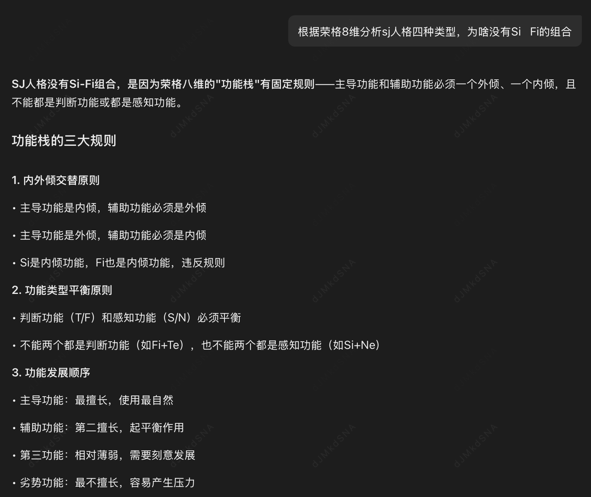
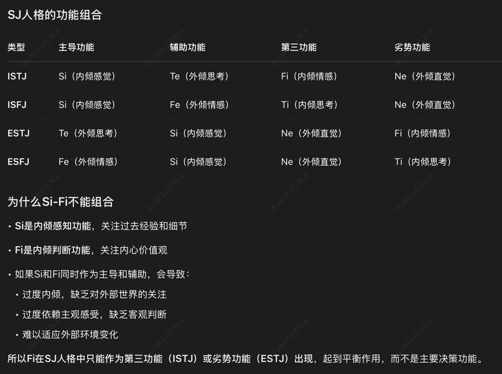
```
一、核心功能通俗比喻

外向感觉（Se）："现场直播导演"
眼睛就是摄像机，随时捕捉环境变化
活在当下，反应快，喜欢新鲜刺激
典型表现：看到新餐厅就想去，遇到机会就行动

内向感觉（Si）："历史档案管理员"
大脑里有个经验库，遇到新情况先查档案
喜欢熟悉的事物，做事有固定流程
典型表现：喜欢走熟悉的路，讨厌突发状况

外向直觉（Ne）："创意联想大师"
看到一个点，能联想到无数可能性
喜欢探索新想法，讨厌被束缚
典型表现：脑洞大，点子多，容易分心

内向直觉（Ni）："未来预言家"
能洞察事物本质，预见未来趋势
喜欢深度思考，追求意义
典型表现：说话有深度，能看到别人看不到的东西

外向思考（Te）："效率执行官"
注重结果和效率，喜欢制定计划
逻辑清晰，目标导向
典型表现：做事有条理，讨厌浪费时间

内向思考（Ti）："逻辑分析家"
喜欢分析事物原理，追求逻辑完美
独立思考，不盲从权威
典型表现：爱问"为什么"，喜欢拆解东西

外向情感（Fe）："和谐调解员"
关注他人感受，维护群体和谐
善于沟通，有同理心
典型表现：能察觉别人情绪，喜欢帮助人

内向情感（Fi）："价值观守护者"
有强烈的个人价值观和信念
忠于内心，追求真实
典型表现：为信念坚持，讨厌虚伪

```
# 气质Temperament 性格Character 人格Personality
## 气质
气质是与生俱来的、由生理基础决定的、相对稳定的心理活动的动力特征
主要类型（希波克拉底的四体液说）：
胆汁质：精力旺盛、反应迅速、情绪强烈、易冲动
多血质：活泼好动、反应迅速、兴趣广泛、注意力易转移
黏液质：安静稳重、反应缓慢、情绪稳定、注意力持久
抑郁质：敏感细腻、反应缓慢、情绪体验深刻、孤僻

## 性格
性格是后天形成的、与社会环境密切相关的、对现实稳定的态度和习惯化的行为方式
主要结构：
态度特征：对现实的态度（如诚实、虚伪、勤劳、懒惰）
意志特征：行为调节的自觉性和自制力
情绪特征：情绪活动的强度、稳定性、持久性
理智特征：认知活动的特点（如观察力、记忆力、想象力）

## 脾气
脾气是情绪反应的强度和表达方式，是情绪特征的外在表现，属于性格的情绪特征维度
主要表现：
急躁型：情绪反应强烈、易怒、缺乏耐心
温和型：情绪反应平和、有耐心、不易发怒
暴躁型：情绪爆发快、强度大、难以控制
沉稳型：情绪稳定、不易波动、控制力强

## 人格
气质+性格=人格

# 各大心理理论 行为学 性格学 人格学

## 行为主义理论(研究性格)
巴甫洛夫：通过狗的实验发现条件反射，提出"刺激-反应"联结，人是机器人,对外界的器械反应，核心观点,人在本质上是相同的

## 精神分析理论(研究性格)

弗洛伊德，人是动物,本能生物,核心观点,人在本质上是相同的

阿德勒 ，目的论
荣格，荣格8维

## 人本主义理论(研究性格)
马斯洛的需求层次理论

## 气质类型理论(研究气质)
盖伦四种体液理论 ，四种体液决定我们的行为和观念
柏拉图&亚里斯多德 四种性格类型

# 语言和工具
语言:我们如何与他人沟通
工具:我们如何使用工具实现自己的目标


## 语言
绝大部分人使用具体的语言使用方式，少部分人使用方式比较抽象
有些人倾向于传递眼前的事物，另一些人说话倾向于传递象征信息

有些人通过直觉自省为自己定位(自治)，另一些人通过感知观察寻找自我定位(他治)

## 工具
对工具的选择和使用，一半人使用实用性的方法，一半人采用合作式方法
实用性工具采用最有效的方式实现目标，以最经济作为唯一的衡量标准，最小成本最短时间
合作式通过和别人和睦相处来实现，谁应该使用它，其他人怎么看待这个工具
实用性或者合作式是优先级不同，大部分人都知道和睦相处以及采取最有效的方式实现目标，只是本能决定我们使用合作式还是实用性

实用性也分具体的 和 抽象的
抽象的先弄清楚方法和结果的关系，使用的会迅速行动起来
# 领域解释
## 战略 vs 战术
战略是"做什么"（方向性决策），战术是"怎么做"（具体执行方法）
战略是宏观层面的长期规划，关注整体目标和资源分配，解决"打什么仗"的问题。比如企业决定进入新市场、国家制定五年发展规划，这些都是战略层面的决策。

战术是微观层面的具体行动，关注执行细节和短期效果，解决"怎么打仗"的问题。比如营销活动如何开展、具体战役如何部署，这些都属于战术范畴。

简单来说，战略决定方向，战术决定方法。战略错了，战术再高明也难以成功；战术错了，战略目标也难以实现。两者相辅相成，共同构成完整的决策体系

## 技巧 vs 技术
技巧是主观的经验性能力，技术是客观的知识体系
是个人通过实践积累的经验和能力，具有主观性、经验性和个体差异性。它强调"怎么做得好"，表现为熟练程度、灵活性和创造性
是系统化的知识和方法体系，具有客观性、可复制性和普适性。它强调"做什么"和"为什么这么做"，表现为标准流程、原理和规范。比如：音乐理论、绘画技法、运动训练方法等
技术是技巧的基础，技巧是技术的升华。掌握技术后通过大量练习才能形成技巧，而技巧的总结提炼又能丰富技术体系。两者相辅相成，共同构成专业能力的完整维度。

## 抽象实用 vs 具体实用
抽象实用:最高效率
具体实用:最佳效果

抽象实用关注的是系统、理论和原则的效用，而具体实用关注的是当下、具体行动和工具的效用

抽象实用是 “道” ，重战略和原理。它回答“为什么”和“最终应该是什么”。
具体实用是 “术” ，重战术和操作。它回答“怎么做”和“现在是什么”
最好的解决方案往往来自于二者的结合：用抽象实用思维来制定正确的战略和方向（确保我们在做正确的事），用具体实用思维来高效地执行和落地（确保我们正确地做事）。
一个伟大的产品既需要抽象实用者构架出优雅的系统模型，也需要具体实用者将其打造成用户易用的工具

## 热情 vs 兴奋
热情是内在的想法,目标引发的情绪，兴奋时游戏、挑战引起的情绪


## 秩序 vs 组织
秩序（Order）指的是系统内部各要素之间相对稳定的关系状态和运行规则，强调结构、规则和稳定性。秩序是组织运行的结果和表现，体现为系统内部的有序性、可预测性和协调性。例如，一个国家的法律体系、社会规范构成了社会秩序

组织（Organization）则是指为实现特定目标而建立的结构、机制和人员安排，强调设计、构建和运作。组织是创造和维持秩序的手段，包括组织结构、制度设计、资源配置等要素。例如，政府机构、企业部门都是具体的组织形式。

核心区别：组织是"如何构建"，秩序是"构建后的状态"。组织是主动的、动态的构建过程，而秩序是被动的、静态的运行结果。组织通过制定规则、建立结构来创造秩序，秩序则是组织有效运作的体现。

在战略管理中，需要先设计合理的组织结构和机制（组织），才能实现系统的高效、稳定运行（秩序）

## 发明 vs 建造

发明（Invention）是从0到1的过程，核心是创造新概念、新原理、新方法。NT型人擅长跳出框架思考，发现现有系统的缺陷，提出颠覆性的解决方案。比如INTJ的战略规划、INTP的理论构建、ENTJ的组织创新、ENTP的创意发散，都属于发明范畴。

建造（Building）是从1到100的过程，核心是将概念转化为现实、将想法系统化。这需要将抽象理念转化为具体结构，建立可执行的体系。比如INTJ的战略执行、INTP的理论验证、ENTJ的组织管理、ENTP的方案落地，都属于建造范畴。

## 皮格马利翁计划
强迫别人朝着自己期望的方向发展和改变

## 自豪 vs 自尊 vs 自信

# SP(技艺者artisan,artifactor)
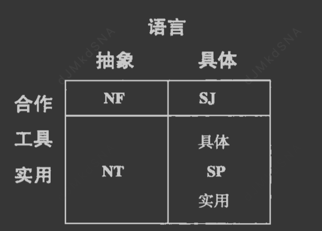
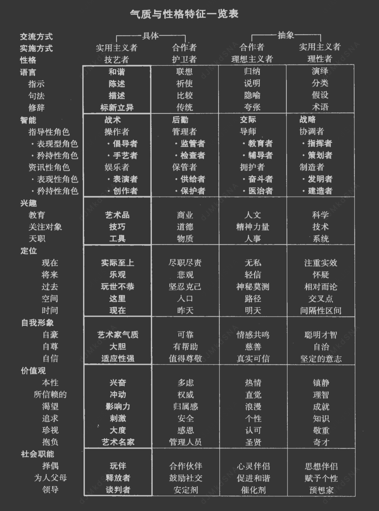

## 第一性原理
SP型（如ESFP/ESTP/ISFP/ISTP）的底层逻辑是"感官输入-即时反应"模式，其主导功能为外向感觉（Se），核心特点是：
先干了再说
敏锐捕捉当下环境细节
快速适应变化
追求即时体验和刺激,喜欢感官上的愉悦
```
SP型（如ESFP/ESTP/ISFP/ISTP）：显示器。SP型人格注重当下体验和感官输入，就像显示器实时呈现画面，追求即时反馈和刺激。他们灵活应变、行动导向，
如同显示器快速响应输入，展现丰富多彩的体验。

```

```
1. 信息处理机制：感官优先模式

SP型的大脑采用"自下而上"的认知模式：
优先处理感官输入（视觉、听觉、触觉等）
快速整合环境信息
即时做出反应，而非先对比经验
这种机制的优势在于反应速度和灵活性，能快速应对突发情况。

2. 时间导向：现在导向

SP型的时间观是"活在当下"：
关注当前的机会和体验
对未来的规划相对灵活
更愿意根据实际情况调整计划
这与SJ型的"过去指导未来"形成鲜明对比。

3. 决策逻辑：情境适应性

SP型的决策过程：
感知当前环境 → 快速评估 → 即时行动 → 边做边调整
核心驱动力是"抓住机会"和"避免错过"
4. 价值判断标准
ESFP/ISFP（Fi辅助）：以"个人价值观、审美体验"为判断标准
ESTP/ISTP（Ti辅助）：以"逻辑分析、效率优化"为判断标准

SP型的典型行为：
观察力敏锐，能快速发现细节变化
行动力强，想到就做
适应能力强，能快速应对突发状况
追求新鲜感和刺激
对规则和程序持灵活态度
与SJ型的对比：
SJ型：先评估风险，制定计划，按部就班执行
SP型：看到新机会就行动，边做边调整

```

敏感的感知力，战术大师，技巧是他们思想关注的焦点，实用至上，活在当下，灵活应变，渴望自由，喜欢制作具体而实际的物品，制造以感官刺激的物体(音乐，文学,舞蹈，雕塑，会话，建筑，体育，医学)
从感官生活获取快乐，不是从积累资产,也不是从道德或者逻辑对话。
他们重视经验和技巧，是机会主义者，关注利益和报酬，会具有剥削性。他们是感官敏锐者，他们可能运动神经发达。
他们用具体的语言交流，会选择实用性的方法来实现自己的目的。
他们没有高尚的志向，不在乎自己是否具备自省，他们关注现实世界实际发生的事情。


```
SP型（Se）的典型表现：
说话时眼神灵动，观察周围环境
喜欢尝试新事物，讨厌重复
反应快，能快速抓住重点
容易分心，注意力随环境变化
像"现场直播导演"：眼睛就是摄像机，随时捕捉环境变化，快速切换镜头，追求即时效果
特点：看到新餐厅就想去，遇到机会就行动，讨厌按部就班
```

## 具体的语言交流
讨论此时此刻正在发生，以及即将发生的事情,绝大多数SP不会把时间花在考虑根本无法观察或者接触的事物上。
他们在讨论事物时通常关注其字面含义，不深入象征含义，他们更偏爱直白的明喻，避免使用暗喻。
他们的语言很少出现计划，规划字眼。他们更倾向于明确描述具体的事物，而不是做概括归纳。
他们更倾向于讨论实际存在的单独事物，而不是讨论事物的种类。
思想上，他们通常重经验轻理论。抽象的概念很难吸引SP的注意力。他们更喜欢无需考虑原则假设且与想象无关的内容。
敏感的感知力，知道什么话让人听起来舒服满意。他们往往选择具体的语言表达他们看到的实物和感觉。
他们对身体的自我感觉往往最好。

## 具体的实用性的工具使用原则
他们的战术技巧越来越熟练
为了实现自己的目标，技艺者通常考虑什么方法最有用，什么工具最合适，而后才思考社会的认可。
只有有益有用的事物才能引起技艺者的注意和兴趣，要么能发挥作用，要么很实用。
实用性也有具体和抽象的区别，
SP型人不会像NT型人在使用工具前先弄清楚方法和结果的关系，他们会毫不犹豫选择实用的方法或工具，迅速行动起来。

## 战术天赋

SP擅长战术性改善他们身边的环境，改善自己状态的行为艺术，倾向于实践。实时的寻找机会和突破角度，做出有效行为，使自己获利。
无论是美术，飞行，打篮球，战场上当将军，还是演讲者，商人，政客，他们具有敏锐的感知力，最擅长用自然资源。
总是自如运用工具，巧妙记性发挥，他们对工具使用充满兴趣。

## 兴趣
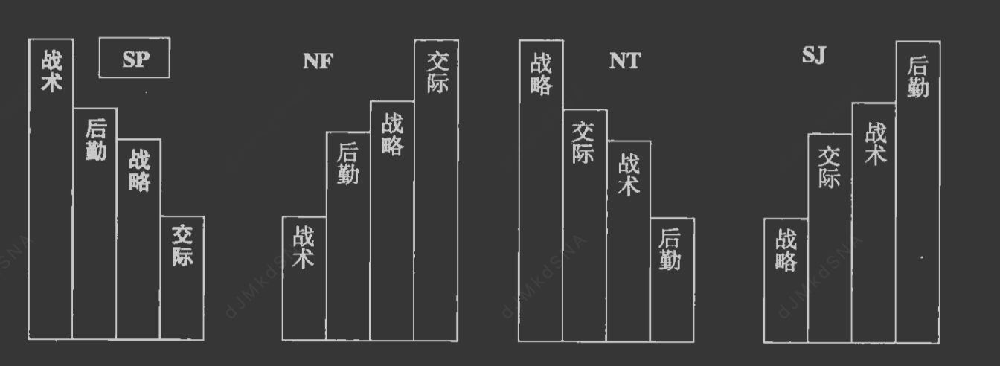
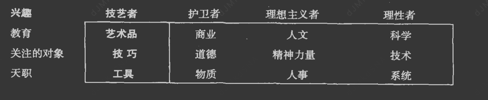
他们对精神力量没有兴趣，不会为道德忧心忡忡，擅长和工具和装备打交道。

### 喜欢艺术
绘画,雕塑，表演，体育，文学，身体，机械，喜剧，工业，交易艺术

### 专注技巧technique
有实践经验和个体差异性,且有主观性,为了让技术完善,他们愿意克服困难花很多时间。
这点在艺术家和运动员体现最为明显，技巧始终是他们思想关注的焦点

### 对使用工具的职业兴趣
喜欢各种器械，装备，他们是工具的使用者，驾驶飞机，轮船，画笔，手术刀，战士，猎手

## 定位
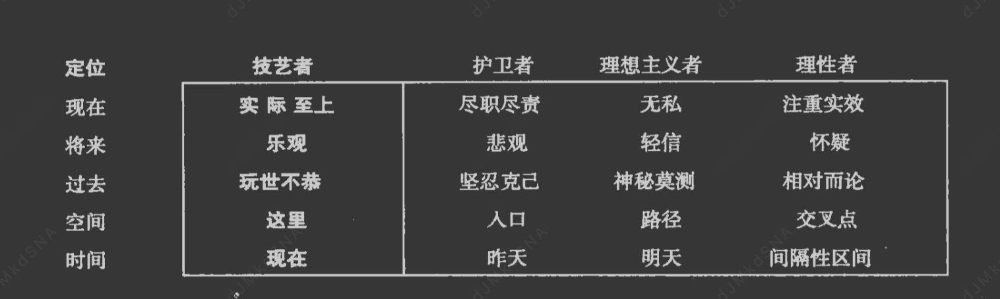
### 务实面对一切
为了得到自己想要的一切，他们可以采取任何方法，无论是无理的还是惯例，只要能实现目标，
他们关心有什么好处，能从中得到什么，这和我有什么关系，回报是什么，务实就是具体的实用主义。
为了实现目的，技艺者可以付出任何努力，不计后果和代价。理性者追求用最少得努力换取最理想结果。

### 展望未来的乐观
乐观主义，他们比其他类型更容易因为意外事件影响而消沉。

### 过去
他们对于过去，无所谓的态度面对逆境，会说这就是生活，他们对人类行为，不会认为别人高贵，
他们会思考人们送礼物的意图。

### 从这里开始
对于活动，他们只想参与进去，而不是当观众，他们全神贯注在此时此刻发生的事情上

### 从现在开始
更加重视现在的生活和行为，对于SP人，没有比现在更重要的时刻了。面对过去和未来，他们似乎健忘。
他们很少反思自己的错误，很难从以往错误吸取经验，可能陷入恶性循环。

## 自我形象
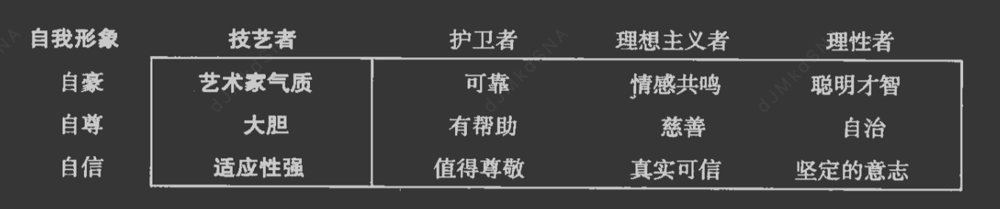

要自我感觉良好，SP认为需要具备艺术家气质，大胆无畏，很强的适应性。
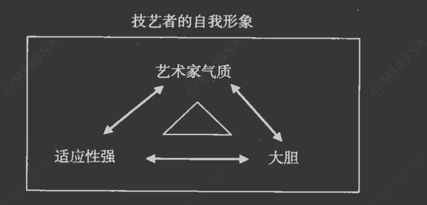

### 对艺术气质的自豪
技艺者向他人展示优雅的行为，为了追求艺术气质，他们可以一遍一遍的练习尝试。
比如舞蹈，开车。
他们重视大胆，以大胆自豪。

### 大胆创新的自尊
技艺者认为自己勇敢，大胆，敢于冒险，大多数跳伞运动员，赛车手，雇佣兵是SP
交易员和投资商也可能是喜欢冒险的技艺者。
他们更倾向于需要勇敢的身体行为的工作，表演，体育，建筑，摩托，飞机，消防员

### 适应能力自信
他们的自信建立在快速适应周围的环境。他们是最灵活，能根据环境快速做出反应的。
他们抗压能力强。


## 价值观
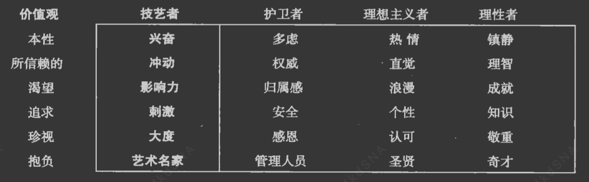
崇尚兴奋(来自外界)，珍惜冲动，看重自己对他人的影响,珍惜冲动
### 喜欢兴奋
他们像孩子一样，总是兴高采烈，他们享受振奋的状态。他们会被活动本身所吸引，他们爬山是为了心跳感，
他们的行为源于刺激和冒险和兴奋，他们讨厌单调和无聊。

### 信赖冲动
对SP，不管长远目标，为当前的行为而活才是最自由激动的生活。他们的目标更少更短暂，牵挂更少。
SP是最有可能响应远游的人。他们更加轻易的切断自己和社会家庭的联系，哪怕他们知道会对身边人造成伤害。
他们有时候像冲动的赌徒，但是冲动对他们不是负担，是兴奋剂。

### 渴望影响力
他们认为社会影响力至关重要，他们更渴望自己在社会发挥显著作用。这也是很多政治家是SP人的原因。
在政治中，可以尽情享受战术，兴奋，冒险，还拥有强大的政治影响力。

### 寻求刺激
他们相信变化是生活的调味剂，希望生活充满新鲜的经历。他们热衷于换房换车，尝试新食物。

### 认可慷慨大度
慷慨大度能打动他
## 社会角色
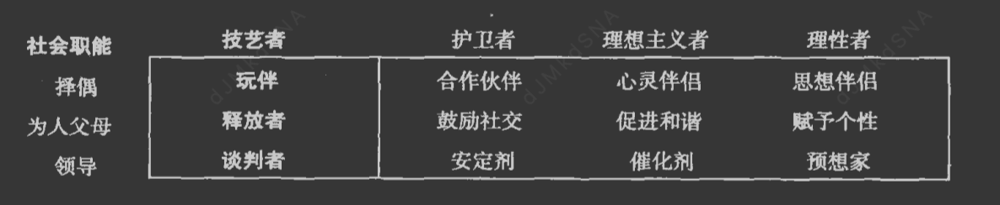
### 择偶
他们是最好享受的人，会把伴侣当成玩伴
### 父母
生性渴望自由，希望自己的孩子也能够自由。推崇冒险精神。
### 领导
机会主义本性，随时把握时机，化解紧张局势的谈判技巧。
## 变体
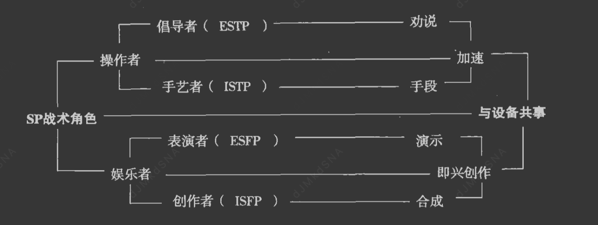
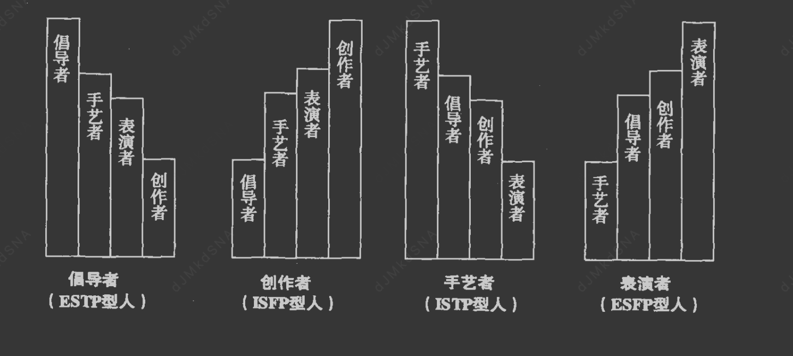
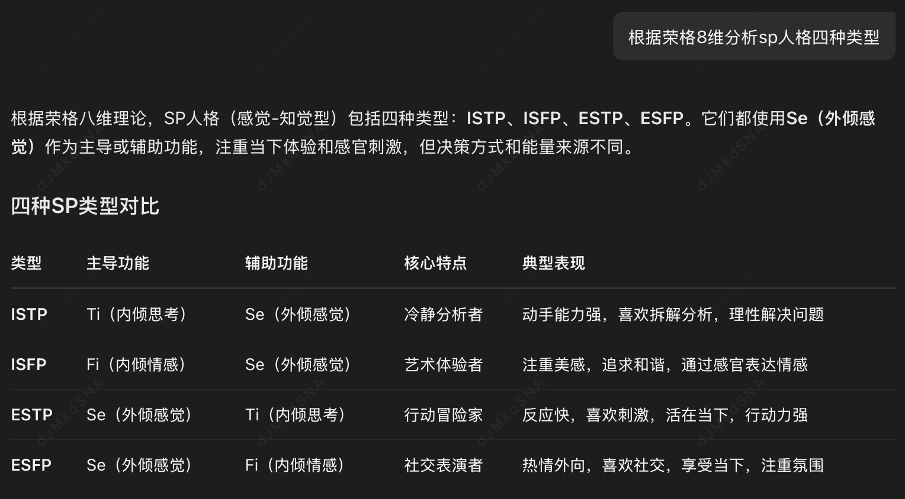
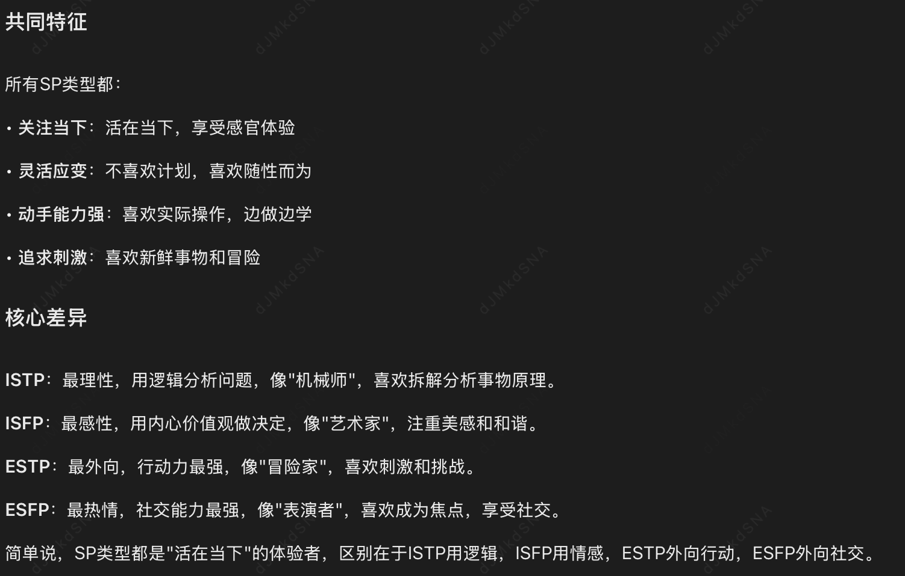
### 战术操作者STP(偏战术,偏做事)
操作者技艺者对利己行为尤其感兴趣，他们会采用一切策略或工具为自己的事业或项目牟利，
在处于需要运用适时战术位置时，为了增加成功几率减少失败可能性采取的明智行为。
他们能灵活使用策略实现意图，他们清楚自己想去哪也清楚最快的捷进。为了实现自己的目标，
他们可以毫无顾忌告诉他人你应该做什么。

ESTP:圆滑的操作者精力都用于说服他人加入自己，积极表现自己的进取心，人就是他们手中的工具，擅长关注人们面部表情和肢体，通过诱惑，说服，宣传，动摇他人意志。销售，投资，政界，娱乐圈，商业等


ISTP:注意力集中在运用工具和机械设备上，很乐意于工具打交道,他们使用清楚如何用工具有效完成任务。医生，赛车手，驾驶员，手工艺等
### 战术娱乐者SFP(偏感官,偏与人相处)
战术娱乐者擅长需要即兴发挥的招待行为。友善见多识广的娱乐者能轻易的演奏，创作，分享创作比指挥他人更轻松。
他们也能发现隐藏在环境的感官细节并自发反应。他们更倾向于即兴应急的做事风格，不会预先设定事物的发展。
ESFP:表演者擅长在他人面前即兴表演，让每位观众尽兴，表演技巧一流，他们的社交兴趣是刺激身边的人或者事，唤醒他们沉睡的感官，他们大度，友善，但不会有严肃认真的关系。他们适合演员，歌唱家，舞蹈家，喜剧演员
ISFP:创作者更愿意创作令人愉悦的艺术品，任何对图像，声音，味道，结构，香气敏锐的感知力，但很少考虑让自己事业更进一步。作曲家，画家，导演，小说家，厨师，服装设计


# SJ(守卫者)


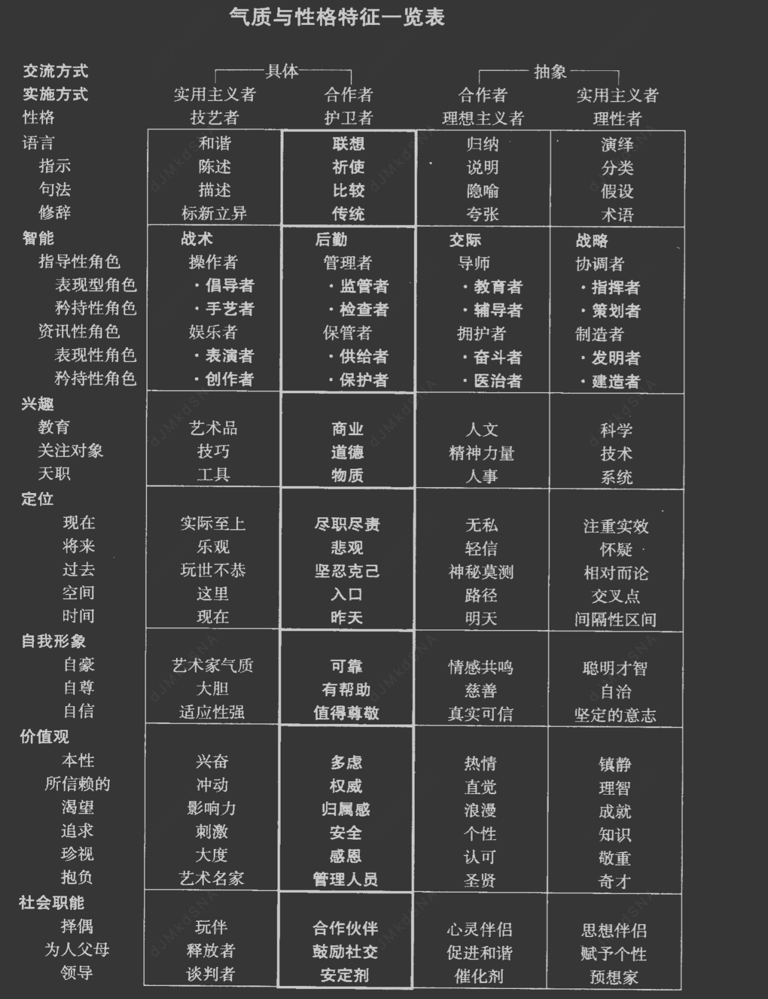


## 第一性原理
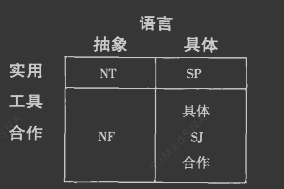

SJ型的底层逻辑是"经验积累-模式识别"模式，其主导功能为内向感觉（Si），核心特点是：
按规矩办事
系统化存储和调用过往经验
通过对比历史数据做出判断
建立稳定的认知框架
喜欢积累，有产者
```
SJ型（如ESFJ/ESTJ/ISFJ/ISTJ）：磁盘。SJ型人格注重经验积累和模式识别，就像磁盘存储数据、维护系统稳定。他们组织规划、遵循传统，
如同磁盘可靠地保存信息，确保系统有序运行。
```
```
1. 信息处理机制：经验数据库模式

SJ型的大脑如同一个不断更新的"经验数据库"，每遇到新信息时，会：
自动与存储的过往经验进行对比
寻找相似的模式和规律
基于历史成功/失败案例做出决策
这种机制的优势在于决策的稳定性和可预测性，但可能对全新情境反应较慢。

2. 时间导向：过去-未来轴

SJ型的时间观是"过去指导未来"：
通过总结历史经验来预测未来趋势
对传统和惯例有天然的信任
倾向于按既定计划执行，避免不确定性
这与SP型的"活在当下"形成鲜明对比。

3. 决策逻辑：对比验证法

SJ型的决策过程：
收集当前信息 → 与经验库对比 → 评估风险 → 选择最稳妥方案
核心驱动力是"避免重蹈覆辙"和"保持稳定"
4. 价值判断标准
ESTJ/ISTJ（Te辅助）：以"效率、逻辑、结果"为判断标准
ESFJ/ISFJ（Fe辅助）：以"和谐、责任、关系"为判断标准
四、实际表现特征

SJ型的典型行为：
注重细节和准确性
遵守规则和程序
责任感强，信守承诺
对变化持谨慎态度
擅长建立和维护秩序
与SP型的对比：
SP型：看到新机会就行动，边做边调整
SJ型：先评估风险，制定计划，按部就班执行

```

```
SJ型（Si）的典型表现：
做事有条理，喜欢列清单
对细节记忆准确，能记住过去的事
遵守规则，重视承诺
对变化持谨慎态度
像"历史档案管理员"：大脑里有个经验库，遇到新情况先查档案，对比过去成功案例
特点：喜欢熟悉的路线，做事有固定流程，讨厌突发状况

```
黑胆汁，海狸，松鼠

对规则制度有较强感知能力，相信规则，相信法律 ，擅长后勤，管理和维护 ，专注道德，捍卫对与错的实践
他们喜欢按照固定时间起床，固定管理洗漱，同一条路线上班，同一个时间去吃饭
他们可靠，乐于助人，他们认为服务是义务，他们是付出者，照顾别人
## 具体的语言交流
SJ讨论的话题也是客观世界的具体事物，讨论的话题大多是自己在客观世界看到的具体事物相关，商品，食物，贷款，薪水，天气，交通娱乐，电视电影
他们的话题连贯，会从一个话题联想到另一个与之有确切关系的话题，而不是像理性者演绎或者理想主义者归纳。
对于自己感兴趣的话题，护卫者会积累大量事实资料，使得自己在谈话时侃侃而谈，他们记住别人的名字和生日，住址等细微信息
可以轻易唤醒别人对另一个话题的回忆。
由于平时的积累，护卫者在有需要时才能轻松联想和使用这些信息，使他们侃侃而谈

他们说话时会比较正统，语言上会较传统的词汇表达，引经据典。

SJ话语往往有告诫之意，倾向于警告他人注意危险，
## 合作式工具使用原则
他们的后勤部署能力会越来越强
使用工具都有使用规则，SJ人会毫不犹豫认为需要服从这些规则。比如马路不能逆行，红灯没车也要等，旁边没人也要打
转向灯。他们是顺从，遵守，合作思维。
他们重视规则，他们认为长远看，忽视规则是通向毁灭的不归路。
他们认为我们应该与他人合作，在纪律和协作中完成目标。
护卫者倾向于指定和推行指导人类的法则，通过建立和遵守原则，制度，我们才能保卫自己的家园。
近一半总统是护卫者，他们可能是大学管理委员会成员，警察，司法官，法官。
他们对规则的观察和鉴别很敏锐。他们相信规则是社会之本。他们认为法律是有效标准。

## 后勤天赋
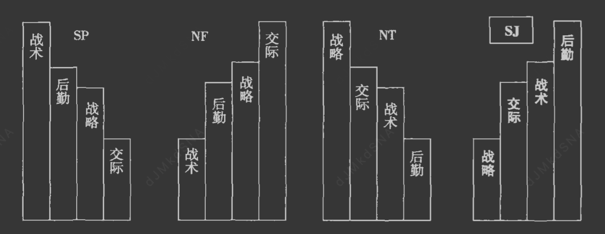

他们关心如何保持事物可靠，维持物质资源。


## 兴趣
喜欢擅长与物资打交道
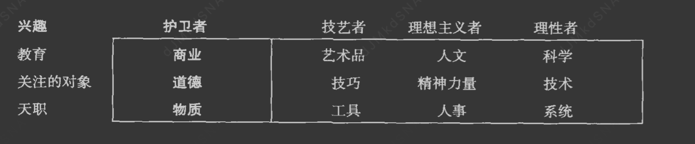

### 专注安全金融
税务，保险比较受亲来
### 专注道德
SJ他们有道德使命感，一种约束思想，知道该做啥不该做啥
NF的精神力量是感受性，用来了解自我与别人相处。
### 物资工作的职业兴趣
喜欢对物资管理有兴趣的工作，收集，存储，测量

## 定位
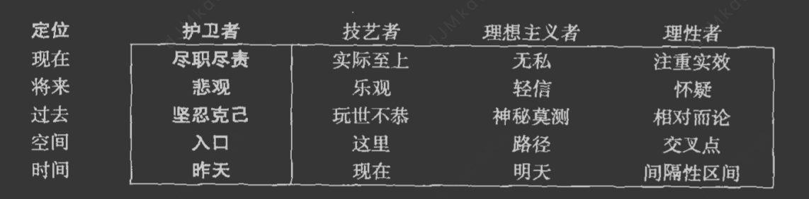
他们的观点是尽职尽责，面对将来过去较悲观
### 尽职尽业面对一切
尽职尽业的思想看世界，勤劳工作和精打细算，他们觉得勤奋工作和积累财富是每个人的义务
他们勤奋工作，精打细算生活，

### 展望未来时的悲观
大部分精力用于约束别人的行为，维持快速发展的现状，他们养成了最坏打算的习惯，做好准备比什么都重要
任何可能出错的事最终难免都会出错
做好准备比什么都重要

### 过去
坦然接受，他们是典型的宿命论
### 这里
他们密切关注每个人的安全和行踪
### 现在
他们的目光集中在昨天，他们对新生创新有怀疑，对过去充满敬畏，忠实于日常管理，按部就班。
他们喜欢按照固定时间起床，固定管理洗漱，同一条路线上班，同一个时间去吃饭，买同样的品牌。
他们觉得老方法是最好的方法

## 自我形象
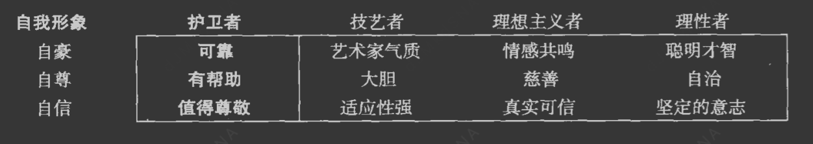
可靠，有帮助，值得尊敬
### 以可靠为基础的自豪
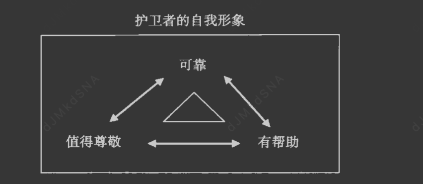
为了维持可靠形象，他们有时候不懂得拒绝，肩负额外负担，有的人会利用他们任劳任怨的心理
当他们努力得不到欣赏时，他们会觉得自己做得不够好，会做很多费力不讨好的工作来摆脱这种感觉
### 基于有帮助的自尊
SJ生来乐于助人，多做好事帮助他人获得自尊感，在他们眼里，服务是一种义务，他们的自尊建立在为他人服务的义务感上
他们在社区担任志愿者义工，在家做各种事情，他们十分关心他人。
他们认为服务是义务，不做就会背负自私的名号，他们的自助建立在为他人服务的义务感上，只有他照顾别人，不会出现
别人照顾他。
### 名望带来的自信
他们谦虚，低调，不爱出风头，讨厌出风头的人，公众的认可是他们自信的基础。在事业上，家庭上，社会上赢得尊重
是对他们最好的的奖励。

## 价值观

### 本性多虑
关心家庭，工作，家人，他们关心广泛，忧国忧民。容易受消极情绪影响。
他们往往很幽默，也有充实惬意的生活。
### 信赖权威
他们相信权威阶级系统，他们从小是乖孩子，听老师教诲，遵照老师要求做的
一般3/4老师是护卫者，教授书本知识，灌输遵守秩序的思想。
### 渴望归属感
他们对归属感十分渴望，会热衷参加各种团体
### 追求安全感
他们时刻警惕，关注危险
### 感恩
他们更加珍惜他人对自己的付出，他们无私尽力，感恩让他们很开心
### 成为管理者
他们想成为社会机构的领导人，成为管理者，变成权威。
## 社会角色
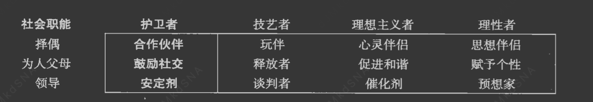
### 择偶
合作伙伴，他们把对方当做合作伙伴，有义务和他们一起作战，
### 鼓励交际的父母
他们希望孩子彬彬有礼，具备社会化，尽可能帮助他们，适应社会。关注端庄得体
### 稳定型领导
稳定的管理是优秀领导前提，该做什么，怎么做，派谁做。
他会建立一套细致规则，让每个人知道自己的职责。
## 后勤变体
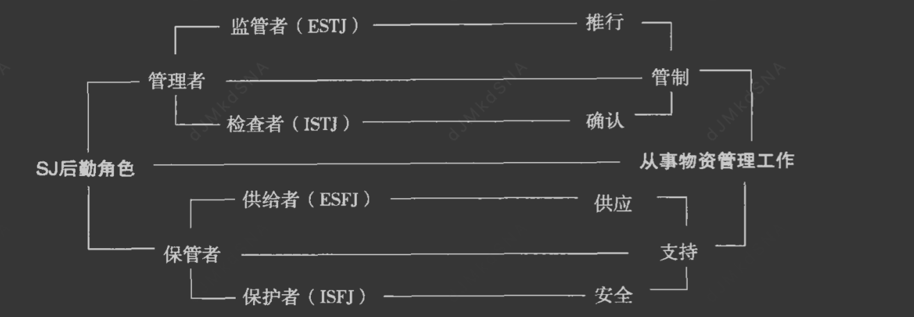
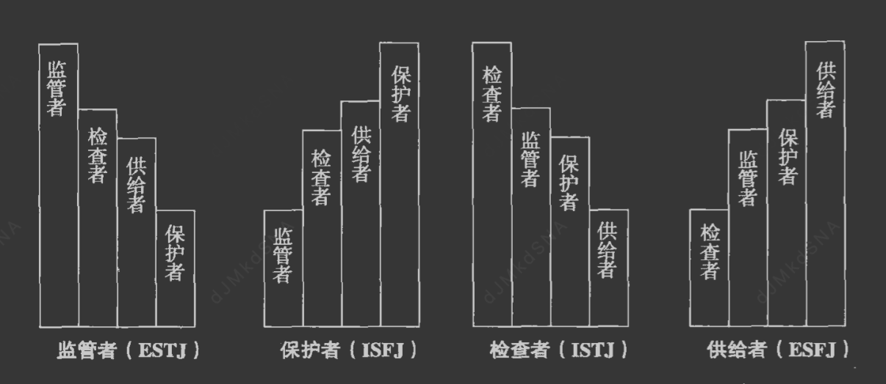
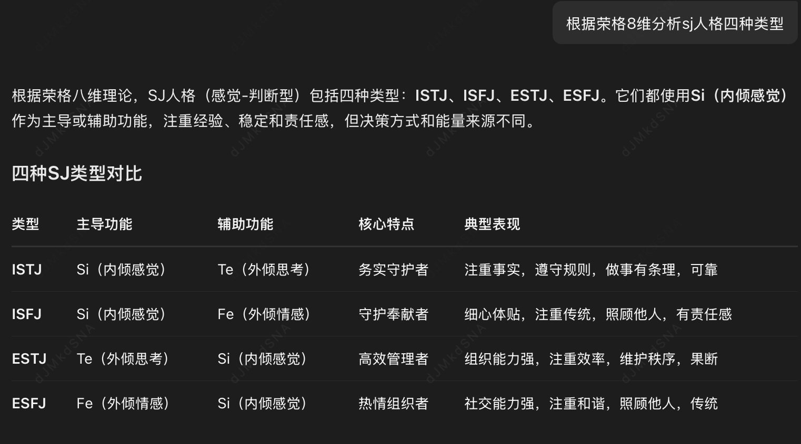
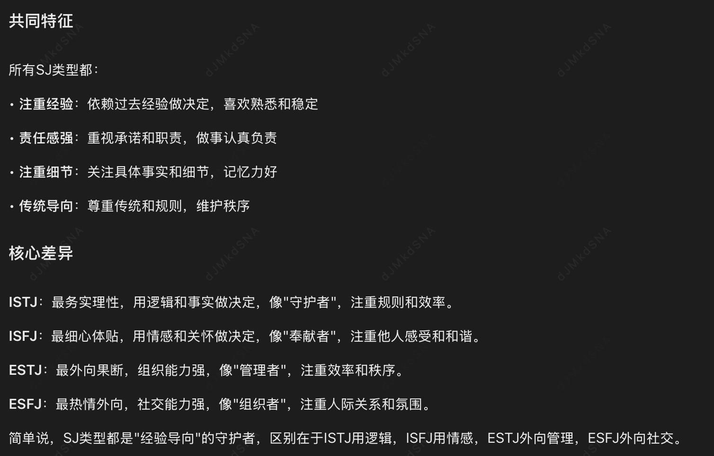
### 管理者(意志坚定型)
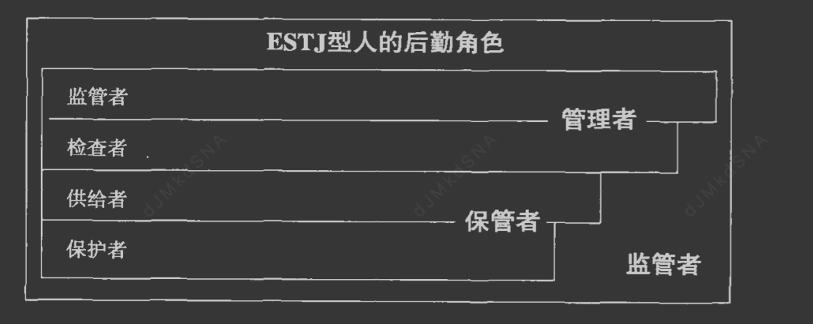
热衷承担管理职责，用严谨的标准来管理自己职权内人员和产品。指导性政策和程序管理者
第一要务是掌管一切，告诉他人怎么做。

ESTJ:监管者推行标准操作流程，关心约束人们是否符合行为标准和操作流程，很少关注人的安全问题，典型唯物主义者
        凡事讲究具体，详细表格和操作流程是他们最信赖的工具。愿意脚踏实地做人做事。
        军官不容忍自己部队出现违纪的人。他们有很强的社会性，崇尚经过时间验证的规则和行为模式。
        他们大多不善于聆听，不会耐心听反面意见。擅长规则程序和规章制度。适合法律，政治，警察，军队。
        传统和礼仪是他们人际关系的两大原则。
        他们对孩子的关心首屈一指，孩子个人主义和叛逆让他们忧心忡忡。
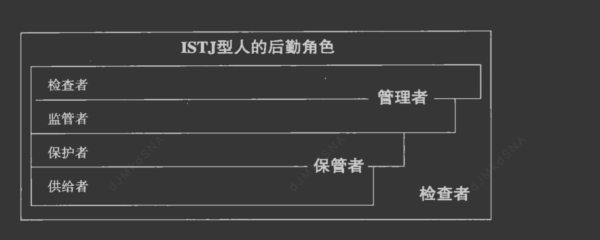
ISTJ:选择幕后工作，严格检查每件物品，鉴定员，审计员，家庭预算，他们都会仔细全面的审查，他们会仔细审查事物是否符合标准。
        他们极度可靠，他们语言简单朴质，不会炫耀，他们生活尽然有序，深知仪式重要性。他们认为所有计划都得正确执行，所有
        资源都维持在标准状态。一旦发现不规则的行为和产品，他们会毫不犹豫上报领导，别人会认为他们冷血。
        他们会成为优秀的银行核验员，审计员，会计。他们一诺千金，交往不提供虚假和不可靠信息。他们适合牙医，律师，军官。
        他们对待孩子比较严格，会制定家规。
### 保管者(友好型)
后勤支持，随时为自己的人和物品提供补给和帮助，咨询人力和财物保管。积累，存蓄，收集，采购

ESFJ:供给者为他人提供生活必需品，热衷为他人服务，雪中送炭的供给者能及时帮助团队成员。

ISFJ:让他人不受危险，保护别人的财产，关注其他人的安全问题，但很少愿意纠正别人。
    

# NF(理想主义者)
## 第一性原理
NF型人格的底层逻辑是"理想构建-价值驱动"(先想明白这事儿有没有意义，再决定要不要干)模式，其主导功能为直觉（N）和情感（F）的组合，核心驱动力在于通过直觉洞察构建理想图景，并基于个人价值观和情感连接推动行动，看感觉对不对
他们擅长归纳总结
他们做事的核心思路是：先看这件事符不符合自己的理想和价值观，如果觉得有意义、有价值，就会充满热情地投入；如果觉得没意思、没意义，就算再赚钱、再容易，也提不起劲

NF人遇到事情，第一反应不是"怎么做"，而是"为什么要做这个？"他们需要先理解背后的意义和目的，才能产生动力

他们是感觉敏锐者，他们擅长反思，喜欢归纳，充满热情，关注人的心灵，乐于分享，懂得自律。
他们是身份追求型人格，他们对他人的情绪能感同身受。他们接受能力强
不利环境下，理想主义变得极不理智，是因为强烈的消极情绪占据了他们，使得他们无法正确


```
NF型（如ENFP/ENFJ/INFP/INFJ）：操作系统。NF型人格关注意义、价值和可能性，就像操作系统连接硬件和软件，为系统赋予意义和方向。他们擅长理解人的需求、建立情感连接、激发他人潜能，
如同操作系统协调资源、提供用户界面、让整个系统"活"起来。
```
```
1. 追求"为什么"：NF人遇到事情，第一反应不是"怎么做"，而是"为什么要做这个？"他们需要先理解背后的意义和目的，才能产生动力。

2. 看重"感觉对不对"：他们做决定主要靠"感觉"——不是情绪化的感觉，而是这件事符不符合自己的价值观、道德观，能不能带来精神上的满足感。

3. 喜欢"画大饼"：NF人特别擅长想象未来，能看到各种可能性。他们不是活在当下，而是活在自己构建的理想世界里。

4. 在乎"人和人之间的连接"：他们很在意人际关系是否真诚、和谐，喜欢帮助别人成长，讨厌冷漠和功利。

```
```
底层逻辑的四个维度

1. 意义驱动（Meaning-Driven）

NF型人格的核心驱动力是寻找和创造意义。他们不满足于表面的现实，而是不断追问"为什么"，试图理解事物背后的深层含义和目的。这种意义导向使他们成为理想主义者和变革推动者。

2. 可能性导向（Possibility-Oriented）

NF型人格擅长看到"可能是什么"而非"现在是什么"。他们通过直觉功能不断生成新的想法、连接不同的概念，这种前瞻性思维使他们能够预见未来趋势和潜在的发展方向。

3. 价值判断（Value-Based Judgment）

情感功能（F）使NF型人格基于个人或集体的价值观做出决策。他们关注"应该是什么"而非"是什么"，追求符合道德、伦理和人文关怀的解决方案。

4. 关系连接（Relational Connection）

NF型人格重视人与人之间的情感连接和和谐。他们擅长理解他人情感需求，通过共情建立深度关系，这种能力使他们成为优秀的沟通者、激励者和领导者。

```
黄胆汁，不擅长控制自己的情绪
虔诚的教徒，有稳定的信仰，身份追求型人格，自省
敏锐的感受力
善于接受，接受能力强，适应能力强，善于调节，乐观，多情，性格柔和
直觉感受型
极富创造力
充满热情
仁慈善良
富有洞察力
虔诚

抽象的合作者
擅长归纳自己的想法和观点
能够敏锐的感知事物内在的联系
关注人的心灵
具有很强的第六感
他们稍微聆听就能从细节跳到对事物的总体把握
热衷于在不同事物间建立联系
他们的语言缺少循序渐渐地层次感，感觉一蹴而就
以众人一致意见为合作，合作是大家都认可统一的行为
关注的是精神力量和快乐
愿意热情赞美他们
## 抽象的语言使用方式
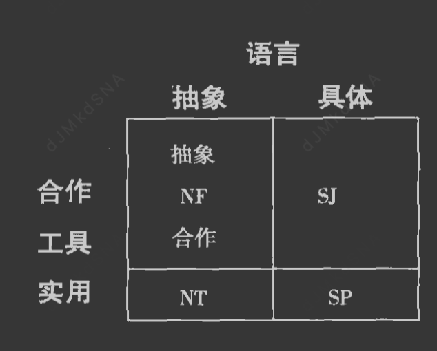
谈话时，理想主义者会很自然的想归纳自己的想法和观点，他们很快将话题从局部转向整体
他们能敏锐感知事物内在线索，他们喜欢跟着自己的感觉走，他们能从细节概括出整体。
他们喜欢揭开世界的意义和价值，他们的思想往往直击本质，他们追求绝对真理。他们会跟着直觉将原本对立的事物通过
某种关联起来。
他们可以轻而易举说出这个人是恶魔，这个人是天使。
他们的态度可能比较热烈明确，但是因为他们敏锐的感知力，他们会显得比较细腻

## 合作式的工具使用原则
以众人的一致意见为基础的合作，而不是护卫者那种以服从为原则的合作
```
NF型（理想主义者）的合作逻辑是"意义驱动"——他们需要先达成价值认同，只有当所有人都真心认同这件事的意义和方向时，才会投入合作。这种合作建立在"我们共同相信什么"的基础上，强调精神层面的共鸣和理想的一致性。

SJ型（护卫者）的合作逻辑是"责任驱动"——他们遵循规则和秩序，合作的基础是明确的职责分工、流程规范和权威认可。只要符合既定规则、有人负责、流程清晰，他们就会执行，不需要过多讨论"为什么"。

```
NF人认为实用主义如果不符合道德和法律要求，往往适得其反，人们不能为了提高实用性而无视他人感受。
NF人看来，斗争让人难受，他们往往通过安抚、调和、辅助来维持亲善的人际关系
他们接受工具发挥其功效的方式，但是必须严密审查，避免对大家产生不利后果。

## 交际天赋

他们往往首要考虑如何培养亲善的人际关系。
NF型人与人相处的交际水平也会越来越好
他们总是能迅速发现人和事物的共同点，懂得换位思考，他们关注事物的内涵。
他们喜欢社交，往往是分裂和歧视，争论让他们感到无比烦恼和焦虑。
他们认为宗教、道德、政治、逻辑都是强加在共有人性上的人为概念，他们更关注"共享体验"和普遍性真理。

## 兴趣
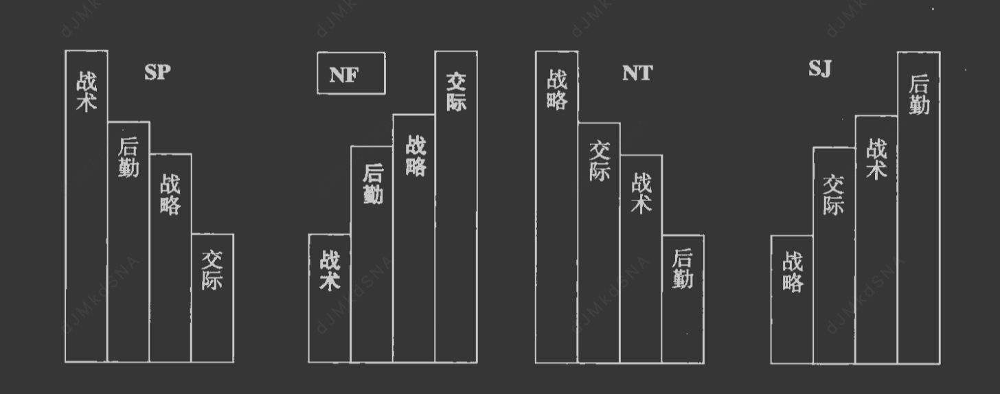
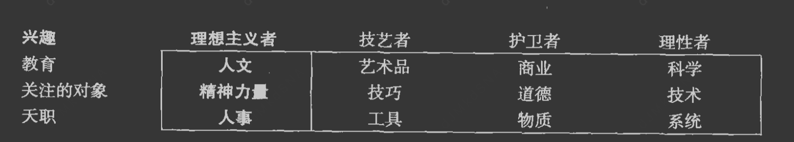
他们对交际行为的兴趣成为了他们锻炼社交技巧的最大动力，他们喜欢社交，唯一制约这个循环的因素是交际技巧的
质量和数量。

他们喜欢建立亲密关系也会带来麻烦，泛滥的同情心，他们的感情会迅速升温帮助他们化解矛盾。
他们需要和人们建立某种情感隔离带，避免太多麻烦事。
### 人文学科
他们会被人文学科吸引，他们从小构建精神力量，擅长人事相关的工作。
需要用文字传递思想的职业，更符合他们的天性。

### 社会学科
社会科学也让他们很喜欢，指引他们成长，帮助他人了解自己。

### 精神力量
关注精神力量，乐于助人，护卫者帮助他人是为了维护积极的自我形象，理想主义者更关注他们的精神力量。
NF,SJ都是道德守护者，NF更关注快乐和能量，后者更专注秩序和正义。


## 定位


### 利他主义
全身心的愿意帮助别人,利他主义，无私的面对一切。形而上的。
常常被其他人怀疑动机，他们愿意发现其他人的美德，帮助他人开发美德。

### 展望未来天真
他们容易轻易相信其他人，他们容易有固执的信念，坚定不移的倡导它
但是当某个事情缺乏深远持久的意义是，他们参与运动的热情就是昙花一现。

### 关注过程和路径
他们关注冒险，精神追求，

### 过去
他们会用一种神秘莫测的观点解释一切


## 自我形象

### 情感共鸣的自豪
与亲近的人情感共鸣让他们自豪，如果不能和身边人分享经历和情感，缺乏亲善意识，他们会觉得生活没有意义。
他们参加组织各种活动的目的，都是为了找到一种自由充满爱意的生活方式。
### 慈善为基础的自尊
他们往往擅长反思，保持善心，对内心的敌意和抽哼，会极力压抑。他们会奋力反抗任何残忍行为。
他们欣赏护卫者的善行和理性者的自律，但是对技艺者的胆大肤浅很反感。
### 依赖真实可信的自信
他们展示的自我形象必须真实不虚假，一旦出现虚伪和伪装，他们会缺少自信。

他们既要保持真实的自己，又要尽量取悦别人，他们会陷入矛盾中，需要学会平衡这种矛盾。理性者通过将评定自身言行的权利留给别人，对别人的评价极其敏感

## 价值观
他们相信心灵是人性的灵魂，技艺者。他们重试热情(内在),珍惜直觉，看重自己与他人的沟通交流。他们的奋斗目标是成为圣贤而不是艺术家


### 本性热情
很容易动情感,来得也快去的也快,大多有积极性格

### 信赖直觉
可以感受到他人的切肤之痛，设身处地为他人着想
以至于下意识按照别人的方式说话和行为，对别人感同身受越多，越想将自己的观念强加给别人


### 追求个性
花了大量时间寻找自己的个性和自我，他们对他人和自己，他们所关注的只有自我，每个人的核心本质。
他们会对地球上竟然有90%的人不关心自我而感到心烦意乱。

### 珍视认可
认可他们让他们很开心
### 立志为圣贤

## 社会角色


### 择偶
心灵伴侣，他们希望对方不开口也了解自己。
### 融洽型父母
培养积极的自我形象，关注自尊心
### 领导
引导，关注下属的良好感觉
## 角色变体
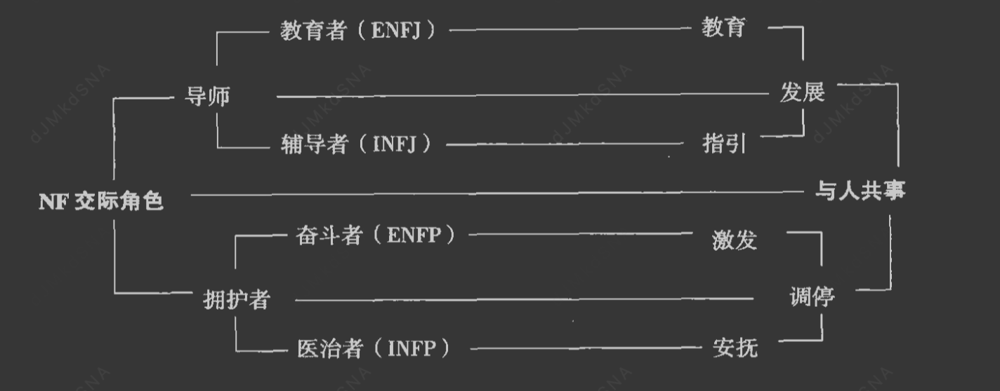
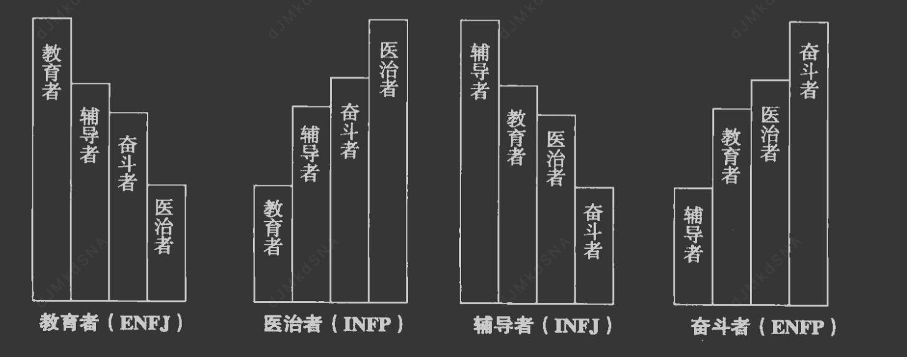
### 交际型导师型

教育者ENFJ，自我身份是他们永远追求的目标，他们珍视他人的认可，他们擅长规划，他们擅长大规模团队教育，交际，善于规划的理想主义者，导师这个角色会给他们带来很大满足感
他们喜欢明确的安排和计划，指引他人思考。他们有一种天生的创造力和自信。
他们擅长启发开导不同层次的学习者，不断完善自我。他们喜欢人文科学，精神力量是他们关注的焦点。
他们擅长人事相关工作，擅长探索，目光焦点始终在未来。情感共鸣，慈善，真实可信是他们自我形象的根基。
和ESFJ的差别，ESFJ是天生的主人，他们会让每一位客人妥善招待，让自己表现得得体大方，关注道德层面
ENFJ更关注个人成长和发展，他们认为人永远是第一位。由于他们具有感同身受的能力，他们可能下意识模仿他人。
他们的洞察力很强，他们不仅知道自己内心的想法，也能准确获取他人的心理动向，对他人意向的理解和判断，他们很少出错。


辅导者INFJ，他们渴望为他人的幸福贡献自己的力量，乐于指引他人获得更高层次的自我实现。他们的内心世界很丰富，但是他们只会与那些值得信赖的人分享感受。
他们强大的接纳和感知能力容易让他受到身边人的伤害，这会让他们变得安静。在所有类型人中，他们是最有可能理解通灵现象的。
他们想象力丰富，有一定的完美主义思想。他们是奉献型父母。
### 交际型拥护者
奋斗者ENFP，他们喜欢探索，和开放性体验。他们是提供信息的拥护者，他们将自己发现的故事告诉大家，希望从中揭示一些真相激励他人采取行动。
渴望揭示社会事件的强大动力，奋斗者可以不知疲倦的和他人交流。他们的热情极具感染力，他们是所有人中最活泼有朝气的人。
拥护就是说出自己的观点，信仰，目标，他们侧重于明确的目标，满腔热血，为一个目标全力以赴。
奋斗者渴望走遍千山万水，亲身体验发生在他们身边的有意义的事情，他们会热情澎湃投入到奋斗行为，拥护他们信仰的 真理和理想。
他们善解人意，可能经常做出离经叛道的行为，他们带来的惊喜和诧异无处不在。


医治者致力于个人安抚，更擅长化解矛盾，帮助身边人恢复健康心理，是为了完成自我修复。每隔一段时间，医治者便需要回到个人空间， 静静思考恢复。

# NT(理性者)
猫头鹰

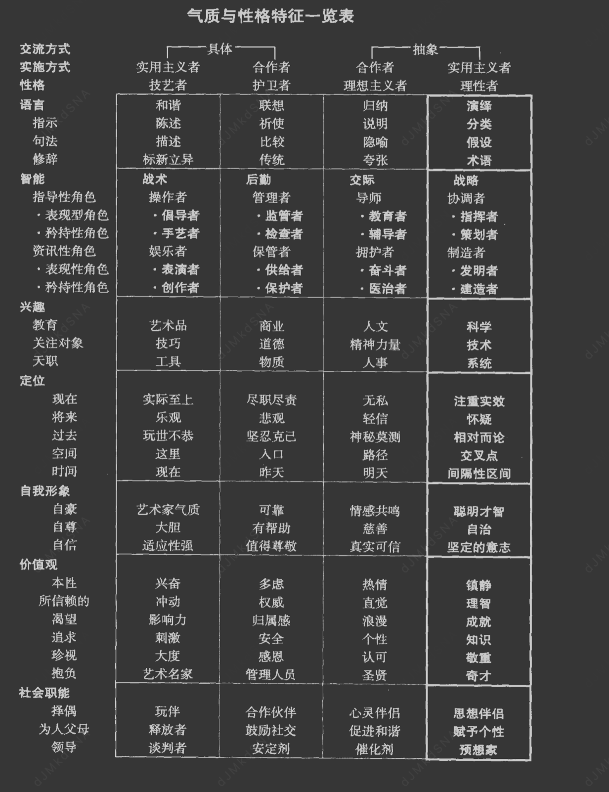
## 第一性原理
NT型人格（如ENTP/ENTJ/INTP/INTJ）的底层逻辑可以概括为"抽象建模-系统优化"模式，其核心运作机制围绕概念化、理论化和效率最大化展开
他们是知识寻求性人格
```
NT型（如ENTP/ENTJ/INTP/INTJ）：CPU/处理器。NT型人格追求逻辑、效率和系统优化，就像CPU处理信息、执行计算、优化算法。
他们擅长抽象思维、理论构建、战略规划，不断寻找更优解，如同CPU通过逻辑运算提升系统性能。
```

```
NT型人格的第一性原理是通过构建抽象模型来理解和改造世界。他们不满足于直接经验（S型）或情感价值（F型），而是追求事物背后的规律、原理和系统结构。这种认知模式体现在：

1. 概念化驱动：NT型人天然倾向于将具体现象抽象为概念、理论和框架。他们看到一棵树，思考的是光合作用的原理；遇到人际关系问题，会构建心理模型来分析互动模式。

2. 系统思维：他们习惯将事物视为相互关联的系统，寻找变量之间的因果关系和反馈循环。这种思维方式使他们擅长识别模式、预测趋势和优化流程。

3. 效率导向：NT型人追求"最优解"，不断质疑现状、挑战假设，寻找更高效、更合理的解决方案。这种驱动力使他们成为天生的创新者和改革者。

```
## 抽象语言使用
理性者讨论的大多数是概念性事物，存在眼前可以被感知的具体事物，他们往往不太感兴趣。他们往往谈论想象当中的概念性事物。谈话中，理性者会试图避免
与话题无关的内容，他们不愿意反复强调自己的观点，他们会觉得这些事显而易见的。他们的简明风格，往往让其他人很难跟上他们的思维。

他们擅长演绎推理，语言和思考措辞比较精准。对应字词意义的界定，理性者常常非常严格。
他们愿意花费大量时间区分意义相近的字词，可能让其他人会觉得拘泥于琐事。按照逻辑来安排字词的顺序保证语的一致性也是一种推理。

很多理性者喜欢阅读词典，翻阅词典让他们清楚知道每个词语的精确含义。他们词库存储量越来越丰富，他们可能喜欢玩文字游戏。
## 实用至上的工具使用
在追求自己的目标时，他们奉行的是实用至上的原则。他们更加看重工具的时效性，而不是他的社会可接受度，法律道德上人们是否接受他。

他们不排斥和社会组织合作，但是他们会优先考虑让工具最大限度发挥作用，将取悦他人放在第二位。

和SP实用性的区别:SP关注有效的操作，NT关注高效率的操作。一个操作可以实现目标，但是成本消耗过高，我们只能说是有效的，不能说是高效的。
NT寻找到的是最少的投入换取最大产出的高效率操作。

即使自己的实用主义得不到社会认可，不符合政治制度，理性者也会我行我素。他们会虚心听取任何人有效意见，但是会忽略反对实用主义的观点。

理性者常以原动力者自居，他们认为自己有义务高举实用主义大旗，对传统提出挑战，将高效率的意图贯穿在事业中。
## 战略天赋
为自己设定的目标大都与提高系统效率有关，有的关注社会系统，有的关注机械系统。 不管是哪种，NT人的目标都是单一明确，提高该系统的效率。
理性者分析系统的方式很简单，寻找低消耗和0消耗的操作方式，他们擅长从复杂的系统发现错误，防止系统出问题，系统有问题时,他们是所有问题的解决者。


有的理性者对秩序更感兴趣，称之为协调者(系统运作)，有的理性者对组织更感兴趣，称之为制造者(系统发明创造)
秩序有空间秩序(军队军衔)，时间秩序(手机发射顺序)
协调者更喜欢排列的工作，军队协作作战战略部署，打麻将排列策略。
制造者更喜欢建造，构建系统需要的各个组成部分，发明机械装置，设计结构。

## 兴趣
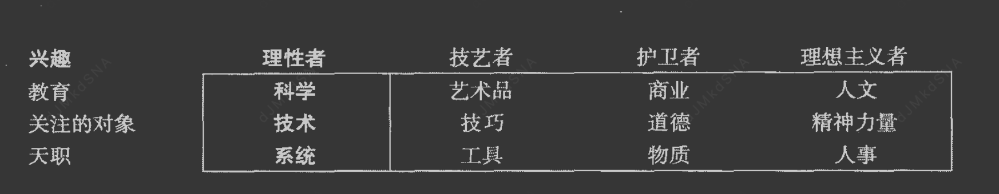
和NF人一样，他们喜欢使用抽象的语言，喜欢自省。他们往往会被科学和数学课程吸引。对艺术和手工活动是业余水平。
他们对技术表现出很浓厚的兴趣，他们对道德层面的话题不感兴趣。他们最好找一份与系统相关的工作。
### 热衷科学
他们在古代是巫师，用自己的意志操控自然。 中世纪变成了炼金术士，现在是科学家，唯有可续让他们有强烈的求知欲
他们有很强的探究自然规律的欲望，他们会继续观察世界，设计自己的试验。
### 专注技术
理性者关注技术，技艺者迷恋技巧，技术是他们的兴趣所在
### 对系统感兴趣
理性者认为机器和有机体充满了无穷的魅力，包括人类学，生物学，动物行为学，心理学，社会学。
机器则是工作师的职责范涛。能激发他们兴趣投入到系统工作的事复杂性本身，与他是有机体还是机器没有任何关系。


## 定位
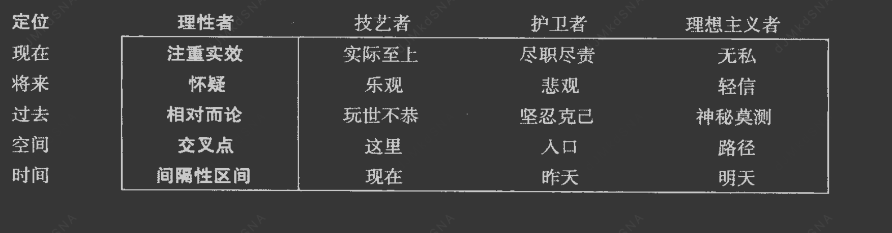
在遇到意外或者危险打击时，我们会暂时失去自己的社会定位，但是我们很快又会重新找到自己的社会位置。
对于现在，他们非常注重实效
面对未来却有些多疑，
面对过去，他们又喜欢相对论的观点评价。
他们喜欢将时间划分为间隔性区间他们倾向于将时间划分为不连续的、有明确边界的块状区间，而不是线性的、连续的时间流。

```
具体含义：

1. 时间块状化：NT型人习惯将时间划分为"工作块""学习块""休息块"等独立区间，每个区间有明确的开始和结束，专注于单一任务，避免多任务切换。

2. 深度专注：在某个时间区间内，他们会完全沉浸其中，追求深度思考和系统化工作，对时间流逝不敏感（进入"心流"状态）。

3. 边界清晰：不同时间区间之间有明确的切换点，比如"上午9-11点写方案""下午2-4点开会"，区间之间会主动休息或转换状态。

4. 非线性规划：他们不追求"每分钟都高效"，而是通过合理分配时间块来保证关键任务的深度完成，允许某些时间段"浪费"在思考或探索上。

与SJ型对比：SJ型（如ISTJ/ESTJ）更倾向于线性时间观，追求"按部就班""不浪费时间"，而NT型更注重"在关键时间块内实现突破性进展"。
```
### 注重实效的态度面对一切
理性者会从讲究实效的角度来分析解释一切，他们必须采取高效的方式实现自己的目标，还必须付出行动前就预计其行为能产生的实际价值。
他们往往采用最小的努力换取最大的回报，他们会因为浪费时间和精力感到烦恼。他们觉得自己有义务为其他人选择最高效的工具和资源。
他们最关注的莫过于效率问题，他们好像推销效率的商人，无论走在那都会积极思考推广效率。
他们十分痛恨同一错误屡次发生的行为。他们在一心一意追求实用方法时，可能无视社会习俗的存在。

### 展望未来时多疑
他们对一切都充满怀疑，他们觉得所有人的努力都躲不开错误的纠缠。他们觉得所有的事情都是不确定的，所有一切都是值得怀疑的。
### 回望过去相对而论
他们可能用以上任何方式为过去发生的事情寻找合理化的解释。他们也会用一种相对而论的角度对待过去的一切。
他们认为所有的事情都是相对的，一切都取决于参照物。他们认为所有的一切都被蒙上了主观色彩，我们只能想象到
关于自己的世界。

### 地点在交叉点

### 时间就是间隔性区间
他们认为时间不是连续的线，而是间隔性的区间，事件本身来定义时间，事件是时间的创造者。
## 自我形象
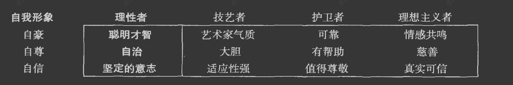
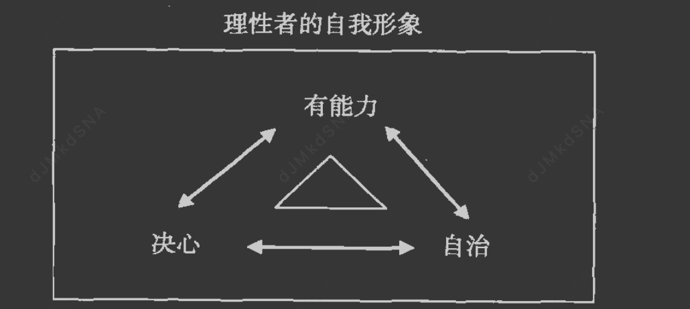

### 以聪明才智为基础的自豪感
他们在乎的不是任务的性质，而是自己在完成这些任务时的聪明才智。
他们玩游戏并不是为了寻求乐趣，而是为了在掌握游戏技能中锻炼自己的聪明才智。他们的乐趣存在于完善技能的过程中。
他们觉得游戏和竞赛就是实验室，他们通过练习不断完善自己的技能。
他们绝不会像技艺者那样放任自己做出欠考虑的事情，技艺者认为游戏和竞赛是源于冲动的活动，参与其中是为了寻求乐趣。
技能提高只是附加性结果。理性者的观点恰恰相反，他们参与游戏就是为了提高技能。

SP投入完全是因为他们一种放松的自发行为，而NT的参与是深思熟虑有意识的练习。
技艺者的参与是冲动轻松的行为，理性者的参与是深思熟虑充满目的性的行为。

理性者是最容易最喜欢对自己的能力进行自我批评的人，他们会无情的揭露和谴责自己的错误。但是他们绝不会允许其他人随意批评自己。
当他们收到不公正不准确的批评，他们往往会在脑海构思高效不失优雅的报复。

### 基于自治的自尊
理性者希望掌握自己的控制权，他们在很小的时候就知道不能轻易接受任何人的观点，至于提出观点的是谁不重要。
这种不尊重权威的天性让理性者显得有点自负和傲慢。
理性者将自治看成最值得歌颂的美德，他们觉得依赖他人变得不齿。

### 坚韧决心的自信
他们相信，只要有决心，就能克服任何困难。他们惧怕自己意志力会衰退。
## 价值观
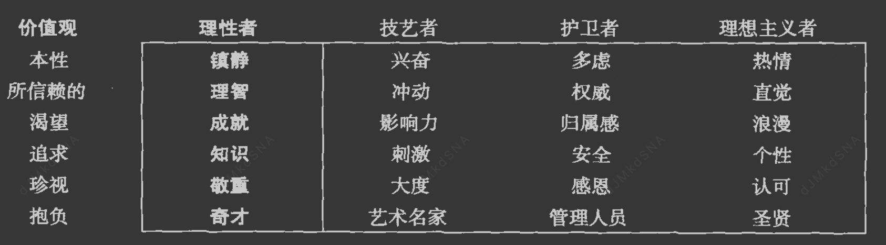
### 镇静沉着
他们看起来冷漠，是因为他们的精力和思想投入到了专注的研究中，他们约束自己的情感，是为了控制自己的行为，不扰乱自己的研究。
理性者并不像他们表面上看起来那么冷漠，他们的感情也和其他人一样浓厚，只不过他们制约和管束情感的力度远远大于其他人。
### 相信理智
他们唯一能无条件信赖的就是理智，他们对其他任何事物的信赖都是有条件基础的。
他们偶尔相信直觉，但是不会信赖冲动。他们认为唯有理智才有一般性和永恒性。
### 希望成就
他们热衷获取知识，希望自己成为有创造性的人。对他们而言，工作是工作，游戏还是工作。
批评他们无所事事是对理性者最严厉的惩罚。
他们全心全意工作的目的就是为了实现自己的目标。一旦进入工作状态，他们就会失去理智，对他人和自己提出苛刻的要求，制定过高的标准。

### 追求知识
他们对知识的需求包含双重目标：1.领会事件发生所必须充分具备的条件。2.理解操作能力和技术的局限性。
他们和NF人一样喜欢问为什么，但是他们不是问事物本身的意义和价值，而是问工作原理。
他们始终未忘记积累知识的任务。他们是知识寻求型人格。
### 珍惜他人的敬重
对他们聪明理性色彩取得成就的认可，让他们心花怒放。但是理性者无法开口索取这种赞美。
### 立志成为奇才
他们往往将技术型奇才作为自己奋斗的目标。
## 社会角色
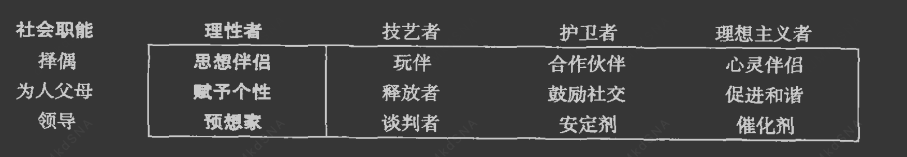
本质上来说，社会角色分两种，一种由我们自身社会环境发挥的作用决定，一种则是通过我们自己争取得到。
面对父母，我们扮演子女角色，面对家族，我们扮演亲戚角色。
在婚姻中，我们扮演配偶角色，在公司中我们是上司和下属。

### 思想伴侣
能够和配偶分享自己的思想和观点是他们择偶的首要标准。他们会讨论各种话题，并且持之以恒讨论这些话题，直至双方阐明各自观点。
他们与配偶探讨的都是抽象的话题，政治，经济，伦理，宗教，认知，语言，科技成就和发明。
渴望与配偶分享智能成果的愿望通常会限制理性者的择偶范围。他们选择的对象如果是技艺者或者护卫者，他们的愿望往往会落空。
如果理性者执意要寻找与他产生共鸣的配偶，则只能选择另一名理性者或者理想主义者。
不过如果他们能够选择那些生性友善的SP/SJ人,例如ESFJ，ISFJ,ESFP,ISFP，他们的婚姻冲突也可能大幅降低。
他们认为择偶是一个困难和危险的问题，他们不允许自己在择偶是犯任何错误，即使是婚姻，他们也追求实效。

### 促进个性化发展的父母
理性者父母更关心孩子成长的个性发展。他们希望看到，面对生活挑战时，每个孩子都能体现自己的独立性和自主性。

### 预想家式的领导
擅长战略规划，常常对机构整体面貌和长期发展形势有个预先认识。他们考虑周全，能够清晰明确表达自己的预见。
## 角色变体


### 协调者

他们往往有指导性性格。随着日渐成熟，他们指导他人的愿望会越来越强烈，他们会因为向他人提供指导感到惬意，向他人下达指令对他们来说是轻而易举的事情，他们也希望其他人遵守自己的指令。
他们认为大多数人的行为是盲目的，他们只是在做一些毫无意义的循环性工作，需要自己的指导。
他们会制定井然有序的等级制度，命令的传达和力量调配成为可能。他们表现力强，精力充沛，会充分利用任何可以为己所用的资源，并帮助他们执行极其复杂的战略计划。
他们擅长不仅是军事活动，商业行为，政治行为，需要排列技巧的活动。他们会执行计划A,B,C

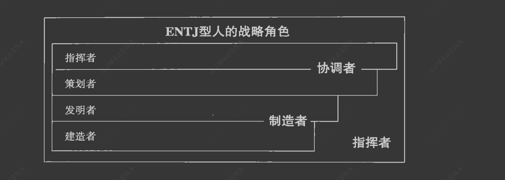
ENTJ指挥者，指挥者更擅长针对目标指挥和调配资源，不擅长结构的建造工作,他们高效的配置资源，有效实现目标。
他们有效的配置和调动资源。他们更擅长系统工作，他们重视实效，多疑，喜欢相对的眼光看待事物。他们更倾向于
指导性的协调者角色。有时候当他们发现自己成为团队领导者，他们自己都感到困惑，但原因很简单，无论他们走到哪，指挥者都可能建立
一套高效有序的系统，有效利用人力和物力，确保最小的成本收获最大的利益，实现目标。
他们往往精通系统化的工作，擅长依照事物优先级安排行动，他们首先对组织的发展前景进行展望，他们有能力将脑海的场景变成现实。
他们总能够让其他人清楚获知自己的各种设想。他们是超级实用主义的执行者，他们能预见方法与结果的联系。
面对他们强烈的工作欲望，他们的配偶和子女有时也的屈居第二。

INTJ策划者,能对行动进行深入精确研究，最擅长制定应急预案的行动计划，但不擅长技术性发明工作，他们能记住计划的每一步。
只要有需要，他们可以随时执行计划B,C,D.在他们眼中，现实好比一盘棋，他们擅长在棋盘上运筹帷幄。
他们擅长聆听任何有益的建议，他们认为任何具体的顺序都存在改进的空间。他们往往更加自信，坚定的意志，更容易做出决定。
他们擅长处理需要创造性解决方案的难题。在学校，他们往往是最优秀的学生，他们用严格的标准要求所有人，包括他们自己。
他们严肃认真对待工作，往往会让其他人觉得他们冷酷无情。不过策略者只要认为自己的正确的，就不会因为其他人的批评而困惑。
他们忠实于他们的工作系统，不会因为人事变动而受到影响。他们希望配偶也有独立自主的个性。
他们通常在第一次第二次约会就知道是否有结果，在别人眼中他们显得过于冷漠和精明。


### 制造者

他们喜欢探索，思想开发，愿意接受为自己提供指引的观点,他们更倾向于资讯的制造者，有兴趣为人们提供其当前设计工作的信息和报告，但不擅长调配资源。
他们注重对发明  原型能力的培养，功能是他们的唯一目标。

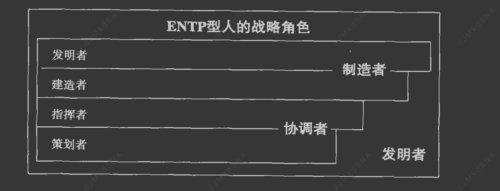
ENTP发明者,有创造天赋，设计出很多天才功能原型，设计富有创造性的机械，对他们来说是很自然的事情。但不擅长制定详细的战略计划。他们拥有强烈的好奇心，会不断探索和发掘可能性。
他们最不愿意拘泥于某种特定方式的人，他们不断搜索新工作项目，和新的工作流程。他们总能给自己的工作和生活带来新奇的理念和方式。
他们的事业心很强，他们依靠的是自身的解决能力，而不是事先准备好的行动计划。他们能在很多领域取得不俗的成就，但是他们从事的工作不能包含过多的常规性内容，
他们很少担任指导性领导者，他们不安心做循规蹈矩的员工。当工作变得无聊反复时，他们逐渐失去工作的兴趣。有时候为了保持工作的新鲜度，他们会
利用系统规则制度创造新的机会，以智取胜。
他们往往活泼 性格随和，很少对他人提出苛刻要求。他们健谈，能将复杂难解的观点描述清楚，可以轻而易举理解令人费解的描述。他们觉得受人欺骗或者操纵是羞辱。
他们专注于兴趣爱好时，很可能忽视孩子的需求。

INTP建造者,可以设计出高效的模型，但是很难实现资源的高效执行。他们性格随和，关注空间和系统设计。他们十分珍惜自己和他人的才智，总是寻找构建世界的各种技术原理和自然规律。
他们关注的焦点往往落在与当前问题相关的事物至上，他们的注意力更加集中。他们十分热衷于分析事物和问题。他们拥有绝佳的记忆力，他们渴望了解各种规则和基本原理。
他们擅长分析和识别差异，轻而易举的推翻对方的观点。他们可以成为逻辑学家，数学家，科学家，建筑学。
他们喜欢小孩，他们将每个小孩当成独立的个体，很少干预小孩的行为，让孩子自己吸取教训。


# 择偶

## 配对规律
到底选择相同气质还是相异气质？
语言的影响>>>工具的影响
常见的比较融洽的组合方式,既相似也不同：语言相似，对工具的使用相异
SP《=》SJ
NF《=》NT
SP选择SJ,NT选择NF主要原因，他们能够清楚的知道双方谈话内容的来龙去脉，这种默契会产生强烈的快乐。
不过过度的重复，会导致语言能被预测失去乐趣，甚至导致双方竞争意识。


选择相似处：具体或抽象的思维和语言习惯，N更适合N(抽象语音),S更适合S(具体语言),说明语言交流方式是人与人最重要的一大差异

选择相异处：合作或实用的工具使用原则，在做事方式上互补，合作方式和实用方式互补

思维=语言，对一段关系是否稳定具有很大的影响，当夫妻双方谈话内容集中在自己观察的事物上(S)，或者他们
想象中的事物(N)时，他们能很快意识到自己和对方在发送相同波长的信息。

工具=行为做事

我们总是想当然认为自己的生活目标就是最好的目标，适用于所有人，但是我们的对象不可能心甘情愿接受别人的生活目标

SP最重视生活追求的感官刺激，SJ重视社会地位和经济条件的安全感，NF追寻个人身份的认同，NT把知识当成自己追求的目标


## SP(技艺者)

### 恋爱
他们的生活追求是寻求感官刺激，他们对其他类型人的生活目标不感兴趣。
当性行为当做刺激体验,他们骨子里带着快乐和兴奋感。他们择偶希望从行动中感受兴奋和刺激。他们渴望更多的自由和经历体验。
他们不会像SJ慎重选择生活伴侣，他们可能因为冲动而喜欢一个人，恋爱中的SP可能是世界上最快乐的人。但是他们的热情来得快去的也快，
他们会心生厌倦，一门心思想着怎么才能让自己挣脱束缚。他们很少采用正面的方式，往往选择沉默和逃避。

他们喜欢讨论性，热衷听各种性行为细节，抽象的事物无法打动他们，他们对感官刺激反应激烈。他们推崇享乐，总有办法让他人喜笑颜开，
```
a.深情的理想主义者常常被技艺者洒脱的气质，出众的外形吸引，情不自禁的将SP冲动潇洒的气质融入自身。
b.理性者面对技艺者带来的快乐和生理愉悦，也不免失去自持，对SP那种自由自在无拘无束的言行，很羡慕。
c.护卫者，遇到无拘无束的技艺者，他们感受到技艺者带来的享受时，他们找到了内心平衡，一方面是技艺者的花花世界，一方面是他们严守不懈的主张和职责。
对护卫者来说，和技艺者约会就好比度过了绝妙的假期。
```
但是他们无忧无虑，任由美好时光溜走的天性，时间久了，会让其他类型的人感到沮丧。游戏玩乐能短暂安抚理想主义者，理性者和护卫者，但是时间久了他们会心生不满，
他们会引导技艺者深入到生活和自我当中。
理性主义者会引导他们探寻自我，护卫者试图在他们内向建立社会责任感，理性者会把他们引入复杂的思索和研究中，但是这会让技艺者感到不安。技艺者更喜欢用轻松随意
的态度对待身边的人和事，他们会试图让身边所有人喜笑颜开。
他们可能回避订婚结婚等永久感情链接的话题，会让他们感觉像自套枷锁，他们会选择沉默，或完全顺从配偶的计划。
他们一旦选择成家，他们在选配偶时会很果断，但往往是一时兴致。他们往往很难识别配偶的真实品质，在面对两性关系时他们往往缺乏警惕性。
他们在表达恋爱时，喜欢送昂贵的礼物或者夸张的情感，每当他们开始新的恋情是，他们往往会做出夸张的承诺。
他们好比随环境改变自己的变色龙，为了取悦自己的配偶，调整自己的性格，他们的改变往往是真诚的，但是往往坚持不了太久。
他们并不在乎传统的婚礼，但他们喜欢成为众人的焦点。不过他们更喜欢离经叛道的婚礼，充满冒险的旅程。


### 婚姻生活
一般SP不会对他人擅加评判，他们对唠叨的耐受力极其出众，但是他们会回避吹毛求疵的配偶，如果缺少刺激，技艺者的婚姻就失去了存在的意义。
他们完全生活在现在，如果你希望他们长期负担经济职责，可能会失望。他们结婚后可能以同样的精力去对待人际关系。
如果新朋友是异性，SP的冲动可能对他们的婚姻造成破坏性打击，但是他们本人没有意识到这样的举止会让自己显得轻浮。
他们无法管束自己的行为，豪爽的举止，大方的馈赠，喜欢赠送礼物，昂贵的礼物。他们十分享受馈赠礼物带来的乐趣和兴奋感，那是一种挥霍的乐趣。
这种慷慨开始能留下深刻印象，但是时间久了会让人感到烦恼。
他们也喜欢体育运动，尤其需要装备完成的耗时久的，比如钓鱼，打猎，赛车，冲浪，自行车。他们也喜欢艺术和手工创作，汽车，家具，运动器材。他们不会因为
准备不做而手忙脚乱，他们会接受现状。


### 技艺者-理性者
技艺者的兴奋和感官享受和   理想主义者的热情浪漫不谋而合。他们还会被NF人的灵性和道德感吸引。
不过理想主义者那种个人强烈的渴望，技艺者会感到困惑，他们会觉得是空想。

### 技艺者-理性者
理性者的实用主义，无视传统和习俗，对工具的热爱也会让技艺者感到亲切，对理论的研究也会让技艺者留下深刻影响。但是理性者的求知欲
让技艺者会失去耐心，理性者冷静超然的生活态度会让技艺者心生怨念。让技艺者觉得自己追求生理快感的天赋有点卑劣

### 技艺者-技艺者
他们都注重客观现实，喜欢讨论具体的事物和话题，都喜欢玩乐和兴奋。他们旅行，体育运动，舞会等。
由于他们都喜欢玩，精力如此多，容易导致双方精疲力尽。最后就异常华丽的烟花，飞快消失殆尽。

### 技艺者-护卫者
热衷于冒险的SP喜欢玩乐，会追求新奇的体验，他们和多虑负责的SJ在一起，会不知不觉的爱上对方。
SP倾向于选择SJ作为配偶却是不争的事实。也许SP想以此填补自己缺失的稳定性。他们的婚姻能够经受时间的考验。
沉稳的护卫者可以平复技艺者不安分的心，无忧无虑的技艺者能舒服护卫者紧张的神经。

ESTP《=》ISFJ
ISTP《=》ESFJ
ESFP《=》ISTJ
ISFP《=》ESTJ
## SJ(护卫者)

以家庭为中心的传统配偶 ，他们满足于当贤惠的妻子，忠实的丈夫，为此感到自豪。忠诚勤劳可靠擅长积累资源和养育他人，
他们是所有文明体系最坚实的基础。

### 恋爱
他们与异性交往并不是为了兴奋感和情感体验，而是为了参加社会活动，培养社交风度，最终找到合适的终身伴侣。
他们的恋爱观有点严肃和拘谨，不过他们也享受生活，他们的乐趣在于参与不同的社会活动。
他们对刺激的娱乐活动不感兴趣，但是他们喜欢看电影，参加教堂，参观各种观赏性公园，动物园，花园，历史遗迹，观看音乐剧。
他们也喜欢参加派对，但是他们不是为了释放情感压力，而是为了与人交往感受自身的社会性。
他们亲身参与社会或公民活动，见证具有特殊意义的重大事件，与朋友同事联络感情。
女护卫者往往希望对方能像对待淑女一样礼貌对待自己，为自己开门，帮自己取衣穿衣。男护卫通常尽可能让自己看起来像完美绅士，
在见面时迎接，晚餐结束后护送对方回家。男护卫会接受约会的策划，准时准点去预约点。
他们会尽心尽力安排好约会的细节。SJ人不会随意与别人发生性关系，他们注重礼节，会将婚前性行为上升到道德高度。
他们从卫生角度看待婚前性行为，对处子比作纯洁，清白的人。
他们[消费-存蓄]婚前性行为观念，反对自由爱情和廉价性体验，守护自己的贞操财富，存储至结婚。
男性护卫者和女孩发生关系，他们可能觉得自己需要对对方负责。
```
初次见面，护卫者的拘谨和保守会让其他类型人觉得不好相处，但护卫者准备构建家庭时，他们会让生命和身份困扰的理想主义者感到安全感。
在理想主义者眼里护卫者真诚的道德观会变成高贵的精神。

对于无视传统的理性者，刚开始往往对护卫者持有批判态度，但是不知不觉会被SJ的社会技能吸引，SJ对家庭和配偶的忠诚，以及处理家务的能力。

对于技艺者，护卫者就是坚实安全的港湾，他们羡慕护卫者高尚的道德，他们觉得护卫者是灯塔，指引自己成为端庄的人。
```
选择礼物时，他们通常不会选择象征意义的礼物，而是价值不菲的座位财富珍藏的物件。他们不在乎对方是否惊讶，观众是否留下深刻印象，他觉得送礼物
的礼节和过程最重要。只有他们做出婚姻承诺后，他们才可能涉足性爱。婚姻的安全感，法律的约束性才是他们婚姻的决定因素。

### 婚姻生活
SJ人会满足于四平八稳的生活，乐于接受常规性的行为，不会抱怨生活单调乏味。绝大多数时候，护卫者都是好脾气，他们愿意每周去同一家餐厅吃饭，
去同一个地方举行同样的娱乐活动。他们愿意与所有亲人保持联系，乐意招待拜访的亲戚。他们努力经营自己和社区组织的关系，对组织的等级制度和地位了如指掌。
他们愿意参加社交活动，慈善活动，孩子就读大学等活动。在家里他们也会做各种家务，洗车，打理花园，采购生活物品。
他们认为时间应该在做有意义的事情，而不是浪费在幻想上。他们认为阅读报纸比小说有吸引力。商务课比艺术有意义。
而且他们很守时，希望社会事件都井然有序的进行。对于家人，护卫者往往有加强占有欲。他们也十分珍惜自己的财产，他们会严格执行家庭预算，保险，存蓄等保守
投资方式是他们青睐的理财方式。他们的穿着比较保守得体，他们信封[细水长流]
对于性格孤单的护卫，家庭是他们的生活中心，照顾家人是他们的核心，孩子和家人的离开，会让他们有空巢综合症。同时护卫者有点杞人忧天，总觉得灾难会降临在
爱人和孩子身上。
通常来说在熟悉的地方做爱让他们感到满足，护卫者，他们觉得孩子给自己生活带来乐趣，养育后代也值得期待，无法接受性生活是娱乐。
在理解他人情感需求时，护卫者会有点笨拙，他们对哲学，心理学无感。他们关爱守护家人，[家长式]作风，哺育和批评于一体。
他们有严格管束其爱人的倾向。


### 护卫者-理想主义者
他们都关注社会和道德，护卫者脚踏实地循规蹈矩，理想主义者带有灵性，能够感知不易察觉的事物。
但理想主义者的热情，自我追求的精神让护卫者担心会打破传统。理想主义者要增加恋情深度不给提示，让护卫者沮丧。
护卫者极力护卫婚姻和家庭的努力，理想主义者会觉得肤浅。

### 护卫者-理性者
理性者怀疑论，对工作痴迷，与护卫者悲观的生活态度不谋而合。NT人的聪明才智和创造力也让他们钦佩。
然后护卫者无法进入理性者的认知，对理性者对传统的轻蔑感到失落。护卫者的付出，理性者是最不懂的欣赏的一类人。

### 护卫者-护卫者
由两位护卫者组成，他们相互吸引，他们维护家庭稳定，关爱家庭，但是他们可能会争夺家庭控制权而争执。
他们争吵时，可能都觉得自己才是正确的，两名裁判都坚持自己的判决而无视对方的意见。他们可能战火连连。

### 护卫者-技艺者
sp人四处探索，sj人保管劳动成果。护卫者认为冲动的技艺者就是需要照顾的孩子，技艺者认为护卫者是温馨的港湾。

ESFJ 《=》 ISTP
ISFJ 《=》 ESTP
ESTJ 《=》 ISFP
ISTJ 《=》 ESFP

## NF(理想主义者)
其他气质往往从各自角度出发，挑选自己的生活伴侣，他们一开始就知道配偶有让自己不满的地方，大多都是妥协为基础。
理想主义者会理想化的观点选择配偶，会把择偶看做浪漫的事情，寻找完美的伴侣，发展理想的恋情。
他们在寻找心灵伴侣，寻找和他们心灵相通的，志趣相投的，有相同情感目标，相同浪漫情怀，追寻完整自我的人。
### 恋爱
他们喜欢热情又持之以恒的恋情，他们会认真一次与一个人交往，并探索恋情是否存在更深的发展空间，他们期待与对方建立更深
的心理联系。他们觉得无聊的舞会，会找个安静的角落，和自己的恋人促膝长谈，他们在观看体育比赛时，可能干脆让自己思想
游离，观察身边的人，思考他们的性格，或者幻想他们的个人生活。
他们更愿意和恋人谈心，不过最好是抽象的话题，思想，哲学，梦想，家庭，追求等。他们会讨论深深打动自己的小说和电影，对道德和艺术，人物象征意义和
人类未来话题很感兴趣，但是决口不提剧本情节。理想主义者对恋情的重视程度往往取决于对方是否和自己一样充满想象力和意味深长。
他们会选择象征含义的物品来定情，珍贵的照片，歌曲等，他们很浪漫。
他们的浪漫可能比较[理想主义]，看不到爱人的缺陷，幻想过上了幸福生活，他们爱上的是自己想象出来的对象。一旦幻想破灭，他们发现自己的爱人是凡夫俗子， 他们会难受。
不过理性主义者一般不重视婚姻的社会习俗，他们认为个人承诺更重要，他们倾向于内心情感和个人信念。
他们热情，大方，活泼，多情，他们的浪漫让技艺者感觉亲切。他们的道德感让护卫者感到亲切，理性者会钦佩理想主义者拥有的情感活力以及待人真诚热情，敏锐的目光和洞察力。

### 婚姻生活
他们支持，理解配偶。他们敏锐感知对方情绪，擅长情感交流，他们会温柔善良的安抚对方。
他们擅长发现别人的优点，赞美别人的品质，他们擅长描述情感差异，其他类型的人无此能力。当他们与配偶交谈时，轻声说"我爱你"是机器自然的交流。他们是最多情、热烈懂得
欣赏爱人的配偶，他们还会毫无保留的将自己的浓情表达出来。他们[情感共鸣]能力很强，能全身心投入他人精神世界，完全的理解他人，他们生来就认可 了解他人，
他们擅长构建亲密深情的关系，是情感大师。
但是身边的情感输入过多时，他们也会不堪重负，感觉心烦意乱。他们敏锐的感知力是本能的，不受自己控制。面对他人的情感需求，他们无法不作出回应。
当配偶不在身边时，他们会对身边的其他人产生共鸣，会显得比较博爱。当他们投入工作需求，热心帮助顾客，学生时，往往容易忽略家人。他们需要学会平衡家庭和工作。
大部分理想主义者会钟情一个人，围绕自己的家庭构建生活。他们会培养自己的艺术爱好，室内装饰，亨饪，园艺，营养学，瑜伽，个人心理疗法等等。
他们十分注重浪漫，他们努力让自己值得信赖。他们对来访客人热情款待，他们常常出现在各种文化，个人发展活动中。例如读书会，电影协会，心理学，文学讨论。
他们会记住家人的生日和纪念日，也希望人们能记住自己的特殊日子。

### 理想主义者-技艺者
理想主义者欣赏技艺者的潇洒，轻松巧妙生活方式，技艺者大胆追求感官刺激也能刺激理想主义者的热情。但是当理想主义者讨论内心情感史，技艺者往往
不愿讨论抽象话题，皮格马利翁计划就会扎根

### 理想主义者-护卫者
理想主义者在护卫者这里会感到舒服，可靠，安定。护卫者坚定的道德感，也会让他们肃然起敬。但是护卫者务实的态度也让渴望情感交流的理性主义者失落。
护卫者可能因为觉得自己没得到赏识而感到失落。

### 理想主义者-理想主义者
他们能尽量分享彼此内心，讨论个人发展问题。过于深入的精神交融可能让对方感到紧张。

### 理想主义者-理性者
他们有浑然思想基础，生活在一个抽象概念世界，充满各种理论和可能性，洞察力和象征信号的世界。理性者的冷静和自洽让理想主义者神往。
NF人相信直觉，NT相信逻辑。NF关注道德人文，NT对使用技术问题感兴趣。对理想主义者的情感表达需求，理性者总是严词拒绝。他们沉迷理性推理，
实际有效的事物。

ENFJ《=》INTP
INFJ《=》ENTP
ENFP《=》INTJ
INFP《=》ENTJ


## NT(理性者)
他们诚实坦率，占有欲望最弱，但是与理性者共度爱河需要耗费很多时间和精力，他们很难接近，而且有点神秘。

### 恋爱
理性者不喜欢在社会交际花费太多时间，他们会觉得恋爱的种种仪式很可笑，也不愿意让自己涉足各种娱乐活动。他们喜欢讨论技术细节的话题。他们更喜欢书本和电脑，
对足球比赛和舞会伴侣不感兴趣，他们对培养社会风度和提神自身受欢迎的程度不感兴趣。
实际上，理性者将性行为看做是个人道德的大事，会对滥交行为表示厌恶。谈论性体验也会让他们浑身难受。他们很少谈论自己的性生活。
让自己的恋爱高度隐秘性，并向对方做出郑重的承诺，理性者的恋情发展速度往往都很缓慢。
他们认为约会是寻找值得他们付出一生的人，约会是件严肃的事情，他们会用很长时间考虑自己的约会意图。如果是渴望长期的情感呼唤，他们便做出长期情感承诺，
他们会牢记对配偶的要求，生理上的，认知上的，对于不符合要求的对象，他们会果断拒绝。他们可能会与第一个品质优良且明确表示对自己感兴趣的人成为恋人。
技艺者欣赏理性者的高效率和不受传统约束。护卫者欣赏NT认真严肃勤奋的行为，对能帮助理性者提供安定的生活感到自豪。理性者的专注力和能力让理想主义者惊奇敬佩。
他们觉得婚姻意识和结婚证书毫无意义，他们遵守这一礼制主要是为了满足家人和配偶。婚姻上他们更在乎的是个人承诺，他们会仔细考虑性道德，严格遵守道德规范。


### 婚姻生活
一旦对配偶倾注了自己的感情，理性者就会满足自己的各种兴趣，了解事物，掌握做事的方法。配偶会指责NT型人冷酷无情，不关心他们的幸福，理性者从自己的角度表达爱意，
但是遭到爱人指责，这会让他们十分震惊。因为他们知道自己心中充满激情，极其关注配偶的一举一动，以及他们的喜怒哀乐。关于理性者冷酷的错误判断，几乎成了人们的成见，
导致其配偶失望，婚姻矛盾的根源。导致这个问题的根源有3个


### 大部分认为理性者生性冷漠不关注自己，但是理性者认为自己澎湃激情，是什么导致这种误解？
[抽象的交流方式，对效率的需求，对自治的渴望]

[抽象的思维]
理性者大部分时间沉浸在抽象的世界中，原则/理论/假设/系统设计 或者研究内战，摄影，始终为了知识而努力，常常让人觉得他们与世界失去了联系，不仅不问世事，而且经常忘记家庭生活日常
他们集中精神解决方案的特点，也使得他们与世隔绝，只关注眼前工作。沉思的他们，即使配偶就在身边也会觉得十万八千里。这也是配偶抱怨最多的一点。有时候配偶会说，
理性者根本不关心他的死活。
但是这绝不代表他们漠不关心，当家庭生活引起其兴趣是，他们会表达真挚的兴趣。但是很多时候NT人没有留意日常生活，包括他的配偶。
关键不在意他们冷酷无情，而是他们生了抽象思维和分外集中的精力。唯有烹饪的提醒，才能放下加入家庭中。
但很多人认为，提醒家人关注自己，本身就是有损自尊的事情，他们希望理性者配偶能自觉想到自己，关心自己。所以他们选择等待对方示爱，内心的愤怒也会日益增加。
当他们的期望落空时，便会毫不犹豫指责理性者自私，冷漠。
[效率的追求]
而且他们追求效率，无论说什么做什么，他们对效率很迷恋。只要有可能，他们就希望以最小的付出换来最大的回报。这种追求最高效率，最小付出和最大回报的操作，
我们可以理解他们的很多怪异行为，为什么他们信任逻辑精确性，犯错后为啥对自己那么严苛。为啥他们集中精力时，总是眉头紧锁。 对效率的追求，
信赖逻辑的精确性，这种追求效率也会导致他们讨厌啰嗦，不喜欢反复说一件事。当他们用行动选择某人作为配偶表达自己的情感后，他几乎不会再和自己的配偶进行
情谊绵绵的对话了。配偶可能期望他们能经常说甜言蜜语表示关心，但是在效率至上的理性者看来，反复说既定事实无异于浪费时间。
只要他们像爱人做出了婚姻的承诺，除非他们示意，否则承诺一直有效。而他们的配偶却常常以为不愿做出情感表达是他们本身缺少感情。于是理性者再度遭到配偶指责。
有点配偶还会觉得他们自私自利，只关注自己的效率，不在乎其他人感受。
[坚持个人自洽原则]
这是对他们自己的要求，也是对其配偶的要求。在自洽问题上，他们立场鲜明，他们自我引导性和独立性最强。他们会反抗任何违背他们意愿的力量。
他们觉得每个人都是一个小岛，面对像控制自己的社会期望，道德期望，他们都坚决反抗。他们擅长沉默，消极对抗，冷眼对抗。
理性者大都不会公开展示自己跌情感，因为他们觉得这样会显得缺乏自治和自律，进一步让人觉得他们冷血。
他们不仅对自己要求这样，还希望配偶也如此，他们排斥一些依赖性行为，包括酒的依赖，人的依赖。期待自己能给他们带来幸福的伴侣，理性者很少表示同情。
他们希望自己的配偶能爱自己，成为完整的人。理性者忠诚，愿意支持配偶帮助老朋友，前提是被帮助的人靠谱稳重。如果身边的人试图把他们当做靠山，骗取他们同情，
他们可能迅速离开，他们觉得幸福只有自己能给自己。
他们喜欢给爱人灌输自治观点，这是为了帮助配偶成为更好的人，但是如果配偶独立性较弱，这种意图会让对方震惊，觉得冷酷无情，不关心他的感受。
理性者通过不会让自己陷入交际争论，而是安静退后一步，这种回避行为往往会火上浇油，让对方更加愤怒，觉得冷漠和不关系。

他们对物质的态度也不以占有为基础，他们会欣赏车和飞机，艺术品，对他们精准的功能感到满意，对身份和炫耀的物质奢侈品不感兴趣。
他们的关注力在理论研究中。但是他们对土地很渴望，那是保证个人自由和自治的地方。

对工具的占有欲是理性者的一大弱点，他们会不计成本购买觉得很实用的工具，摄影机，硬件，软件等。买书也是他们的乐趣，随处可见的技术期刊，哲学，历史，
解密自然的书和逻辑类小说。

理性者热衷和配偶思想辩论，他们从经济，政治，历史，科学议论中获得乐趣。他们认为讨论必须遵循逻辑规律。他们希望说服爱人与自己分享科学和技术的乐趣。
他们往往十分幽默，他们的笑话往往以文字游戏为基础，他们十分喜欢讽刺和双关幽默。


### 理性者-技艺者
理性者没有占有欲不干涉配偶，与技艺者自由天性不谋而合。理性者需要学习玩乐，技艺者四处玩乐。但是技艺者的玩乐可能让理性者觉得轻浮。
理性者抽象话题也难以吸引技艺者。

### 理性者-护卫者
护卫者是家庭稳定可靠的基础，他们完成一切家庭事务，带了以家庭导向的社会活动，护卫者乐于帮助理性者想起社会义务，参加家庭活动。护卫者后勤部署很精妙，但是
他们对系统分析和技术设计不感兴趣。理性者往往觉得他们与配偶少了重要的联系。

### 理性者-理性者
他们走在一起热烈讨论，充满竞争意识，讨论话题很有逻辑且深奥难懂，但是容易沉浸在自己的认知世界，忘记对方的存在。
### 理性者-理想主义者
他们都对抽象世界感兴趣，都有洞察力和概念的爱好。他们能流利的实用抽象语言。理想主义者还会为婚姻注入温情，会深深吸引善于分析且自控力强的理性者。
帮助他们暂时放下工作，享受生活。但是与理性者讨论时，定义，逻辑范涛，因果关系的表轮，让理想主义者觉得很紧张，希望在友好的氛围中讨论。
对理想主义者渴望的情感表达，理性者往往冷漠拒绝。

ENTJ 《=》INFP
INTJ 《=》ENFP
ENTP 《=》INFJ
INTP 《=》ENFJ
# 父母
所有的婚姻都躲不开皮格马利翁计划，但是皮格马利翁计划对父母的诱惑更大。绝大部分父母都觉得自己有责任积极引导他们的孩子。家长和子女存在控制与被控制仿佛是
天经地义。实际上，无论家长如何干涉，不同气质的孩子必然会沿着其固有的模式成长。如果我们的父母不分青红皂白消灭所有植物，我们应有的和不应该有的都会变成不毛之地。
家长会想当然认为孩子是自己人格的延伸，不过气质理论提醒我们，孩子和父母有本质差异，需要不同于父母的成长方式，才能拥有健康的人格。
孩子与生俱来的人格并不会因为家长的反驳控制而改变。如果孩子生来和我们相似，我们自然不会产生改造念头，我们应该让孩子在轻松自然的环境成长为他们本该成为的人。

## 成熟
只有来自社会环境的刺激和鼓励，我们才能发育成熟，我们身为家长的任务，就是为孩子提供特殊的成长环境。父母是孩子的看护人，而不是改造者。所有的家长都必须答出一个问题：
我的孩子是何种类型的人，我能帮助他做什么？

## 基本差异
在使用工具时，所有孩子会和他们父母一样，表现实用主义和合作倾向。日常交流会出现语言的偏向性，抽象或者具体。如果孩子自然表达具体的思想和话语，他们会忽略抽象的思想和话语，
如果他们掌握工具后，他们会得到更多的练习，更明显的展示。大概4岁后，我们就能清楚的知道孩子的类型是什么。

从工具入手，SP/NT对社交使用的达到差礼仪不以为然，会问为什么要这么做？如果没有大人的惩罚，他们会毫不犹豫抛弃传统。

SJ和NF孩子相反，只有遵循长辈的欢心，他们就依葫芦画瓢。SJ和NF孩子愿意做哪些别人希望他们做的事情。他们会尽力满足大人的要求。


SJ和NF很快适应了各种社会技巧，传统，习俗，礼仪，学会遵守和执行社会规则。SP也能轻易掌握，但是他们是学会如何假装遵守规则。他们逐渐意识到，社会行为会收到不同规则约束。
唯有理性者，他们遵守只是因为特定意义，他们了解传统会变得很缓慢，他们的父母会心生疑虑，自己的孩子不太聪明？

SP和SJ倾向和同年人交谈，各种玩具和工具，而理想主义者孩子更喜欢谈论想象世界的事物，他们更喜欢和大人交谈。NF和NT更喜欢各种故事，充满想象和虚构的故事，寓言，童话，神话
有象征意义的故事，所以NT和NF孩子想象力更丰富。当然SP和SJ孩子也喜欢故事，冒险故事，动物故事，民间传说。他们更愿意放下故事去玩游戏。

SP和SJ他们的具体词汇一般更好，动手能力更强。少数NF和NT也喜欢玩，但是抽象交流很容易把他们和SP,SJ孩子区分开。
SP和SJ孩子认为卡车就是卡车，NF和NT可能认为卡车是潜艇，三轮车是坦克，衣柜是通往秘密通道。

## 技艺者孩子
[感觉寻求型人格]
他们对颜色，声音，口味感官多样性很在意，他们也喜欢动物，尽管他们对待动物的方式很粗暴。
他们更容易兴奋，兴奋时间也更久，但是他们也容易产生厌倦情绪。他们寻找风险和恶作剧，从而得到欢乐。他们富有行动力和表现力。他们喜欢美术，艺术，游戏，体育。
他们喜欢滑雪，冲浪，唱歌，跳舞，弹吉他，他们往往不愿意家长陪，不愿意听家长挑剔评价。如果别人认为他是胆小鬼，他们就会很惭愧。
他们会强迫自己以身冒险，证明自己的胆量。他们可能第一个学会骑自行车，滑板，化妆品，抽烟，喝酒。有时候，他们要承受灾难性后果。家长还是应该鼓励他们的大胆行为，
避免失去自尊，染上不良习惯。
他们的自信取决于他们的适应社会环境的能力，他们与人相处会越来越[圆滑]，他们在外人面前会展示圆滑老练的适应能力，在父母面前却不服从管教，比较叛逆。
他们喜欢有轮子的玩具，滑板，三轮车，自行车，摩托车，轿车，他们随着年纪增长，可能更容易听从[冲动]的召唤。炫耀不仅带来满足感，还让他们振奋，他们渴望给
别人留下深刻印象，改变和影响别人。玩乐使他们内心的冲动，不受意志控制。他们可能尽情享乐，不考虑给父母带来的麻烦。
生活在现在和这里的乐趣，无需考虑将来，他们总是无忧无虑，不担心上学迟到，垃圾是否有人倒，sp认为玩的开心就是把一切弄乱。但这就是他们想要的结果，
他们喜欢这样的环境，他们忙着找更多好玩的事情，他们这种无拘无束的享乐常常惹怒家长，他们学会了[充耳不闻]

## 护卫者孩子
SJ人忧郁的黑胆汁，他们[严肃多虑],考虑很多事，保持玩具整洁，收拾自己的房间，帮父母家务，他们是长辈眼中的[乖宝宝],他们是[后勤部署支柱],护卫者为自己不辜负
长辈而自豪，SJ孩子是老师的得力助手，他们保持值得信赖的榜样形象。担任班长，班干部。他们对常规家务格外感兴趣，他们很在意大人的指责和负面批评，为了证明
自己，他们会加倍努力。他们[帮助别人时，他们自尊心会得到增强],他们帮助父母准备饭菜，打理家务，给弟弟妹妹喂饭。他们会竞争给老师同学提供更多帮助，技艺者和理性者则不会。
如果无法为他人提供帮助，他们自信心会消失，有很沉重愧疚感，他们更容易产生自责心理。
每当长辈给出具体的奖励时，SJ孩子自信得到增强，小护卫者会因为这样的奖励沾沾自喜，但技艺者从不担心自己顽皮恶作剧收到大人批评。理性者也不介意被他人看做捣蛋鬼书呆子。
护卫者的自信来自别人对自己的夸奖。护卫者不会寻求刺激，刺激意味着[高风险],他们注意力集中在[安全]上,他们谨慎，反复琢磨，他们更愿意在自家院子里，或者
城市公园，游乐中心，学校宿舍等。他们喜欢亨饪，手工，木制品。
他们渴望更多的安全感，他们有很强的安全警惕性，离开家旅行时，他们可能更想家。他们会非常高兴接受执行大家认可的常规性事务。他们喜欢在相同环境长大，同样的环境，
同样的学校和社区，他们信赖权威，他们期望明确的对与错，他们遵守规则，不辜负权威期待，他比别人更渴望获取他人的认可。
他们还渴望[归属感]，很少有不合群的孩子，他们喜欢家庭生活，[家庭成员身份]很重要.他们比较[悲观]，总觉得会发生不好的事情.他们的悲观情绪不愿表露，他们更倾向于自己默默
的忍受。[稳定守护型人格]

## 理想主义者孩子
[活力热情] [强烈的情绪],很难保持冷静。性格外向的理想主义者从未停止说话，他们有时候暴躁易怒，但是他们[真诚热情]，愿意了解他人的情感表达，懂得如何与
他人建立亲密联系,交际中的[情感共鸣]。但是他们很难从身边找到自己可以模仿的对象，理想主义者孩子必须[自学成才]，他们逐渐学会了导师和拥护者两种角色。他们
利用自己[敏锐的感知力]学习，从技艺者，护卫者，理想主义者学习自己感兴趣的技能。真正让NF自豪的能力，他们对情感敏锐的感知力,他们能自由和家人保持情感共鸣。
如果家庭矛盾丛生，他们可能由热情变得逐渐冷漠，缺乏安全感。他们更不愿看到其他孩子收到不友善的对待。在竞争中，他们又想赢又感到羞愧。合作性的家庭游戏更有利于
NF孩子身心健康。

理想主义者自尊也是来自自己的善意。和SJ的乐于助人不同，NF人更多的向他人表达自己的良好意愿，SJ则是身体力行的满足他人的具体需求。理想主义者孩子生来
对自己有极高道德期望，他们希望自己与他人相处时表现完美无瑕疵，像圣人那样。如果他们有不良意图，或做了不好的行为，NF孩子会陷入强烈罪恶感，会给他们心灵
带来沉重精神负担。他们往往会压抑那些坏念头，从而维持自己的道德理想。

他们可能可以扮演某种角色，获得大人的称赞，但是对他们构建自信没有帮助。他们获得自信的唯一方式是[真实的展示自我]。技艺者会从诡计欺骗获得快乐，但是理想主义者
会自我怀疑。理想主义者希望自己成为别人眼中[独一无二]的人。他们是[身份追求型人格]。
他们的经历和理性者类似，他们常常发现自己与其他同学格格不入，他们感受到自己与其他人的差异，但是不知道差异究竟是什么。他们比例实在太少(不到10%)，他们会感觉
自己和其他人有些疏远，他们会感觉自己很特殊，与众不同。对他们而言，独一无二让他们自豪。他们的自我意识不稳定，需要父母认可自己的独特性，亲口确认自身的重要性，
他们才会觉得自己有价值。他们最需要父母说，你很[特别]，我重视你，你对我很重要
理想主义者孩子对他人的信任远胜其他孩子，他们信赖那些好的冲动，但是撒谎，报复等冲动让他们感到害怕和压抑。他们参与典礼仪式时也信任权威，他们的参与热情洋溢充满人情味。
他们也相信[理智的力量],会仔细思考行为的意义，他们也会聆听心灵的呼唤，他们更愿意跟着直觉走，他们知道自己的直觉从何而来，只是旁人觉得神秘。
NF喜欢充满想象的故事，但是他们太容易受到故事情节鼓动，所以故事的结局最好大团圆，留下美好的梦想。
他们还会将这种浪漫情节投射到玩具上，用身边的玩具编造故事，玩具的丢失，对他们来说无疑是悲剧。

理想主义者的孩子容易早熟，他们从小就寻找生活的意义和信仰，他们可能从小加入教堂，去思考生命的意义。他们思考道德，政治，艺术，毫不介意和朋友讨论
严肃的哲学话题。

## 理性者孩子
理性者孩子在婴儿时就十分安静沉默，长大总显得[冷漠]不合群。他们拥有[战略操控能力]，渴望预测和控制事情发展。他们很难找到效仿的榜样，他们只能依靠自己，他们的进步
都是来自他们坚持不懈的实验和思考。他们的房间可能杂乱无序，但他们清楚知道东西在哪里。他们对组装玩具(乐高)情有独钟，他们对化学，电力装置很感兴趣，喜欢实验。
他们玩战略游戏，如象棋，他们会被各种电脑游戏吸引，他们会认真研究地图，如果他们挑战失败，他们会极度失望，感觉自己愚蠢并自责。
他们更容易自我怀疑，过多的失败会让他们自尊心受损。他们不喜欢别人告诉他们如何思考行动，否则他们会顽抗到底。他们觉得大胆和勇气无用，他们需要的是自治。
他们高傲自负，希望[自主思考]，行动，享受自己解决问题。他们甚至会因为经济上依赖父母而自责。
他们可能觉得餐桌礼仪没有意义，花很多时间才能强迫自己去掌握。他们需要更多的时间学习常规性事务。
他们是[知识追求型人格],他们觉得事物的工作方法和内在结构很重要。他们要求自己能拆分开来，并组装回去。
他们喜欢科幻故事，魔法，英雄故事。故事可以给他们很多好奇心，产生很多灵感。他们觉得[理智是一切行动的基础]。
他们只做有意义的事情，只有父母老师的要求有意义时，他们才会去做，蛮不讲理会失去NT孩子的尊重。
一旦他们陷入对成就的追求，有了目标，其他的一切都会变得不重要。

## 释放型技艺者父母

他们总是显得更加宽容，甚至不管教自己的孩子。他们的孩子可以自由的活动，亲身经历很多惨痛经历。技艺者认为失败乃成功之母，对孩子太严格会导致他们性格软弱。
这种教育有利有弊，弊端是父母监管大量缺失，不利于健康成长，优势就是宽厚充满活力，孩子能自由成长。
操作者ESTP和ISTP不太关注孩子成长礼节问题，和生理需求和安全需求，他们觉得孩子拥有快乐的生活，享受游戏冒险的刺激是最重要的，有时候他们会对孩子百般纵容，
买各种昂贵玩具，参加各种旅行，但是又会显得严厉苛刻，他们让孩子做某些事时，孩子不能提出质疑和顶嘴。

娱乐者相反，面对孩子，他们总是显得亲切随和，他们和孩子一样，随时能投身欢乐中，先娱乐后工作。让他们对孩子严格管教是困难的事。

### 技艺者父母-技艺者孩子
技艺者孩子不需要鼓励就很勇敢，愿意尝试各种冒险和体育，不需要家长催促，主动会接触音乐，舞蹈，表演，手工艺。在寻找乐趣和朋友相处上，他们无师自通。
技艺者父母可以成为sp孩子最好的伙伴，他们彼此欣赏，有相同的工具使用观念和相同的品味。SP孩子很容易成为父母的掌上明珠。

### 技艺者父母-护卫者孩子
一帆风顺，技艺者父母会鼓励护卫者孩子放松享受生活的乐趣。但是富有攻击性的技艺者父母会对SJ孩子多虑表示不满，他们会表示自己不喜欢做作的孩子，对孩子
畏手畏脚的行为提出指责。他们可能威慑教训孩子，说他们是失败者，幸运的是父母都是技艺者可能性比较小。

### 技艺者父母-理想主义者孩子
理想主义者容易在抽象世界迷失，沉浸在事物意义中，技艺者父母的实际现实人生观让他们受益匪浅。技艺者父母不拘小节，随性自然地态度，享受生活，让他们受益。

### 技艺者父母-理性者孩子

技艺者父母不干涉教育正和理性者孩子心意。独立自主使他们追求的目标。理性者孩子无需鼓励便会主动学习新技巧。

## 促进社交型护卫者父母
护卫者父母他们对孩子大多关注一个问题：如何提高孩子的社会性？他们教会孩子社会习俗和传统，传授好公民应该履行的职责和义务。他们希望自己的孩子能尽力履行这些
义务，尽可能帮助别人。他们也希望自动孩子重视职责，他们认为培养孩子的[社会性]更有利于他们成长.

管理者ESTJ  ISTJ父母往往很严厉，他们关注孩子的对错，他们觉得自己有责任对孩子严加管教，避免他们误入歧途。他们的孩子不能有半点损失家庭声誉的事情。
他们相信，严惩是让孩子坚守正道的最好方法，他们认为孩子不打不成才。

保管者ESFJ ISFJ，他们更关心孩子的身体状态，他们在生活上很好的照顾孩子的吃穿住行，在这之后才会严格标准要求孩子言行。他们对孩子无微不至的照顾，有时候
保护的有些过分，他们愿意牺牲自己的舒适生活换取孩子的幸福和平安。孩子言行不得体时，他们可能严厉责备孩子，但不会体罚自己的孩子。

### 护卫者父母-技艺者孩子
那些爱冒险的孩子进入青春期后，护卫者父母发现自己的教育方式不再有效，责备体罚会适得其反。SP孩子渴望兴奋大胆，体验感官刺激，但是护卫者父母会希望他们多虑，
可靠，顺从社会秩序。护卫者父母可以鼓励SP孩子参加体育，摇滚等活动。

### 护卫者父母-护卫者孩子
SJ孩子大多不会有叛逆期，他们很信赖权威，遵守各种规则，有很强的责任感，他们符合护卫者父母对孩子的全部要求。SJ孩子生来小心谨慎，他们的护卫者父母有可能
加剧这种忧患意识。如果他们的父母有一方提供乐观的生活榜样，他们的孩子将会更出色，更有冒险精神。

### 护卫者父母-理想主义者孩子
护卫者父母和NF孩子不存在明显问题，NF孩子生来具备强烈道德观，合作意识，他们关心对错愿意帮助别人。但是护卫者父母善意但多余得告诫给理想主义者孩子会
造成困扰，NF孩子他们有意愿和需求时刻保持 真实，善良与他人产生情感共鸣。NF孩子他们可能觉得父母的提示有点多余，父母小看他们了，他们可能和父母越来越生疏。

### 护卫者父母-理性者孩子
护卫者父母欣赏NT孩子严肃和渴望成就的意愿，他们通常和NT孩子孩子融洽。但是护卫者父母试图警告或惩罚NT孩子服从自己，NT孩子会把这种行为当成人身攻击，
NT孩子做什么事都必须有充足的理由，父母以权威而不是理性要求他们做某事时，理性者通常不会心存敬意。

意志坚定的管理最有可能和NT孩子冲突。可能会导致子女长时间疏远。

## 力求和谐性理想主义者父母
理想主义者希望融入孩子生活，建立积极自我形象，和孩子保持和谐融洽关系。理想主义者是关怀型父母，他们会自然流露感情表达，他们会跟孩子交流自己的梦想和
幻想，给孩子听虚构童话。孩子情绪低落时，他们会为孩子提供心理辅导，让孩子建立良好自我感觉。他们希望家中每个人都享有快乐充实的生活，所有人的情感需求
都能得到满足。
ENFJ INFJ会给孩子展开积极教育辅导，和孩子一同旅行，带孩子参加活动，和孩子讨论某本书的观点，传授孩子如何和朋友相处。

ENFP INFP会积极培养孩子健康形象。寻找促进孩子的认知和社交能力。他们更加关注孩子的道德观念和精神世界，他们会努力与孩子建立密切联系，向孩子表达自己的
个人理想。

### 理想主义者父母-技艺者孩子
SP孩子对抽象和心灵交流不感兴趣，也很少体贴家人，这让理想主义父母很困惑。NF父母希望与孩子建立密切特殊的关系，但是SP孩子没这方面的想法时，NF父母会
大失所望。NF父母后面会放弃自己的改造计划，鼓励孩子他们的艺术气质和乐观想法。当然，孩子不能冲动和耍小聪明。

[SP孩子是早期选手，很早就把聪明才智]体现出来了。
### 理想主义者-护卫者孩子
SJ性格孩子特征体现较晚，可能给人留下印象不深刻，不够勇敢，不独立，适应性不强，不渴望学习新鲜事物。理想主义者父母可能寻找孩子理想主义者的踪迹，但是
随着孩子长大，NF父母发现自己的孩子是脚踏实地的小孩，责任安全归属感才是他们的焦点。NF父母会鼓励自己的孩子发展个性。

### 理想主义者父母-理想主义者孩子
NF孩子是NF父母最理想培养对象。NF父母希望孩子能延续自己的情感共鸣能力，热情真诚能力，做自己的能力，NF孩子也非常乐意这么做。他们精准知道父母的真实含义。
他们渴望内在的统一，完整，真实的自我。

### 理想主义者父母-理性者孩子
理性者孩子和理想主义者父母有着牢固的亲情。NF父母希望和孩子建立联系，挖掘潜力，NT孩子则有这种渴望，NF父母鼓励和欣赏孩子。但是NT孩子的实用主义和冷库自治
也会让NF父母伤心。

## 推崇个性的理性者父母
他们将孩子当成独立的个体，而孩子也应当对自己负责，按照自身气质发展。NT父母不愿干涉孩子。他们时刻准备帮助孩子，使孩子潜力充分开发。他们不会唠叨不绝，也不会
竭力保护孩子，他们会让孩子自己承担后果。他们会对孩子执行，<滥用意味着失去>的训练原则。他们还会采用阿德勒逻辑推理原则。

ENTJ INTJ会阅读各种为人父母的书籍，研究思考为人父母的技巧。他们大都具备管理大型企业的能力。制定家庭管理计划没有任何难度。
ENTP INTP抚养孩子时，他们会茫然不知，毫无计划，他们只会思考与孩子相处的问题，这一问题的答案大都来自他们的观察和提问。他们对孩子的唯一期望就是
孩子有抱负。他们认为通情达理的对待孩子，帮助他们成长，他们将成为有用的人。

### 理性者父母-技艺者孩子
NT父母对SP孩子不会有过高期望和失望。他们关注SP孩子的冲动言行，用严格的限制来约束他们的行为。NT父母无条件剥夺特权的教育方式效果明显。
SP孩子会适应充满规则的生活。NT父母会有意培养孩子的艺术潜质。

### 理性者父母-护卫者孩子
NT父母会觉得和SJ孩子存在问题，不知道怎么培养SJ孩子创造力，独立性。SJ孩子试图适应融入社会，让NT父母干奥困扰。他们人云亦云的方式让父母也感到悲哀。
SJ渴望安全感也让NT父母感到失望。SJ孩子常常让NT父母感到无助自惭形秽。SJ孩子会尽力蛐蛐儿自己的NT父母，帮他们打理家务，服务家人，遵守社会规范。

### 理性者父母-理想主义者孩子
注重实效的NT父母会发现，NF孩子感情丰富，面对逻辑推理和劝说，也无动于衷，让NT父母感到不安。他们发现对易爆发的NF孩子，NT父母能做的就是回避，静静
观察事态变化，避免火上加油。但是NF孩子不断展示的热情，想象力，幻想也让NT父母感到吃惊。这种想象的兴趣通常是NT父母和NF孩子建立情感纽带的基础。

###  理性者父母-理性者孩子
NT孩子愿意聆听父母的大道理，NT孩子和NT父母几乎不会遇到问题，NT孩子很多特征让NT父母欣慰，尤其是强烈的自治，渴望知识和技能的愿望。NT孩子在努力扩充
自己的知识库是，往往变得往我投入。在各方面都和NT父母极其相似。但是他们必有意识培养孩子的社会技能。


# 领导者

## 气质和智能
无论哪种气质领导，若想完成领导工作，必须将自身和员工智能因素考虑在内。
不同的目标需要不同类型的智能角色完成，领导者需要再完成自己不熟悉的目标是，从容做出明智选择。他们必须了解各工作所需的智能角色类型和技能，并做出统筹
规划。[最佳的领导策略都是寻找发现人们不同的智能特征],将其最大程度发挥到工作中。

[4种人格智能的互斥性]
人的各项智能不可能均匀发展，如果领导者无法清除了解自身的能力和弱点，那么失败和损失在所难免。


## SP战术智能
战术智能是四种智能技能种[最直观]的技能，战术是即时，具体的谋略和技巧。

ESTP倡导者，为了赢得他人对自己的信任，他们可以做任何事情，他们是[圆滑的操作者],他们擅长各种形式的游说，帮助他人建立对自己的信任，信心，从而达成自己的
目的。他们性格外向，随和，无论是策划或者组织工作，他们可以轻松说服其他员工成为自己的支持者。他们乐于讨论自己的技能和工作。

ISTP手艺者，安静的操作者会借助工具完成工作，他们对工具的驾驭能力让人钦佩，例如推土机。

ESFP,喜欢展示表演自己的才能，他们是天生的娱乐者，擅长宣传和介绍公司产品。

ISFP,以感官世界任一感知作为娱乐媒介，他们拥有神奇的感触李，一眼就能看出艺术作品的和谐和不和谐因素。他们是最棒的室内装饰师或服装设计师。摄影师，音乐家，运动员。


SP人他们像狡猾的狐狸，不会让任何事物阻挡自己前进的脚步，规章制度，政策，个人感情，人际关系都不会阻挡他们。他们会先入为主的设定自己的立场和谈判条件。
期望少量牺牲换来自己想要的谈判结果。他们不会因为道德问题而停滞不前，只要能解决问题，他们愿意尝试任何方式，做什么事情。他们总是对机构内实际情况了如指掌。
他们细微观察社会关系，掌握其运作方式，他们能察觉工作的故障和问题，快速纠正。他们不会和系统做斗争，会极大限度利用手头资源让工作步入正轨。
技艺者领导擅长口头安排工作，他们效率高，十分关注手下员工的工作条件和舒适程度。他们关心下属福利，改善他们的工作环境。
他们不喜欢标准流程，喜欢按自己意愿工作，但是他们的粗心大意，忘记承诺，容易让周围人困扰。
技艺者领导常常显得难以预测，他们可能固执已见，领导模式单一。

## SJ
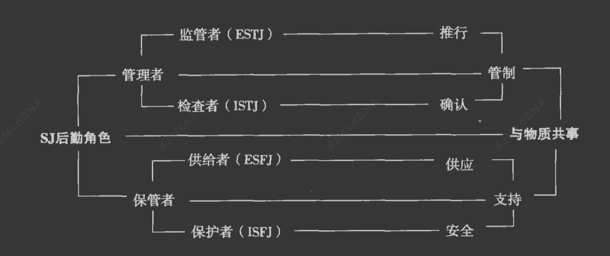
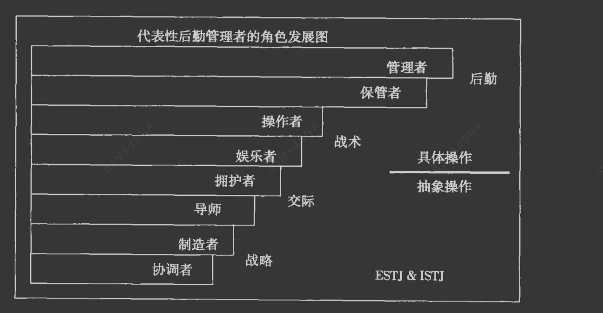
后勤智能和战术智能一样，十分便于观察和发现。后勤部署对象是具体而实际的日常事物，交际和战略是抽象行为。
SJ是名副其实的传统主义者，他们充满感情的保护培养传统，他们更享受传统观念的归属感，和安定感。相对于收益成本，他们更关注操作成本。
作为领导，SJ认为唯有恪守本分的工作者材质的他人赏识，他们用自己的艰辛换得自己的一切，包括他人的赞赏。他们觉得最勤奋尽职的下属才值得赞赏。
他们应该有意识训练自己注意到人们的细小成就。对于护卫者，批判别人的缺点比评价他们的优点更容易。他们总是井然有序，希望别人也能够和自己一样井然有序。
对护卫者，最后期限相当重要，如果有人忘记这些时间，他们会变得很不耐烦。他们永远只关注最顺从的员工，忽略质疑权威的人的贡献，常常令同事不满。
护卫者领导者起到稳定和巩固组织的作用，他们妥善安置工作带来莫大满足感，他们对政策心存敬意，他们坚韧有耐心，很少凡是实行错误。

管理者致力于后勤部署的调控工作，他们意志坚强，运用各种行政制度管理和运行。严格执行和遵守政策。自己指令性的职责，他们
十分满意，要么按规矩办事，要么卷铺盖走人。

ESTJ,指令性管理者，通过强化标准和指出他人的失职行为来管理其下属。监管者是管理标准模式的不二人选。他们不仅了解各项流程的操作标准，还会坚定不移的将标准应用于下属。
他们会极力推行各种制度和标准，密切关注员工执行情况。不过被他们指出的人往往心存不满，他们的工作往往费力不讨好。

ISTJ,指令性检查这，更多集中在产品和账目上，而不是生产流程， 他们工作异常勤奋且细致，但是他们更喜欢默默无闻的工作方式，发现和报告人们工作的不当之处，不会对质。
他们使用保险精算师，会计师，税务代理人。在处理金融事务时，他们是我们不可获取的得力助手。

ESFJ,维护性后勤,确保自己的公司物资供应充足，他们性格随和，热衷于提供各项支持，保证储备充足。他们适合商务采购，军需官。

ISFJ,确保保卫和防护性措施及时到位，保障人员财产安全，他们生来具备警惕感和安全意识。他们觉得安全享有至高无上的优先权，他们很早就致力于
培养锻炼自己的安全意识，他们是最优秀的保安，监护人，警卫官。当安全遭到破坏和一起故障时，体现了他们的重要性。
## NF
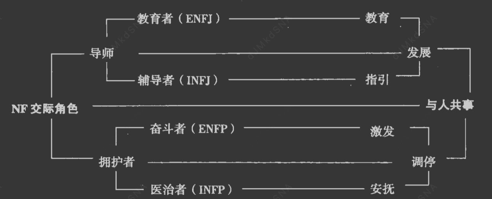
他们擅长与人打交道，可能像导师那样引领个人发展，可能像拥护者一样调节人际纷争。他们擅长的交际能力，是一种抽象极其难以言明的才能，观察起来不容易。
理想主义者对自身的交际才能有着清楚的认识，他们知道自己在任何与人交往的事物中获得成功。NF人对领导者的重视和赏识是最为敏感的，细微的否定也会造成毁灭性打击。
尽可能多的对他们鼓励和肯定，谈话焦点集中在方法和结果上。
理想主义者很少担任政治和军事领导者，但是在其他方面还是能成为领导者，比较宗教，教育。
他们渴望与人共事，他们能源源不断给人际关系注入活力，他们能发掘人性美好的一面，信奉以人为本的处事原则。他们关注人本身，而不是身份和地位。他们对个人发展
有浓厚兴趣，他们乐于发现员工潜质，他们倡导民主参与，对下属富有同情心。他们将大量时间满足他人需求，慷慨让出自己的时间，容易忽略自己的家庭义务。
他们需要学会规划时间。定期检查自己的目标，需要优先解决的问题和意图，看看是否偏离了正常的方向。
他们精力旺盛，富有浪漫主义观点，如果有人认为他们与众不同，他们会非常开心。但是面对负面评价，他们的情绪容易一落千丈。他们渴望与所有人建立融洽情感，
容易像所有人示好取悦别人。但他们觉得自己受到了缺乏人性的对待时，比如工具时，他们容易勃然大怒。


ENFJ 全身心投入教育和引导他人，通过各种方式启发启蒙思想，发掘其他人的品质。他们很擅长循循善诱，为学生的成长指点迷津。他们是所有理想主义者中[最积极乐观]的一类,

INFJ 擅长私人化辅导，他们外冷内热。他们有神奇的力量，他们能感知到其他人的需求和能力，帮助他人发现自我。在个人发展方面，他们是不可多得的人才。

ENFP,他们的交际智能体现在超高的调停和干预技巧。他们更倾向于探索他人内心推进他人自我发展。他们不会发布指令，而是源源不断的提供大量信息。他们热情投入事业，
寻求自我同一。他们是性格最活跃的一类人，他们满腔热血唤醒身边人，极力为他人设想。

INFP 他们鼓励他人回复完整的状态，调和矛盾，他们是精神治疗者，他们能成为出色的儿童辅导者。

## NT
战略智能体现在卓越的系统工作能力上，相对于战术和后勤，战略智能的观察也比较困难。理性者对他们的领导是否能够明白自己的战略智能深表怀疑。
他们擅长战略角色，他们是预想家，他们能预想到组织未来目标，构思战略发展规划，他们常常为自己的创造力和技术能力感到自豪。希望通过自己的系统天赋将复杂
的事情简单化。有关战略性工作，理性者都乐于去做。理性者往往不会称赞他们的上司下属，他们会觉得尴尬。
理性者容易忽略他人的情绪，他们通常着眼于长远规划和全局利益。他们下属往往认为他们冷酷，不近人情，不太愿意接近他们。和他们讨论日常生活会觉得拘谨不自在。
理性者不擅长闲谈，专注工作，很难以轻松姿态和下属谈论琐碎。
他们只关注重视聪明的下属，他们对自己和别人期望过高，他们常常觉得自己没达标，要求过严，同样的错误犯两次，让他们局的不能原谅。
当其他人做无效，低效率的事，他们容易大怒，坚持以最小付出换最大成效，他们可能伤害他人，对他人嘲讽和轻视，怀疑他人的能力。
他们有坚定不移的实用主义精神，一如既往的怀疑精神。

ENTJ,最擅长等级秩序的理性者，天生的指挥能力，擅长征募人力和物力资源，擅长调兵遣将。

INTJ,他们是排列大师，能针对复杂的项目，尽然有序安排操作行为，他们擅长指定战略，各项事务优先级，流程图。

ENTP,会根据脑海明确功能设想设计机械装置，大多数发明家默默无闻度过了他们的一生

INTP,他们性格孤僻，专注模型和结果，他们乐于从事系统设计的工作。
