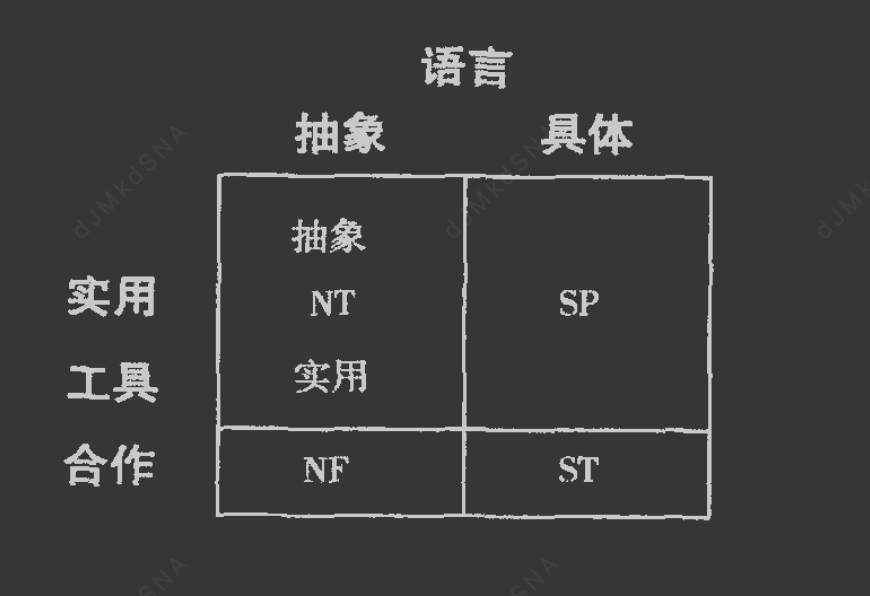

# 总纲
这本书最核心的观点就是  每个人 的人格 由  语言(思维)  和工具(行为)组成。

并且重要性来说：     语言 >  工具。


语言分：抽象语言(信仰,逻辑,直觉,情感,沟通,文学)  和  现实语言(吃住穿行,柴米油盐)

工具分：合作工具(关注他人情绪,以人为本)  和  实用工具(关注事情，达到目的为第一)


黄人SP: 现实语言 + 实用工具
蓝人SJ:现实语言 +  合作工具
绿人NF:抽象语言 + 合作工具
紫人NT:抽象语言 + 实用工具

语言>工具

绿人适合找抽象语言的对象，也就是适合绿人和紫人，并且绿人和紫人在工具上的差异，会产生更多意外的奇妙反应

# 四种人格的第一性原则,快速识别不同类型的人
人格 = 语言（思维模式）× 工具（行为模式）
语言维度：抽象 vs 具体 → 决定信息处理方式
工具维度：合作 vs 实用 → 决定目标实现方式
# 荣格8维


```
一、核心功能通俗比喻

外向感觉（Se）："现场直播导演"
眼睛就是摄像机，随时捕捉环境变化
活在当下，反应快，喜欢新鲜刺激
典型表现：看到新餐厅就想去，遇到机会就行动

内向感觉（Si）："历史档案管理员"
大脑里有个经验库，遇到新情况先查档案
喜欢熟悉的事物，做事有固定流程
典型表现：喜欢走熟悉的路，讨厌突发状况

外向直觉（Ne）："创意联想大师"
看到一个点，能联想到无数可能性
喜欢探索新想法，讨厌被束缚
典型表现：脑洞大，点子多，容易分心

内向直觉（Ni）："未来预言家"
能洞察事物本质，预见未来趋势
喜欢深度思考，追求意义
典型表现：说话有深度，能看到别人看不到的东西

外向思考（Te）："效率执行官"
注重结果和效率，喜欢制定计划
逻辑清晰，目标导向
典型表现：做事有条理，讨厌浪费时间

内向思考（Ti）："逻辑分析家"
喜欢分析事物原理，追求逻辑完美
独立思考，不盲从权威
典型表现：爱问"为什么"，喜欢拆解东西

外向情感（Fe）："和谐调解员"
关注他人感受，维护群体和谐
善于沟通，有同理心
典型表现：能察觉别人情绪，喜欢帮助人

内向情感（Fi）："价值观守护者"
有强烈的个人价值观和信念
忠于内心，追求真实
典型表现：为信念坚持，讨厌虚伪

```
# 气质Temperament 性格Character 人格Personality
## 气质
气质是与生俱来的、由生理基础决定的、相对稳定的心理活动的动力特征
主要类型（希波克拉底的四体液说）：
胆汁质：精力旺盛、反应迅速、情绪强烈、易冲动
多血质：活泼好动、反应迅速、兴趣广泛、注意力易转移
黏液质：安静稳重、反应缓慢、情绪稳定、注意力持久
抑郁质：敏感细腻、反应缓慢、情绪体验深刻、孤僻

## 性格
性格是后天形成的、与社会环境密切相关的、对现实稳定的态度和习惯化的行为方式
主要结构：
态度特征：对现实的态度（如诚实、虚伪、勤劳、懒惰）
意志特征：行为调节的自觉性和自制力
情绪特征：情绪活动的强度、稳定性、持久性
理智特征：认知活动的特点（如观察力、记忆力、想象力）

## 脾气
脾气是情绪反应的强度和表达方式，是情绪特征的外在表现，属于性格的情绪特征维度
主要表现：
急躁型：情绪反应强烈、易怒、缺乏耐心
温和型：情绪反应平和、有耐心、不易发怒
暴躁型：情绪爆发快、强度大、难以控制
沉稳型：情绪稳定、不易波动、控制力强

## 人格
气质+性格=人格

# 各大心理理论 行为学 性格学 人格学

## 行为主义理论(研究性格)
巴甫洛夫：通过狗的实验发现条件反射，提出"刺激-反应"联结，人是机器人,对外界的器械反应，核心观点,人在本质上是相同的

## 精神分析理论(研究性格)

弗洛伊德，人是动物,本能生物,核心观点,人在本质上是相同的

阿德勒 ，目的论
荣格，荣格8维

## 人本主义理论(研究性格)
马斯洛的需求层次理论

## 气质类型理论(研究气质)
盖伦四种体液理论 ，四种体液决定我们的行为和观念
柏拉图&亚里斯多德 四种性格类型

# 语言和工具
语言:我们如何与他人沟通
工具:我们如何使用工具实现自己的目标


## 语言
绝大部分人使用具体的语言使用方式，少部分人使用方式比较抽象
有些人倾向于传递眼前的事物，另一些人说话倾向于传递象征信息

有些人通过直觉自省为自己定位(自治)，另一些人通过感知观察寻找自我定位(他治)

## 工具
对工具的选择和使用，一半人使用实用性的方法，一半人采用合作式方法
实用性工具采用最有效的方式实现目标，以最经济作为唯一的衡量标准，最小成本最短时间
合作式通过和别人和睦相处来实现，谁应该使用它，其他人怎么看待这个工具
实用性或者合作式是优先级不同，大部分人都知道和睦相处以及采取最有效的方式实现目标，只是本能决定我们使用合作式还是实用性

实用性也分具体的 和 抽象的
抽象的先弄清楚方法和结果的关系，使用的会迅速行动起来
# 领域解释
## 战略 vs 战术
战略是"做什么"（方向性决策），战术是"怎么做"（具体执行方法）
战略是宏观层面的长期规划，关注整体目标和资源分配，解决"打什么仗"的问题。比如企业决定进入新市场、国家制定五年发展规划，这些都是战略层面的决策。

战术是微观层面的具体行动，关注执行细节和短期效果，解决"怎么打仗"的问题。比如营销活动如何开展、具体战役如何部署，这些都属于战术范畴。

简单来说，战略决定方向，战术决定方法。战略错了，战术再高明也难以成功；战术错了，战略目标也难以实现。两者相辅相成，共同构成完整的决策体系

## 技巧 vs 技术
技巧是主观的经验性能力，技术是客观的知识体系
是个人通过实践积累的经验和能力，具有主观性、经验性和个体差异性。它强调"怎么做得好"，表现为熟练程度、灵活性和创造性
是系统化的知识和方法体系，具有客观性、可复制性和普适性。它强调"做什么"和"为什么这么做"，表现为标准流程、原理和规范。比如：音乐理论、绘画技法、运动训练方法等
技术是技巧的基础，技巧是技术的升华。掌握技术后通过大量练习才能形成技巧，而技巧的总结提炼又能丰富技术体系。两者相辅相成，共同构成专业能力的完整维度。

## 抽象实用 vs 具体实用
抽象实用:最高效率
具体实用:最佳效果

抽象实用关注的是系统、理论和原则的效用，而具体实用关注的是当下、具体行动和工具的效用

抽象实用是 “道” ，重战略和原理。它回答“为什么”和“最终应该是什么”。
具体实用是 “术” ，重战术和操作。它回答“怎么做”和“现在是什么”
最好的解决方案往往来自于二者的结合：用抽象实用思维来制定正确的战略和方向（确保我们在做正确的事），用具体实用思维来高效地执行和落地（确保我们正确地做事）。
一个伟大的产品既需要抽象实用者构架出优雅的系统模型，也需要具体实用者将其打造成用户易用的工具

## 热情 vs 兴奋
热情是内在的想法,目标引发的情绪，兴奋时游戏、挑战引起的情绪


## 秩序 vs 组织
秩序（Order）指的是系统内部各要素之间相对稳定的关系状态和运行规则，强调结构、规则和稳定性。秩序是组织运行的结果和表现，体现为系统内部的有序性、可预测性和协调性。例如，一个国家的法律体系、社会规范构成了社会秩序

组织（Organization）则是指为实现特定目标而建立的结构、机制和人员安排，强调设计、构建和运作。组织是创造和维持秩序的手段，包括组织结构、制度设计、资源配置等要素。例如，政府机构、企业部门都是具体的组织形式。

核心区别：组织是"如何构建"，秩序是"构建后的状态"。组织是主动的、动态的构建过程，而秩序是被动的、静态的运行结果。组织通过制定规则、建立结构来创造秩序，秩序则是组织有效运作的体现。

在战略管理中，需要先设计合理的组织结构和机制（组织），才能实现系统的高效、稳定运行（秩序）

## 发明 vs 建造

发明（Invention）是从0到1的过程，核心是创造新概念、新原理、新方法。NT型人擅长跳出框架思考，发现现有系统的缺陷，提出颠覆性的解决方案。比如INTJ的战略规划、INTP的理论构建、ENTJ的组织创新、ENTP的创意发散，都属于发明范畴。

建造（Building）是从1到100的过程，核心是将概念转化为现实、将想法系统化。这需要将抽象理念转化为具体结构，建立可执行的体系。比如INTJ的战略执行、INTP的理论验证、ENTJ的组织管理、ENTP的方案落地，都属于建造范畴。

# SP(技艺者artisan,artifactor)


## 第一性原理
SP型（如ESFP/ESTP/ISFP/ISTP）的底层逻辑是"感官输入-即时反应"模式，其主导功能为外向感觉（Se），核心特点是：
先干了再说
敏锐捕捉当下环境细节
快速适应变化
追求即时体验和刺激,喜欢感官上的愉悦
```
SP型（如ESFP/ESTP/ISFP/ISTP）：显示器。SP型人格注重当下体验和感官输入，就像显示器实时呈现画面，追求即时反馈和刺激。他们灵活应变、行动导向，
如同显示器快速响应输入，展现丰富多彩的体验。

```

```
1. 信息处理机制：感官优先模式

SP型的大脑采用"自下而上"的认知模式：
优先处理感官输入（视觉、听觉、触觉等）
快速整合环境信息
即时做出反应，而非先对比经验
这种机制的优势在于反应速度和灵活性，能快速应对突发情况。

2. 时间导向：现在导向

SP型的时间观是"活在当下"：
关注当前的机会和体验
对未来的规划相对灵活
更愿意根据实际情况调整计划
这与SJ型的"过去指导未来"形成鲜明对比。

3. 决策逻辑：情境适应性

SP型的决策过程：
感知当前环境 → 快速评估 → 即时行动 → 边做边调整
核心驱动力是"抓住机会"和"避免错过"
4. 价值判断标准
ESFP/ISFP（Fi辅助）：以"个人价值观、审美体验"为判断标准
ESTP/ISTP（Ti辅助）：以"逻辑分析、效率优化"为判断标准

SP型的典型行为：
观察力敏锐，能快速发现细节变化
行动力强，想到就做
适应能力强，能快速应对突发状况
追求新鲜感和刺激
对规则和程序持灵活态度
与SJ型的对比：
SJ型：先评估风险，制定计划，按部就班执行
SP型：看到新机会就行动，边做边调整

```

敏感的感知力，战术大师，技巧是他们思想关注的焦点，实用至上，活在当下，灵活应变，渴望自由，喜欢制作具体而实际的物品，制造以感官刺激的物体(音乐，文学,舞蹈，雕塑，会话，建筑，体育，医学)
从感官生活获取快乐，不是从积累资产,也不是从道德或者逻辑对话。
他们重视经验和技巧，是机会主义者，关注利益和报酬，会具有剥削性。他们是感官敏锐者，他们可能运动神经发达。
他们用具体的语言交流，会选择实用性的方法来实现自己的目的。
他们没有高尚的志向，不在乎自己是否具备自省，他们关注现实世界实际发生的事情。


```
SP型（Se）的典型表现：
说话时眼神灵动，观察周围环境
喜欢尝试新事物，讨厌重复
反应快，能快速抓住重点
容易分心，注意力随环境变化
像"现场直播导演"：眼睛就是摄像机，随时捕捉环境变化，快速切换镜头，追求即时效果
特点：看到新餐厅就想去，遇到机会就行动，讨厌按部就班
```

## 具体的语言交流
讨论此时此刻正在发生，以及即将发生的事情,绝大多数SP不会把时间花在考虑根本无法观察或者接触的事物上。
他们在讨论事物时通常关注其字面含义，不深入象征含义，他们更偏爱直白的明喻，避免使用暗喻。
他们的语言很少出现计划，规划字眼。他们更倾向于明确描述具体的事物，而不是做概括归纳。
他们更倾向于讨论实际存在的单独事物，而不是讨论事物的种类。
思想上，他们通常重经验轻理论。抽象的概念很难吸引SP的注意力。他们更喜欢无需考虑原则假设且与想象无关的内容。
敏感的感知力，知道什么话让人听起来舒服满意。他们往往选择具体的语言表达他们看到的实物和感觉。
他们对身体的自我感觉往往最好。

## 具体的实用性的工具使用原则
他们的战术技巧越来越熟练
为了实现自己的目标，技艺者通常考虑什么方法最有用，什么工具最合适，而后才思考社会的认可。
只有有益有用的事物才能引起技艺者的注意和兴趣，要么能发挥作用，要么很实用。
实用性也有具体和抽象的区别，
SP型人不会像NT型人在使用工具前先弄清楚方法和结果的关系，他们会毫不犹豫选择实用的方法或工具，迅速行动起来。

## 战术天赋

SP擅长战术性改善他们身边的环境，改善自己状态的行为艺术，倾向于实践。实时的寻找机会和突破角度，做出有效行为，使自己获利。
无论是美术，飞行，打篮球，战场上当将军，还是演讲者，商人，政客，他们具有敏锐的感知力，最擅长用自然资源。
总是自如运用工具，巧妙记性发挥，他们对工具使用充满兴趣。

## 兴趣


他们对精神力量没有兴趣，不会为道德忧心忡忡，擅长和工具和装备打交道。

### 喜欢艺术
绘画,雕塑，表演，体育，文学，身体，机械，喜剧，工业，交易艺术

### 专注技巧technique
有实践经验和个体差异性,且有主观性,为了让技术完善,他们愿意克服困难花很多时间。
这点在艺术家和运动员体现最为明显，技巧始终是他们思想关注的焦点

### 对使用工具的职业兴趣
喜欢各种器械，装备，他们是工具的使用者，驾驶飞机，轮船，画笔，手术刀，战士，猎手

## 定位

### 务实面对一切
为了得到自己想要的一切，他们可以采取任何方法，无论是无理的还是惯例，只要能实现目标，
他们关心有什么好处，能从中得到什么，这和我有什么关系，回报是什么，务实就是具体的实用主义。
为了实现目的，技艺者可以付出任何努力，不计后果和代价。理性者追求用最少得努力换取最理想结果。

### 展望未来的乐观
乐观主义，他们比其他类型更容易因为意外事件影响而消沉。

### 过去
他们对于过去，无所谓的态度面对逆境，会说这就是生活，他们对人类行为，不会认为别人高贵，
他们会思考人们送礼物的意图。

### 从这里开始
对于活动，他们只想参与进去，而不是当观众，他们全神贯注在此时此刻发生的事情上

### 从现在开始
更加重视现在的生活和行为，对于SP人，没有比现在更重要的时刻了。面对过去和未来，他们似乎健忘。
他们很少反思自己的错误，很难从以往错误吸取经验，可能陷入恶性循环。

## 自我形象


要自我感觉良好，SP认为需要具备艺术家气质，大胆无畏，很强的适应性。


### 对艺术气质的自豪
技艺者向他人展示优雅的行为，为了追求艺术气质，他们可以一遍一遍的练习尝试。
比如舞蹈，开车。
他们重视大胆，以大胆自豪。

### 大胆创新的自尊
技艺者认为自己勇敢，大胆，敢于冒险，大多数跳伞运动员，赛车手，雇佣兵是SP
交易员和投资商也可能是喜欢冒险的技艺者。
他们更倾向于需要勇敢的身体行为的工作，表演，体育，建筑，摩托，飞机，消防员

### 适应能力自信
他们的自信建立在快速适应周围的环境。他们是最灵活，能根据环境快速做出反应的。
他们抗压能力强。


## 价值观

崇尚兴奋(来自外界)，珍惜冲动，看重自己对他人的影响,珍惜冲动
### 喜欢兴奋
他们像孩子一样，总是兴高采烈，他们享受振奋的状态。他们会被活动本身所吸引，他们爬山是为了心跳感，
他们的行为源于刺激和冒险和兴奋，他们讨厌单调和无聊。

### 信赖冲动
对SP，不管长远目标，为当前的行为而活才是最自由激动的生活。他们的目标更少更短暂，牵挂更少。
SP是最有可能响应远游的人。他们更加轻易的切断自己和社会家庭的联系，哪怕他们知道会对身边人造成伤害。
他们有时候像冲动的赌徒，但是冲动对他们不是负担，是兴奋剂。

### 渴望影响力
他们认为社会影响力至关重要，他们更渴望自己在社会发挥显著作用。这也是很多政治家是SP人的原因。
在政治中，可以尽情享受战术，兴奋，冒险，还拥有强大的政治影响力。

### 寻求刺激
他们相信变化是生活的调味剂，希望生活充满新鲜的经历。他们热衷于换房换车，尝试新食物。

### 认可慷慨大度
慷慨大度能打动他
## 社会角色

### 择偶
他们是最好享受的人，会把伴侣当成玩伴
### 父母
生性渴望自由，希望自己的孩子也能够自由。
### 领导
机会主义本性，随时把握时机，化解紧张局势的谈判技巧。
## 变体


### 战术操作者STP(偏战术,偏做事)
操作者技艺者对利己行为尤其感兴趣，他们会采用一切策略或工具为自己的事业或项目牟利，
在处于需要运用适时战术位置时，为了增加成功几率减少失败可能性采取的明智行为。
他们能灵活使用策略实现意图，他们清楚自己想去哪也清楚最快的捷进。为了实现自己的目标，
他们可以毫无顾忌告诉他人你应该做什么。

ESTP:圆滑的操作者精力都用于说服他人加入自己，积极表现自己的进取心，人就是他们手中的工具，擅长关注人们面部表情和肢体，通过诱惑，说服，宣传，动摇他人意志。销售，投资，政界，娱乐圈，商业等


ISTP:注意力集中在运用工具和机械设备上，很乐意于工具打交道,他们使用清楚如何用工具有效完成任务。医生，赛车手，驾驶员，手工艺等
### 战术娱乐者SFP(偏感官,偏与人相处)
战术娱乐者擅长需要即兴发挥的招待行为。友善见多识广的娱乐者能轻易的演奏，创作，分享创作比指挥他人更轻松。
他们也能发现隐藏在环境的感官细节并自发反应。他们更倾向于即兴应急的做事风格，不会预先设定事物的发展。
ESFP:表演者擅长在他人面前即兴表演，让每位观众尽兴，表演技巧一流，他们的社交兴趣是刺激身边的人或者事，唤醒他们沉睡的感官，他们大度，友善，但不会有严肃认真的关系。他们适合演员，歌唱家，舞蹈家，喜剧演员
ISFP:创作者更愿意创作令人愉悦的艺术品，任何对图像，声音，味道，结构，香气敏锐的感知力，但很少考虑让自己事业更进一步。作曲家，画家，导演，小说家，厨师，服装设计


# SJ(守卫者)


## 第一性原理


SJ型的底层逻辑是"经验积累-模式识别"模式，其主导功能为内向感觉（Si），核心特点是：
按规矩办事
系统化存储和调用过往经验
通过对比历史数据做出判断
建立稳定的认知框架
喜欢积累，有产者
```
SJ型（如ESFJ/ESTJ/ISFJ/ISTJ）：磁盘。SJ型人格注重经验积累和模式识别，就像磁盘存储数据、维护系统稳定。他们组织规划、遵循传统，
如同磁盘可靠地保存信息，确保系统有序运行。
```
```
1. 信息处理机制：经验数据库模式

SJ型的大脑如同一个不断更新的"经验数据库"，每遇到新信息时，会：
自动与存储的过往经验进行对比
寻找相似的模式和规律
基于历史成功/失败案例做出决策
这种机制的优势在于决策的稳定性和可预测性，但可能对全新情境反应较慢。

2. 时间导向：过去-未来轴

SJ型的时间观是"过去指导未来"：
通过总结历史经验来预测未来趋势
对传统和惯例有天然的信任
倾向于按既定计划执行，避免不确定性
这与SP型的"活在当下"形成鲜明对比。

3. 决策逻辑：对比验证法

SJ型的决策过程：
收集当前信息 → 与经验库对比 → 评估风险 → 选择最稳妥方案
核心驱动力是"避免重蹈覆辙"和"保持稳定"
4. 价值判断标准
ESTJ/ISTJ（Te辅助）：以"效率、逻辑、结果"为判断标准
ESFJ/ISFJ（Fe辅助）：以"和谐、责任、关系"为判断标准
四、实际表现特征

SJ型的典型行为：
注重细节和准确性
遵守规则和程序
责任感强，信守承诺
对变化持谨慎态度
擅长建立和维护秩序
与SP型的对比：
SP型：看到新机会就行动，边做边调整
SJ型：先评估风险，制定计划，按部就班执行

```

```
SJ型（Si）的典型表现：
做事有条理，喜欢列清单
对细节记忆准确，能记住过去的事
遵守规则，重视承诺
对变化持谨慎态度
像"历史档案管理员"：大脑里有个经验库，遇到新情况先查档案，对比过去成功案例
特点：喜欢熟悉的路线，做事有固定流程，讨厌突发状况

```
黑胆汁，海狸，松鼠

对规则制度有较强感知能力，相信规则，相信法律 ，擅长后勤，管理和维护 ，专注道德，捍卫对与错的实践
他们喜欢按照固定时间起床，固定管理洗漱，同一条路线上班，同一个时间去吃饭
他们可靠，乐于助人，他们认为服务是义务，他们是付出者，照顾别人
## 具体的语言交流
SJ讨论的话题也是客观世界的具体事物，讨论的话题大多是自己在客观世界看到的具体事物相关，商品，食物，贷款，薪水，天气，交通娱乐，电视电影
他们的话题连贯，会从一个话题联想到另一个与之有确切关系的话题，而不是像理性者演绎或者理想主义者归纳。
对于自己感兴趣的话题，护卫者会积累大量事实资料，使得自己在谈话时侃侃而谈，他们记住别人的名字和生日，住址等细微信息
可以轻易唤醒别人对另一个话题的回忆。
由于平时的积累，护卫者在有需要时才能轻松联想和使用这些信息，使他们侃侃而谈

他们说话时会比较正统，语言上会较传统的词汇表达，引经据典。

SJ话语往往有告诫之意，倾向于警告他人注意危险，
## 合作式工具使用原则
他们的后勤部署能力会越来越强
使用工具都有使用规则，SJ人会毫不犹豫认为需要服从这些规则。比如马路不能逆行，红灯没车也要等，旁边没人也要打
转向灯。他们是顺从，遵守，合作思维。
他们重视规则，他们认为长远看，忽视规则是通向毁灭的不归路。
他们认为我们应该与他人合作，在纪律和协作中完成目标。
护卫者倾向于指定和推行指导人类的法则，通过建立和遵守原则，制度，我们才能保卫自己的家园。
近一半总统是护卫者，他们可能是大学管理委员会成员，警察，司法官，法官。
他们对规则的观察和鉴别很敏锐。他们相信规则是社会之本。他们认为法律是有效标准。

## 后勤天赋


他们关心如何保持事物可靠，维持物质资源。


## 兴趣
喜欢擅长与物资打交道


### 专注安全金融
税务，保险比较受亲来
### 专注道德
SJ他们有道德使命感，一种约束思想，知道该做啥不该做啥
NF的精神力量是感受性，用来了解自我与别人相处。
### 物资工作的职业兴趣
喜欢对物资管理有兴趣的工作，收集，存储，测量

## 定位

他们的观点是尽职尽责，面对将来过去较悲观
### 尽职尽业面对一切
尽职尽业的思想看世界，勤劳工作和精打细算，他们觉得勤奋工作和积累财富是每个人的义务
他们勤奋工作，精打细算生活，

### 展望未来时的悲观
大部分精力用于约束别人的行为，维持快速发展的现状，他们养成了最坏打算的习惯，做好准备比什么都重要
任何可能出错的事最终难免都会出错
做好准备比什么都重要

### 过去
坦然接受，他们是典型的宿命论
### 这里
他们密切关注每个人的安全和行踪
### 现在
他们的目光集中在昨天，他们对新生创新有怀疑，对过去充满敬畏，忠实于日常管理，按部就班。
他们喜欢按照固定时间起床，固定管理洗漱，同一条路线上班，同一个时间去吃饭，买同样的品牌。
他们觉得老方法是最好的方法

## 自我形象

可靠，有帮助，值得尊敬
### 以可靠为基础的自豪

为了维持可靠形象，他们有时候不懂得拒绝，肩负额外负担，有的人会利用他们任劳任怨的心理
当他们努力得不到欣赏时，他们会觉得自己做得不够好，会做很多费力不讨好的工作来摆脱这种感觉
### 基于有帮助的自尊
SJ生来乐于助人，多做好事帮助他人获得自尊感，在他们眼里，服务是一种义务，他们的自尊建立在为他人服务的义务感上
他们在社区担任志愿者义工，在家做各种事情，他们十分关心他人。
他们认为服务是义务，不做就会背负自私的名号，他们的自助建立在为他人服务的义务感上，只有他照顾别人，不会出现
别人照顾他。
### 名望带来的自信
他们谦虚，低调，不爱出风头，讨厌出风头的人，公众的认可是他们自信的基础。在事业上，家庭上，社会上赢得尊重
是对他们最好的的奖励。

## 价值观

### 本性多虑
关心家庭，工作，家人，他们关心广泛，忧国忧民。容易受消极情绪影响。
他们往往很幽默，也有充实惬意的生活。
### 信赖权威
他们相信权威阶级系统，他们从小是乖孩子，听老师教诲，遵照老师要求做的
一般3/4老师是护卫者，教授书本知识，灌输遵守秩序的思想。
### 渴望归属感
他们对归属感十分渴望，会热衷参加各种团体
### 追求安全感
他们时刻警惕，关注危险
### 感恩
他们更加珍惜他人对自己的付出，他们无私尽力，感恩让他们很开心
### 成为管理者
他们想成为社会机构的领导人，成为管理者，变成权威。
## 社会角色

### 择偶
合作伙伴，他们把对方当做合作伙伴，有义务和他们一起作战，
### 鼓励交际的父母
他们希望孩子彬彬有礼，具备社会化，尽可能帮助他们，适应社会。
### 稳定型领导
稳定的管理是优秀领导前提，该做什么，怎么做，派谁做。
他会建立一套细致规则，让每个人知道自己的职责。
## 后勤变体


### 管理者(意志坚定型)

热衷承担管理职责，用严谨的标准来管理自己职权内人员和产品。指导性政策和程序管理者
第一要务是掌管一切，告诉他人怎么做。

ESTJ:监管者推行标准操作流程，关心约束人们是否符合行为标准和操作流程，很少关注人的安全问题，典型唯物主义者
        凡事讲究具体，详细表格和操作流程是他们最信赖的工具。愿意脚踏实地做人做事。
        军官不容忍自己部队出现违纪的人。他们有很强的社会性，崇尚经过时间验证的规则和行为模式。
        他们大多不善于聆听，不会耐心听反面意见。擅长规则程序和规章制度。适合法律，政治，警察，军队。
        传统和礼仪是他们人际关系的两大原则。
        他们对孩子的关心首屈一指，孩子个人主义和叛逆让他们忧心忡忡。

ISTJ:选择幕后工作，严格检查每件物品，鉴定员，审计员，家庭预算，他们都会仔细全面的审查，他们会仔细审查事物是否符合标准。
        他们极度可靠，他们语言简单朴质，不会炫耀，他们生活尽然有序，深知仪式重要性。他们认为所有计划都得正确执行，所有
        资源都维持在标准状态。一旦发现不规则的行为和产品，他们会毫不犹豫上报领导，别人会认为他们冷血。
        他们会成为优秀的银行核验员，审计员，会计。他们一诺千金，交往不提供虚假和不可靠信息。他们适合牙医，律师，军官。
        他们对待孩子比较严格，会制定家规。
### 保管者(友好型)
后勤支持，随时为自己的人和物品提供补给和帮助，咨询人力和财物保管。积累，存蓄，收集，采购

ESFJ:供给者为他人提供生活必需品，热衷为他人服务，雪中送炭的供给者能及时帮助团队成员。

ISFJ:让他人不受危险，保护别人的财产，关注其他人的安全问题，但很少愿意纠正别人。
    

# NF(理想主义者)
## 第一性原理
NF型人格的底层逻辑是"理想构建-价值驱动"(先想明白这事儿有没有意义，再决定要不要干)模式，其主导功能为直觉（N）和情感（F）的组合，核心驱动力在于通过直觉洞察构建理想图景，并基于个人价值观和情感连接推动行动，看感觉对不对
他们擅长归纳总结
他们做事的核心思路是：先看这件事符不符合自己的理想和价值观，如果觉得有意义、有价值，就会充满热情地投入；如果觉得没意思、没意义，就算再赚钱、再容易，也提不起劲

NF人遇到事情，第一反应不是"怎么做"，而是"为什么要做这个？"他们需要先理解背后的意义和目的，才能产生动力

他们是感觉敏锐者，他们擅长反思，喜欢归纳，充满热情，关注人的心灵，乐于分享，懂得自律。
他们是身份追求型人格，他们对他人的情绪能感同身受。他们接受能力强
不利环境下，理想主义变得极不理智，是因为强烈的消极情绪占据了他们，使得他们无法正确


```
NF型（如ENFP/ENFJ/INFP/INFJ）：操作系统。NF型人格关注意义、价值和可能性，就像操作系统连接硬件和软件，为系统赋予意义和方向。他们擅长理解人的需求、建立情感连接、激发他人潜能，
如同操作系统协调资源、提供用户界面、让整个系统"活"起来。
```
```
1. 追求"为什么"：NF人遇到事情，第一反应不是"怎么做"，而是"为什么要做这个？"他们需要先理解背后的意义和目的，才能产生动力。

2. 看重"感觉对不对"：他们做决定主要靠"感觉"——不是情绪化的感觉，而是这件事符不符合自己的价值观、道德观，能不能带来精神上的满足感。

3. 喜欢"画大饼"：NF人特别擅长想象未来，能看到各种可能性。他们不是活在当下，而是活在自己构建的理想世界里。

4. 在乎"人和人之间的连接"：他们很在意人际关系是否真诚、和谐，喜欢帮助别人成长，讨厌冷漠和功利。

```
```
底层逻辑的四个维度

1. 意义驱动（Meaning-Driven）

NF型人格的核心驱动力是寻找和创造意义。他们不满足于表面的现实，而是不断追问"为什么"，试图理解事物背后的深层含义和目的。这种意义导向使他们成为理想主义者和变革推动者。

2. 可能性导向（Possibility-Oriented）

NF型人格擅长看到"可能是什么"而非"现在是什么"。他们通过直觉功能不断生成新的想法、连接不同的概念，这种前瞻性思维使他们能够预见未来趋势和潜在的发展方向。

3. 价值判断（Value-Based Judgment）

情感功能（F）使NF型人格基于个人或集体的价值观做出决策。他们关注"应该是什么"而非"是什么"，追求符合道德、伦理和人文关怀的解决方案。

4. 关系连接（Relational Connection）

NF型人格重视人与人之间的情感连接和和谐。他们擅长理解他人情感需求，通过共情建立深度关系，这种能力使他们成为优秀的沟通者、激励者和领导者。

```
黄胆汁，不擅长控制自己的情绪
虔诚的教徒，有稳定的信仰，身份追求型人格，自省
敏锐的感受力
善于接受，接受能力强，适应能力强，善于调节，乐观，多情，性格柔和
直觉感受型
极富创造力
充满热情
仁慈善良
富有洞察力
虔诚

抽象的合作者
擅长归纳自己的想法和观点
能够敏锐的感知事物内在的联系
关注人的心灵
具有很强的第六感
他们稍微聆听就能从细节跳到对事物的总体把握
热衷于在不同事物间建立联系
他们的语言缺少循序渐渐地层次感，感觉一蹴而就
以众人一致意见为合作，合作是大家都认可统一的行为
关注的是精神力量和快乐
愿意热情赞美他们
## 抽象的语言使用方式

谈话时，理想主义者会很自然的想归纳自己的想法和观点，他们很快将话题从局部转向整体
他们能敏锐感知事物内在线索，他们喜欢跟着自己的感觉走，他们能从细节概括出整体。
他们喜欢揭开世界的意义和价值，他们的思想往往直击本质，他们追求绝对真理。他们会跟着直觉将原本对立的事物通过
某种关联起来。
他们可以轻而易举说出这个人是恶魔，这个人是天使。
他们的态度可能比较热烈明确，但是因为他们敏锐的感知力，他们会显得比较细腻

## 合作式的工具使用原则
以众人的一致意见为基础的合作，而不是护卫者那种以服从为原则的合作
```
NF型（理想主义者）的合作逻辑是"意义驱动"——他们需要先达成价值认同，只有当所有人都真心认同这件事的意义和方向时，才会投入合作。这种合作建立在"我们共同相信什么"的基础上，强调精神层面的共鸣和理想的一致性。

SJ型（护卫者）的合作逻辑是"责任驱动"——他们遵循规则和秩序，合作的基础是明确的职责分工、流程规范和权威认可。只要符合既定规则、有人负责、流程清晰，他们就会执行，不需要过多讨论"为什么"。

```
NF人认为实用主义如果不符合道德和法律要求，往往适得其反，人们不能为了提高实用性而无视他人感受。
NF人看来，斗争让人难受，他们往往通过安抚、调和、辅助来维持亲善的人际关系
他们接受工具发挥其功效的方式，但是必须严密审查，避免对大家产生不利后果。

## 交际天赋

他们往往首要考虑如何培养亲善的人际关系。
NF型人与人相处的交际水平也会越来越好
他们总是能迅速发现人和事物的共同点，懂得换位思考，他们关注事物的内涵。
他们喜欢社交，往往是分裂和歧视，争论让他们感到无比烦恼和焦虑。
他们认为宗教、道德、政治、逻辑都是强加在共有人性上的人为概念，他们更关注"共享体验"和普遍性真理。

## 兴趣


他们对交际行为的兴趣成为了他们锻炼社交技巧的最大动力，他们喜欢社交，唯一制约这个循环的因素是交际技巧的
质量和数量。

他们喜欢建立亲密关系也会带来麻烦，泛滥的同情心，他们的感情会迅速升温帮助他们化解矛盾。
他们需要和人们建立某种情感隔离带，避免太多麻烦事。
### 人文学科
他们会被人文学科吸引，他们从小构建精神力量，擅长人事相关的工作。
需要用文字传递思想的职业，更符合他们的天性。

### 社会学科
社会科学也让他们很喜欢，指引他们成长，帮助他人了解自己。

### 精神力量
关注精神力量，乐于助人，护卫者帮助他人是为了维护积极的自我形象，理想主义者更关注他们的精神力量。
NF,SJ都是道德守护者，NF更关注快乐和能量，后者更专注秩序和正义。


## 定位


### 利他主义
全身心的愿意帮助别人,利他主义，无私的面对一切。形而上的。
常常被其他人怀疑动机，他们愿意发现其他人的美德，帮助他人开发美德。

### 展望未来天真
他们容易轻易相信其他人，他们容易有固执的信念，坚定不移的倡导它
但是当某个事情缺乏深远持久的意义是，他们参与运动的热情就是昙花一现。

### 关注过程和路径
他们关注冒险，精神追求，

### 过去
他们会用一种神秘莫测的观点解释一切


## 自我形象

### 情感共鸣的自豪
与亲近的人情感共鸣让他们自豪，如果不能和身边人分享经历和情感，缺乏亲善意识，他们会觉得生活没有意义。
他们参加组织各种活动的目的，都是为了找到一种自由充满爱意的生活方式。
### 慈善为基础的自尊
他们往往擅长反思，保持善心，对内心的敌意和抽哼，会极力压抑。他们会奋力反抗任何残忍行为。
他们欣赏护卫者的善行和理性者的自律，但是对技艺者的胆大肤浅很反感。
### 依赖真实可信的自信
他们展示的自我形象必须真实不虚假，一旦出现虚伪和伪装，他们会缺少自信。

他们既要保持真实的自己，又要尽量取悦别人，他们会陷入矛盾中，需要学会平衡这种矛盾。理性者通过将评定自身言行的权利留给别人，对别人的评价极其敏感

## 价值观
他们相信心灵是人性的灵魂，技艺者。他们重试热情(内在),珍惜直觉，看重自己与他人的沟通交流。他们的奋斗目标是成为圣贤而不是艺术家


### 本性热情
很容易动情感,来得也快去的也快,大多有积极性格

### 信赖直觉
可以感受到他人的切肤之痛，设身处地为他人着想
以至于下意识按照别人的方式说话和行为，对别人感同身受越多，越想将自己的观念强加给别人


### 追求个性
花了大量时间寻找自己的个性和自我，他们对他人和自己，他们所关注的只有自我，每个人的核心本质。
他们会对地球上竟然有90%的人不关心自我而感到心烦意乱。

### 珍视认可
认可他们让他们很开心
### 立志为圣贤

## 社会角色


### 择偶
心灵伴侣，他们希望对方不开口也了解自己。
### 融洽型父母
培养积极的自我形象
### 领导
引导，关注下属的良好感觉
## 角色变体


### 交际型导师型

教育者ENFJ，自我身份是他们永远追求的目标，他们珍视他人的认可，他们擅长规划，他们擅长大规模团队教育，交际，善于规划的理想主义者，导师这个角色会给他们带来很大满足感
他们喜欢明确的安排和计划，指引他人思考。他们有一种天生的创造力和自信。
他们擅长启发开导不同层次的学习者，不断完善自我。他们喜欢人文科学，精神力量是他们关注的焦点。
他们擅长人事相关工作，擅长探索，目光焦点始终在未来。情感共鸣，慈善，真实可信是他们自我形象的根基。
和ESFJ的差别，ESFJ是天生的主人，他们会让每一位客人妥善招待，让自己表现得得体大方，关注道德层面
ENFJ更关注个人成长和发展，他们认为人永远是第一位。由于他们具有感同身受的能力，他们可能下意识模仿他人。
他们的洞察力很强，他们不仅知道自己内心的想法，也能准确获取他人的心理动向，对他人意向的理解和判断，他们很少出错。


辅导者INFJ，他们渴望为他人的幸福贡献自己的力量，乐于指引他人获得更高层次的自我实现。他们的内心世界很丰富，但是他们只会与那些值得信赖的人分享感受。
他们强大的接纳和感知能力容易让他受到身边人的伤害，这会让他们变得安静。在所有类型人中，他们是最有可能理解通灵现象的。
他们想象力丰富，有一定的完美主义思想。他们是奉献型父母。
### 交际型拥护者
奋斗者ENFP，他们喜欢探索，和开放性体验。他们是提供信息的拥护者，他们将自己发现的故事告诉大家，希望从中揭示一些真相激励他人采取行动。
渴望揭示社会事件的强大动力，奋斗者可以不知疲倦的和他人交流。他们的热情极具感染力，他们是所有人中最活泼有朝气的人。
拥护就是说出自己的观点，信仰，目标，他们侧重于明确的目标，满腔热血，为一个目标全力以赴。
奋斗者渴望走遍千山万水，亲身体验发生在他们身边的有意义的事情，他们会热情澎湃投入到奋斗行为，拥护他们信仰的 真理和理想。
他们善解人意，可能经常做出离经叛道的行为，他们带来的惊喜和诧异无处不在。


医治者致力于个人安抚，更擅长化解矛盾，帮助身边人恢复健康心理，是为了完成自我修复。每隔一段时间，医治者便需要回到个人空间， 静静思考恢复。

# NT(理性者)
猫头鹰

## 第一性原理
NT型人格（如ENTP/ENTJ/INTP/INTJ）的底层逻辑可以概括为"抽象建模-系统优化"模式，其核心运作机制围绕概念化、理论化和效率最大化展开
他们是知识寻求性人格
```
NT型（如ENTP/ENTJ/INTP/INTJ）：CPU/处理器。NT型人格追求逻辑、效率和系统优化，就像CPU处理信息、执行计算、优化算法。
他们擅长抽象思维、理论构建、战略规划，不断寻找更优解，如同CPU通过逻辑运算提升系统性能。
```

```
NT型人格的第一性原理是通过构建抽象模型来理解和改造世界。他们不满足于直接经验（S型）或情感价值（F型），而是追求事物背后的规律、原理和系统结构。这种认知模式体现在：

1. 概念化驱动：NT型人天然倾向于将具体现象抽象为概念、理论和框架。他们看到一棵树，思考的是光合作用的原理；遇到人际关系问题，会构建心理模型来分析互动模式。

2. 系统思维：他们习惯将事物视为相互关联的系统，寻找变量之间的因果关系和反馈循环。这种思维方式使他们擅长识别模式、预测趋势和优化流程。

3. 效率导向：NT型人追求"最优解"，不断质疑现状、挑战假设，寻找更高效、更合理的解决方案。这种驱动力使他们成为天生的创新者和改革者。

```
## 抽象语言使用
理性者讨论的大多数是概念性事物，存在眼前可以被感知的具体事物，他们往往不太感兴趣。他们往往谈论想象当中的概念性事物。谈话中，理性者会试图避免
与话题无关的内容，他们不愿意反复强调自己的观点，他们会觉得这些事显而易见的。他们的简明风格，往往让其他人很难跟上他们的思维。

他们擅长演绎推理，语言和思考措辞比较精准。对应字词意义的界定，理性者常常非常严格。
他们愿意花费大量时间区分意义相近的字词，可能让其他人会觉得拘泥于琐事。按照逻辑来安排字词的顺序保证语的一致性也是一种推理。

很多理性者喜欢阅读词典，翻阅词典让他们清楚知道每个词语的精确含义。他们词库存储量越来越丰富，他们可能喜欢玩文字游戏。
## 实用至上的工具使用
在追求自己的目标时，他们奉行的是实用至上的原则。他们更加看重工具的时效性，而不是他的社会可接受度，法律道德上人们是否接受他。

他们不排斥和社会组织合作，但是他们会优先考虑让工具最大限度发挥作用，将取悦他人放在第二位。

和SP实用性的区别:SP关注有效的操作，NT关注高效率的操作。一个操作可以实现目标，但是成本消耗过高，我们只能说是有效的，不能说是高效的。
NT寻找到的是最少的投入换取最大产出的高效率操作。

即使自己的实用主义得不到社会认可，不符合政治制度，理性者也会我行我素。他们会虚心听取任何人有效意见，但是会忽略反对实用主义的观点。

理性者常以原动力者自居，他们认为自己有义务高举实用主义大旗，对传统提出挑战，将高效率的意图贯穿在事业中。
## 战略天赋
为自己设定的目标大都与提高系统效率有关，有的关注社会系统，有的关注机械系统。 不管是哪种，NT人的目标都是单一明确，提高该系统的效率。
理性者分析系统的方式很简单，寻找低消耗和0消耗的操作方式，他们擅长从复杂的系统发现错误，防止系统出问题，系统有问题时,他们是所有问题的解决者。


有的理性者对秩序更感兴趣，称之为协调者(系统运作)，有的理性者对组织更感兴趣，称之为制造者(系统发明创造)
秩序有空间秩序(军队军衔)，时间秩序(手机发射顺序)
协调者更喜欢排列的工作，军队协作作战战略部署，打麻将排列策略。
制造者更喜欢建造，构建系统需要的各个组成部分，发明机械装置，设计结构。

## 兴趣

和NF人一样，他们喜欢使用抽象的语言，喜欢自省。他们往往会被科学和数学课程吸引。对艺术和手工活动是业余水平。
他们对技术表现出很浓厚的兴趣，他们对道德层面的话题不感兴趣。他们最好找一份与系统相关的工作。
### 热衷科学
他们在古代是巫师，用自己的意志操控自然。 中世纪变成了炼金术士，现在是科学家，唯有可续让他们有强烈的求知欲
他们有很强的探究自然规律的欲望，他们会继续观察世界，设计自己的试验。
### 专注技术
理性者关注技术，技艺者迷恋技巧，技术是他们的兴趣所在
### 对系统感兴趣
理性者认为机器和有机体充满了无穷的魅力，包括人类学，生物学，动物行为学，心理学，社会学。
机器则是工作师的职责范涛。能激发他们兴趣投入到系统工作的事复杂性本身，与他是有机体还是机器没有任何关系。


## 定位

在遇到意外或者危险打击时，我们会暂时失去自己的社会定位，但是我们很快又会重新找到自己的社会位置。
对于现在，他们非常注重实效
面对未来却有些多疑，
面对过去，他们又喜欢相对论的观点评价。
他们喜欢将时间划分为间隔性区间他们倾向于将时间划分为不连续的、有明确边界的块状区间，而不是线性的、连续的时间流。

```
具体含义：

1. 时间块状化：NT型人习惯将时间划分为"工作块""学习块""休息块"等独立区间，每个区间有明确的开始和结束，专注于单一任务，避免多任务切换。

2. 深度专注：在某个时间区间内，他们会完全沉浸其中，追求深度思考和系统化工作，对时间流逝不敏感（进入"心流"状态）。

3. 边界清晰：不同时间区间之间有明确的切换点，比如"上午9-11点写方案""下午2-4点开会"，区间之间会主动休息或转换状态。

4. 非线性规划：他们不追求"每分钟都高效"，而是通过合理分配时间块来保证关键任务的深度完成，允许某些时间段"浪费"在思考或探索上。

与SJ型对比：SJ型（如ISTJ/ESTJ）更倾向于线性时间观，追求"按部就班""不浪费时间"，而NT型更注重"在关键时间块内实现突破性进展"。
```
### 注重实效的态度面对一切
理性者会从讲究实效的角度来分析解释一切，他们必须采取高效的方式实现自己的目标，还必须付出行动前就预计其行为能产生的实际价值。
他们往往采用最小的努力换取最大的回报，他们会因为浪费时间和精力感到烦恼。他们觉得自己有义务为其他人选择最高效的工具和资源。
他们最关注的莫过于效率问题，他们好像推销效率的商人，无论走在那都会积极思考推广效率。
他们十分痛恨同一错误屡次发生的行为。他们在一心一意追求实用方法时，可能无视社会习俗的存在。

### 展望未来时多疑
他们对一切都充满怀疑，他们觉得所有人的努力都躲不开错误的纠缠。他们觉得所有的事情都是不确定的，所有一切都是值得怀疑的。
### 回望过去相对而论
他们可能用以上任何方式为过去发生的事情寻找合理化的解释。他们也会用一种相对而论的角度对待过去的一切。
他们认为所有的事情都是相对的，一切都取决于参照物。他们认为所有的一切都被蒙上了主观色彩，我们只能想象到
关于自己的世界。

### 地点在交叉点

### 时间就是间隔性区间
他们认为时间不是连续的线，而是间隔性的区间，事件本身来定义时间，事件是时间的创造者。
## 自我形象


### 以聪明才智为基础的自豪感
他们在乎的不是任务的性质，而是自己在完成这些任务时的聪明才智。
他们玩游戏并不是为了寻求乐趣，而是为了在掌握游戏技能中锻炼自己的聪明才智。他们的乐趣存在于完善技能的过程中。
他们觉得游戏和竞赛就是实验室，他们通过练习不断完善自己的技能。
他们绝不会像技艺者那样放任自己做出欠考虑的事情，技艺者认为游戏和竞赛是源于冲动的活动，参与其中是为了寻求乐趣。
技能提高只是附加性结果。理性者的观点恰恰相反，他们参与游戏就是为了提高技能。

SP投入完全是因为他们一种放松的自发行为，而NT的参与是深思熟虑有意识的练习。
技艺者的参与是冲动轻松的行为，理性者的参与是深思熟虑充满目的性的行为。

理性者是最容易最喜欢对自己的能力进行自我批评的人，他们会无情的揭露和谴责自己的错误。但是他们绝不会允许其他人随意批评自己。
当他们收到不公正不准确的批评，他们往往会在脑海构思高效不失优雅的报复。

### 基于自治的自尊
理性者希望掌握自己的控制权，他们在很小的时候就知道不能轻易接受任何人的观点，至于提出观点的是谁不重要。
这种不尊重权威的天性让理性者显得有点自负和傲慢。
理性者将自治看成最值得歌颂的美德，他们觉得依赖他人变得不齿。

### 坚韧决心的自信
他们相信，只要有决心，就能克服任何困难。他们惧怕自己意志力会衰退。
## 价值观

### 镇静沉着
他们看起来冷漠，是因为他们的精力和思想投入到了专注的研究中，他们约束自己的情感，是为了控制自己的行为，不扰乱自己的研究。
理性者并不像他们表面上看起来那么冷漠，他们的感情也和其他人一样浓厚，只不过他们制约和管束情感的力度远远大于其他人。
### 相信理智
他们唯一能无条件信赖的就是理智，他们对其他任何事物的信赖都是有条件基础的。
他们偶尔相信直觉，但是不会信赖冲动。他们认为唯有理智才有一般性和永恒性。
### 希望成就
他们热衷获取知识，希望自己成为有创造性的人。对他们而言，工作是工作，游戏还是工作。
批评他们无所事事是对理性者最严厉的惩罚。
他们全心全意工作的目的就是为了实现自己的目标。一旦进入工作状态，他们就会失去理智，对他人和自己提出苛刻的要求，制定过高的标准。

### 追求知识
他们对知识的需求包含双重目标：1.领会事件发生所必须充分具备的条件。2.理解操作能力和技术的局限性。
他们和NF人一样喜欢问为什么，但是他们不是问事物本身的意义和价值，而是问工作原理。
他们始终未忘记积累知识的任务。他们是知识寻求型人格。
### 珍惜他人的敬重
对他们聪明理性色彩取得成就的认可，让他们心花怒放。但是理性者无法开口索取这种赞美。
### 立志成为奇才
他们往往将技术型奇才作为自己奋斗的目标。
## 社会角色

## 角色变体


### 协调者

他们往往有指导性性格。随着日渐成熟，他们指导他人的愿望会越来越强烈，他们会因为向他人提供指导感到惬意，向他人下达指令对他们来说是轻而易举的事情，他们也希望其他人遵守自己的指令。
他们认为大多数人的行为是盲目的，他们只是在做一些毫无意义的循环性工作，需要自己的指导。
他们会制定井然有序的等级制度，命令的传达和力量调配成为可能。他们表现力强，精力充沛，会充分利用任何可以为己所用的资源，并帮助他们执行极其复杂的战略计划。
他们擅长不仅是军事活动，商业行为，政治行为，需要排列技巧的活动。他们会执行计划A,B,C


ENTJ指挥者，指挥者更擅长针对目标指挥和调配资源，不擅长结构的建造工作
INTJ策划者,能对行动进行深入精确研究，制定应急预案的行动计划，但不擅长技术性发明工作。

### 制造者
他们喜欢探索，思想开发，愿意接受为自己提供指引的观点。他们更倾向于资讯的制造者，有兴趣为人们提供其当前设计工作的信息和报告，但不擅长调配资源。
他们注重对发明  原型能力的培养，功能是他们的唯一目标。

ENTP发明者,有创造天赋，设计出很多天才功能原型，但不擅长制定详细的战略计划。
INTP建造者,可以设计出高效的模型，但是很难实现资源的高效执行。


# 择偶

## 配对规律
到底选择相同气质还是相异气质？
常见的比较融洽的组合方式,既相似也不同：语言相似，对工具的使用相异
SP《=》SJ
NF《=》NT


选择相似处：具体或抽象的思维和语言习惯，N更适合N(抽象语音),S更适合S(具体语言),说明语言交流方式是人与人最重要的一大差异

选择相异处：合作或实用的工具使用原则，在做事方式上互补，合作方式和实用方式互补

思维=语言，对一段关系是否稳定具有很大的影响，当夫妻双方谈话内容集中在自己观察的事物上(S)，或者他们
想象中的事物(N)时，他们能很快意识到自己和对方在发送相同波长的信息。

工具=行为做事

我们总是想当然认为自己的生活目标就是最好的目标，适用于所有人，但是我们的对象不可能心甘情愿接受别人的生活目标

SP最重视生活追求的感官刺激，SJ重视社会地位和经济条件的安全感，NF追寻个人身份的认同，NT把知识当成自己追求的目标

## SP(技艺者)
当性行为当做刺激体验
SP追求刺激和冲动，寻求感官刺激，更关注外形性感程度，喜欢冒险，抽象的食物打动不了他们，象征性的刺激打动不了他们，
对于感官刺激特别强烈，推崇享受生活，无拘无束，但是时间久了，作为对象就会心生不满。

喜欢很多身体行为满足自己的渴望，比如钓鱼，打猎，赛车，冲浪，自行车

不太愿意讨论自己的内心感情,不喜欢抽象的话题
## SJ(护卫者)
当性行为当做义务
以家庭为中心的传统配偶，忠诚可靠，积累养育，喜欢游乐园，各种观赏性公园，动物园，植物园，话剧，音乐剧
生性节俭，聚餐时希望对方礼貌对待自己，让自己看起来更加绅士，会长时间钟情于一个人
SJ更倾向传统爱恋，重视礼节，他们喜欢从事各个家务活动，一般很守时，在指定计划后喜欢严格执行
喜欢细水长流，对待性生活保守，喜欢在熟悉的地方做相同的事情，对待性比较严肃认真，尝尝会把性生活当做一种职责
喜欢脚踏实地循规蹈矩，通过为他人提供服务来体现自身忠诚可靠。
护卫者在婚姻中扮演的是侍卫的角色，通过为他人提供服务来体现忠诚，可靠的品质

## NF(理想主义者)
善于发现别人的优点，擅长赞美，敏锐感知别人的情绪和情感，最热情
天生拥有认可和了解他人精神世界的力量，敏锐的感知力，对别人理解和包容
将性行为当做爱

NF和SP
滔滔不绝讨论真我，深刻的意识，抽象的话题，不适合SP，SP不太愿意讨论自己的内心感情,不喜欢抽象的话题

NF和SJ
SJ舒适，安定，踏实，在日常生活规则和规范问题无异议，但是护卫者无法满足分享内向思想的要求

NF和NF
可能存在竞争者关系

NF和NT
NT的冷静和自治让理想主义者很欣赏，NF重视直觉，NT相信逻辑，NF关注道德，NT关注实用

## NT(理性者)



看逻辑对不对
诚实坦率，很难接近，有点神秘，不喜欢在社交上花费过多时间精力，不愿意让自己涉足太多娱乐活动
大多理智，喜欢讨论充满技术细节的话题。将性行为看做个人道德的大事
很少讨论过去的情感和体验，对自己的恋情保持高度的隐秘且对对方有很重的承诺，恋情发展速度往往很缓慢

他们会很长时间考虑自己约会的意图，以及他们期待什么

高效的效率，不愿受传统束缚的率性
一旦他们认定某个人是终生伴侣，理性者就会觉得自己有责任保护这段感情


### 大部分认为理性者生性冷漠不关注自己，但是理性者认为自己澎湃激情，是什么导致这种误解？
抽象的交流方式，对效率的需求，对自治的渴望
理性者大部分时间沉浸在抽象的世界中，原则/理论/假设/系统设计
或者研究内战，摄影，常常让人觉得他们与世界失去了联系
他们集中精神解决方案的特点，也使得他们与世隔绝，只关注眼前工作
他们抽象的思维和分外集中的精力

而且他们追求效率，信赖逻辑的精确性，这种追求效率也会导致他们讨厌啰嗦，不喜欢反复说一件事

### 自治原则
面对自洽问题，他们的自我引导和独立性是最强的，面对想控制他们的行为，他们都会坚决反抗。
NT的自尊心建立在自治之上，他们也不会公开展示自己的情感，不符合他们的作风，会让他们觉得
自己缺乏自治，自律。并且NT还会可以对自己的人格和聪明有所保留。

理性者希望自己按照自身要求生活，还希望自己的配偶也能如此，对于期望自己能给他们带来幸福的配偶，理性者
很少表示同情，他们认为这种人根本无法自立自主，他们希望自己的配偶变成一个完整独立的自己。

理性者忠诚愿意帮助，但是被帮助的人不能表现的太不靠谱。理性者不会同情别人，他们认为幸福都是自己给的。


# 父母

# 领导

## SP
战术性谈判者，消防员，纠纷解决者，他们喜欢化解危机，适合谈判，不适合维稳。
他们往往有乐观的天性，喜欢感官刺激，喜欢冲动，他们信赖冲动，他们对自己的定位是现在和这里，他们认为玩的开心就是把一切弄糟，
他们的房间总是杂乱不堪，到处都是玩具衣服，贵重物品也随处乱扔，简直就像狗窝。

面对父母的责备，他们学会了充耳不闻。他们从不担心批评，他们是同年孩子中最冲动的

SP会从自己的诡计欺骗行为中获取乐趣，这也是一种艺术

他们不需要家长鼓励就会很勇敢，并且乐意尝试冒险和体育活动，主动接触音乐，舞蹈，表演其他手工艺。

在寻找乐趣和朋友相处，他们无师自通。
## SJ


管理者  保管者
管理者：卓越的后勤部署能力，担任制定和管理规章制度的管理者。他们意志坚定，通过各种行政制度管理运行下属机构
他们适合会计，经纪人，税务
保管者：确保各种储备充足，确保保卫和防护措施到位，他们十分关注他人幸福，他们有种与生俱来的警惕性和安全意识。
他们觉得安全是最重要的。

严肃多虑，从小比较悲观，渴望更多的安全感，他们从小忧虑就比其他孩子多，渴望归属感。他们小时候保持玩具整洁，收拾房间，帮父母做家务，
担心自己不负责，父母眼中的乖宝宝
他们勤劳，承担家庭保管者角色，后勤支柱，他们从小模仿父母的勤劳，以身作者
护卫者会因为完成长辈期待而自豪，他们清楚该做什么,不该做什么。在学校他们是老师的好帮手。
在家，护卫者也会把自尊建立在可靠性上，通常会按量完成大人委派的任务，比如打扫卫生，衣服分类。

如果他们无法为他人提供服务和帮助，他们就会有愧疚感，他们更容易自责。

他们对风险很在意，他们是做事最谨慎的。他们更愿意从事家庭劳动，做饭，缝衣服
## NF

他们是催化剂，激活其他潜在物质和他们的形成，他们更关注个人成长，他们是快乐的梦想家，他们对待下属有强烈责任感。他们能够源源不断为人际关系注入活力，他们能发掘人性中美好的一面。
导师：导师的交际能力，主要体现在对个人成长和发展的帮助上。具备较强的规划性，帮助别人实现自己的潜力。
他们热衷于协助他们解决个人成长问题。他们充满激情和活力的鼓舞，任何学习者都会接受他们的指引。


## 理想主义者
热情真诚的天性，敏锐的洞察力和感知力，同理性，他们对自己有极高的道德期望，是身份认同型。天生懂得和别人建立亲密联系，但是他们很少能找到自己可以模仿的对象，他们必须自学成才。
他们可以自由的与家人保持强烈的情感共鸣，家庭其乐融融，他们会很平和，家庭悲伤他的情绪也会跌入低谷。

父母的争吵会让NF孩子冷漠缺少安全感，父母的责备会对他们造成巨大伤害。竞争性游戏会让他很矛盾，他们适合合作性
家庭游戏或者自我竞赛。

他们自尊来自善意，如果他们做了不好的行为，他们通常有强烈的罪恶感。
真实的展现自我是NF型孩子获得自信的唯一方法，他们希望自己是独一无二的人，对身份的认同。
由于NF人口占比较少，他们常常感受自己与别人格格不入，却不知道自己差异在哪。他们做事时更愿意跟随直觉。

他们可能热衷于中世纪的故事，他们想象力丰富，喜欢美好的结局。他们会把自己的玩具想象成其他的事物，并编造故事。

## 理性者
沉稳、冷静，宁静，显得冷漠不合群，他们在控制情感产生的压力。另外他渴望预测和控制事情发展，
与生俱来的战略操作能力，但是他们只有小部分人能找到效仿的榜样，大部分时间他们只能依赖自己。
对于父母的提醒，他们可能我行我素。他们对具有技术含量的创造行为感兴趣，但是如果他们挑战失败，
他们会极度失望和沮丧，会比较自责。

理性者孩子更容易产生自我怀疑，过多的失败会让他们自尊心受损，理性者不希望收到别人的管束和指引。
他们最大的愿望在于了解事物的工作原理，知识追求性人格。他们对权威充满怀疑态度，他们相信只有理智
是一切行动的基础。

只做有意义的事情，是理性者的座右铭，只有父母的要求有意义时他们才会按照要求去做。


理性者战略智能体现在他们卓越的系统工作能力上，即找到实现某个明确目标所需的复杂方法
规划复杂秩序的协调者，建造复杂结构的制造者。
他们是预想家，拥有一种遇见能力，能够预想到组织的未来目标。
他们有坚定不移的实用主义精神，他们会认真细致的研究方法和成效
他们有一如既往的怀疑精神。坚定不移的实用主义精神，认真细致的研究方法和成效的关系。


