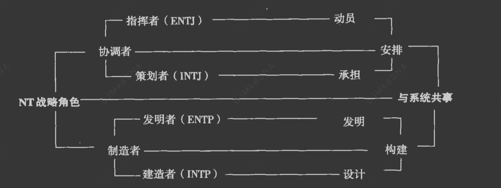

# 总纲
这本书最核心的观点就是  每个人 的人格 由  语言(思维)  和工具(行为)组成。

并且重要性来说：     语言 >  工具。

语言分：抽象语言(信仰,逻辑,直觉,情感,沟通,文学)  和  现实语言(吃住穿行,柴米油盐)

工具分：合作工具(关注他人情绪,以人为本)  和  实用工具(关注事情，达到目的为第一)

黄人SP: 现实语言 + 实用工具
蓝人SJ:现实语言 +  合作工具
绿人NF:抽象语言 + 合作工具
紫人NT:抽象语言 + 实用工具

语言>工具

绿人适合找抽象语言的对象，也就是适合绿人和紫人，并且绿人和紫人在工具上的差异，会产生更多意外的奇妙反应

# 四种人格的第一性原则,快速识别不同类型的人
人格 = 语言（思维模式）× 工具（行为模式）
语言维度：抽象 vs 具体 → 决定信息处理方式
工具维度：合作 vs 实用 → 决定目标实现方式
# 荣格8维
## E I
## N S
自省(N)  ，观察(S)
当然所有人都能观察，也能自省，只是85%人倾向于用感官区观察眼前的事物，很少花时间内省。
我们可以将观察者称为世俗的人，讲究实际具体的人，很少将注意力放在预测未来上。

## T F
相信逻辑，展示情感会让他们感到尴尬，他们宁愿将情感藏起来，不愿意失控
性格友善，擅长表达情绪
但是他们的情感都很强烈，只是表现方式不同

## J P
J:规划者，对计划和日程有明智的判断力，喜欢计划性和条理性，享受完成任务的感觉，做事喜欢"先计划后行动"
P:探索者，灵活开放，享受探索和发现的过程，适应性强，能随情况变化调整，做事喜欢"边走边看"

他们的差异还衍生到对现实环境的观点上，规划者希望自己的办公桌整洁有序，探索者对杂乱无序耐受力强很多，
他们经常淡忘琐碎的家务。
# 气质Temperament 性格Character 人格Personality
## 气质
气质是与生俱来的、由生理基础决定的、相对稳定的心理活动的动力特征
主要类型（希波克拉底的四体液说）：
胆汁质：精力旺盛、反应迅速、情绪强烈、易冲动
多血质：活泼好动、反应迅速、兴趣广泛、注意力易转移
黏液质：安静稳重、反应缓慢、情绪稳定、注意力持久
抑郁质：敏感细腻、反应缓慢、情绪体验深刻、孤僻

## 性格
性格是后天形成的、与社会环境密切相关的、对现实稳定的态度和习惯化的行为方式
主要结构：
态度特征：对现实的态度（如诚实、虚伪、勤劳、懒惰）
意志特征：行为调节的自觉性和自制力
情绪特征：情绪活动的强度、稳定性、持久性
理智特征：认知活动的特点（如观察力、记忆力、想象力）

## 脾气
脾气是情绪反应的强度和表达方式，是情绪特征的外在表现，属于性格的情绪特征维度
主要表现：
急躁型：情绪反应强烈、易怒、缺乏耐心
温和型：情绪反应平和、有耐心、不易发怒
暴躁型：情绪爆发快、强度大、难以控制
沉稳型：情绪稳定、不易波动、控制力强

## 人格
气质+性格=人格

# 各大心理理论 行为学 性格学 人格学

## 行为主义理论
巴甫洛夫：通过狗的实验发现条件反射，提出"刺激-反应"联结，人是机器人,对外界的器械反应，核心观点,人在本质上是相同的

## 精神分析理论

弗洛伊德，人是动物,本能生物,核心观点,人在本质上是相同的

阿德勒 ，目的论
荣格，荣格8维

## 人本主义理论
马斯洛的需求层次理论

## 气质类型理论
盖伦四种体液理论 ，四种体液决定我们的行为和观念
柏拉图&亚里斯多德 四种性格类型

# 语言和工具
语言:我们如何与他人沟通
工具:我们如何使用工具实现自己的目标

## 语言
绝大部分人使用具体的语言使用方式，少部分人使用方式比较抽象
有些人倾向于传递眼前的事物，另一些人说话倾向于传递象征信息

有些人通过直觉自省为自己定位(自治)，另一些人通过感知观察寻找自我定位(他治)

## 工具
对工具的选择和使用，一半人使用实用性的方法，一半人采用合作式方法
实用性工具采用最有效的方式实现目标，以最经济作为唯一的衡量标准，最小成本最短时间
合作式通过和别人和睦相处来实现，谁应该使用它，其他人怎么看待这个工具
实用性或者合作式是优先级不同，大部分人都知道和睦相处以及采取最有效的方式实现目标，只是本能决定我们使用合作式还是实用性

# SP(技艺者)
乐观的红血液，狐狸
活在当下，灵活应变
战术
# SJ(守卫者)

黑胆汁，海狸，松鼠

1.注重细节和实际，任劳任怨，有耐心，工作勤劳，尽职尽业
2.讨论的话题大多是自己在客观世界看到的具体事物相关，商品，食物，贷款，薪水，天气，交通娱乐，电视电影
3.对规则有较强感知能力，相信规则，相信法律
4.擅长后勤，管理和维护
5.最难接受不擅长应对的就是改变
6.喜欢商务应用课程
7.专注道德，捍卫对与错的实践
8.对于将来和过去，表现得悲观
9.服从式合作
10.关注的是道德正义

## 尽职尽业面对一切
尽职尽业的思想看世界，勤劳工作和精打细算，他们觉得勤奋工作和积累财富是每个人的义务

## 展望未来时的悲观
大部分精力用于约束别人的行为，维持快速发展的现状，他们养成了最坏打算的习惯，做好准备比什么都重要
任何可能出错的事最终难免都会出错

## 目光焦点在昨天
喜欢固定时间起床，固定路线上班，老方法就是最好的方法，他们怀念过去，他们是历史学家

## 以可靠为基础的自豪
## 基于有帮助的自尊
多做好事帮助他人获得自尊感，在他们眼里，服务是一种义务，他们的自尊建立在为他人服务的义务感上

# NF(理想主义者)
黄胆汁，不擅长控制自己的情绪
虔诚的教徒，有稳定的信仰，身份追求型人格，自省
敏锐的感受力
善于接受，接受能力强，适应能力强，善于调节，乐观，多情，性格柔和
直觉感受型
极富创造力
充满热情
仁慈善良
富有洞察力
虔诚

抽象的合作者
擅长归纳自己的想法和观点
能够敏锐的感知食物内在的联系
具有很强的第六感
他们稍微聆听就能从细节跳到对事物的总体把握
热衷于在不同事物间建立联系
他们的语言缺少循序渐渐地层次感，感觉一蹴而就
以众人一致意见为合作，合作是大家都认可统一的行为
关注的是精神力量和快乐
## 抽象的语言使用方式

## 合作式的工具使用原则
考虑如何培养亲善的人际关系，是成为他们实现目标的必要条件

## 交际天赋

## 定位

### 利他主义
全身心的愿意帮助别人,利他主义

### 关注未来

## 自我形象

### 自豪

### 自尊

### 自信
既要保持真实的自己，又要尽量取悦别人，理性者通过将评定自身言行的权利留给别人，对别人的评价极其敏感

## 价值观
重视热情(内在)
珍惜直觉

### 本性热情
很容易动情感,来得也快去的也快,大多有积极性格

### 信赖直觉
可以感受到他人的切肤之痛，设身处地为他人着想
以至于下意识按照别人的方式说话和行为，对别人感同身受越多，越想将自己的观念强加给别人

### 渴望浪漫

### 追求个性
花了大量时间寻找自己的个性和自我，他们对他人和自己，他们所关注的只有自我，每个人的核心本质。
他们会对地球上竟然有90%的人不关心自我而感到心烦意乱。

### 珍视认可

### 立志为圣贤

## 社会角色

## 角色变体
### 导师型
根据表现力较强的教育者，较为内向的辅导者

### 拥护者
拥护者衍生的奋斗者和医治者

# NT理性者
猫头鹰

## 抽象语言使用
注重语言一致性，不喜欢闲谈

## 实用至上的工具使用
高效的操作，执着于高效率

## 战略天赋
为自己设定的目标大都与提高系统效率有关，有的关注社会系统，有的关注机械系统。
不管是哪种，NT人的目标都是单一明确，提高该系统的效率
环形因果，系统的反馈是互为原因的过程

## 秩序和组织
秩序，事物内部的位置，上下前后，顺序秩序，排列组合，协调者
组织，事物内部的关联，设计和配置不同部分所组成的复杂系统，建造，制造者

## 战略协调者

## 战略制造者

## 战略角色变体

## 兴趣爱好
### 热衷科学
### 专注技术
### 对系统感兴趣

## 以聪明才智为基础的自豪感
NT人绝不允许其他人随意批评自己，他们收到不准确的批评时，他们会构思各种高效不失优雅的报复方法

# 择偶

## 配对规律
到底选择相同气质还是相异气质？
常见的比较融洽的组合方式,既相似也不同：语言相似，对工具的使用相异
SP《=》SJ
NF《=》NT

选择相似处：具体或抽象的思维和语言习惯，N更适合N(抽象语音),S更适合S(具体语言),说明语言交流方式是人与人最重要的一大差异

选择相异处：合作或实用的工具使用原则，在做事方式上互补，合作方式和实用方式互补

思维=语言，对一段关系是否稳定具有很大的影响，当夫妻双方谈话内容集中在自己观察的事物上(S)，或者他们
想象中的事物(N)时，他们能很快意识到自己和对方在发送相同波长的信息。

工具=行为做事

我们总是想当然认为自己的生活目标就是最好的目标，适用于所有人，但是我们的对象不可能心甘情愿接受别人的生活目标

SP最重视生活追求的感官刺激，SJ重视社会地位和经济条件的安全感，NF追寻个人身份的认同，NT把知识当成自己追求的目标

## SP(技艺者)
当性行为当做刺激体验
SP追求刺激和冲动，寻求感官刺激，更关注外形性感程度，喜欢冒险，抽象的食物打动不了他们，象征性的刺激打动不了他们，
对于感官刺激特别强烈，推崇享受生活，无拘无束，但是时间久了，作为对象就会心生不满。

喜欢很多身体行为满足自己的渴望，比如钓鱼，打猎，赛车，冲浪，自行车

不太愿意讨论自己的内心感情,不喜欢抽象的话题
## SJ(护卫者)
当性行为当做义务
以家庭为中心的传统配偶，忠诚可靠，积累养育，喜欢游乐园，各种观赏性公园，动物园，植物园，话剧，音乐剧
生性节俭，聚餐时希望对方礼貌对待自己，让自己看起来更加绅士，会长时间钟情于一个人
SJ更倾向传统爱恋，重视礼节，他们喜欢从事各个家务活动，一般很守时，在指定计划后喜欢严格执行
喜欢细水长流，对待性生活保守，喜欢在熟悉的地方做相同的事情，对待性比较严肃认真，尝尝会把性生活当做一种职责
喜欢脚踏实地循规蹈矩，通过为他人提供服务来体现自身忠诚可靠。
护卫者在婚姻中扮演的是侍卫的角色，通过为他人提供服务来体现忠诚，可靠的品质

## NF(理想主义者)
善于发现别人的优点，擅长赞美，敏锐感知别人的情绪和情感，最热情
天生拥有认可和了解他人精神世界的力量，敏锐的感知力，对别人理解和包容
将性行为当做爱

NF和SP
滔滔不绝讨论真我，深刻的意识，抽象的话题，不适合SP，SP不太愿意讨论自己的内心感情,不喜欢抽象的话题

NF和SJ
SJ舒适，安定，踏实，在日常生活规则和规范问题无异议，但是护卫者无法满足分享内向思想的要求

NF和NF
可能存在竞争者关系

NF和NT
NT的冷静和自治让理想主义者很欣赏，NF重视直觉，NT相信逻辑，NF关注道德，NT关注实用

## NT(理性者)
诚实坦率，很难接近，有点神秘，不喜欢在社交上花费过多时间精力，不愿意让自己涉足太多娱乐活动
大多理智，喜欢讨论充满技术细节的话题。将性行为看做个人道德的大事
很少讨论过去的情感和体验，对自己的恋情保持高度的隐秘且对对方有很重的承诺，恋情发展速度往往很缓慢

他们会很长时间考虑自己约会的意图，以及他们期待什么

高效的效率，不愿受传统束缚的率性
一旦他们认定某个人是终生伴侣，理性者就会觉得自己有责任保护这段感情

### 大部分认为理性者生性冷漠不关注自己，但是理性者认为自己澎湃激情，是什么导致这种误解？
抽象的交流方式，对效率的需求，对自治的渴望
理性者大部分时间沉浸在抽象的世界中，原则/理论/假设/系统设计
或者研究内战，摄影，常常让人觉得他们与世界失去了联系
他们集中精神解决方案的特点，也使得他们与世隔绝，只关注眼前工作
他们抽象的思维和分外集中的精力

而且他们追求效率，信赖逻辑的精确性，这种追求效率也会导致他们讨厌啰嗦，不喜欢反复说一件事

### 自治原则
面对自洽问题，他们的自我引导和独立性是最强的，面对想控制他们的行为，他们都会坚决反抗。
NT的自尊心建立在自治之上，他们也不会公开展示自己的情感，不符合他们的作风，会让他们觉得
自己缺乏自治，自律。并且NT还会可以对自己的人格和聪明有所保留。

理性者希望自己按照自身要求生活，还希望自己的配偶也能如此，对于期望自己能给他们带来幸福的配偶，理性者
很少表示同情，他们认为这种人根本无法自立自主，他们希望自己的配偶变成一个完整独立的自己。

理性者忠诚愿意帮助，但是被帮助的人不能表现的太不靠谱。理性者不会同情别人，他们认为幸福都是自己给的。

# 父母

# 领导

## SP
战术性谈判者，消防员，纠纷解决者，他们喜欢化解危机，适合谈判，不适合维稳。
他们往往有乐观的天性，喜欢感官刺激，喜欢冲动，他们信赖冲动，他们对自己的定位是现在和这里，他们认为玩的开心就是把一切弄糟，
他们的房间总是杂乱不堪，到处都是玩具衣服，贵重物品也随处乱扔，简直就像狗窝。

面对父母的责备，他们学会了充耳不闻。他们从不担心批评，他们是同年孩子中最冲动的

SP会从自己的诡计欺骗行为中获取乐趣，这也是一种艺术

他们不需要家长鼓励就会很勇敢，并且乐意尝试冒险和体育活动，主动接触音乐，舞蹈，表演其他手工艺。

在寻找乐趣和朋友相处，他们无师自通。
## SJ

管理者  保管者
管理者：卓越的后勤部署能力，担任制定和管理规章制度的管理者。他们意志坚定，通过各种行政制度管理运行下属机构
他们适合会计，经纪人，税务
保管者：确保各种储备充足，确保保卫和防护措施到位，他们十分关注他人幸福，他们有种与生俱来的警惕性和安全意识。
他们觉得安全是最重要的。

严肃多虑，从小比较悲观，渴望更多的安全感，他们从小忧虑就比其他孩子多，渴望归属感。他们小时候保持玩具整洁，收拾房间，帮父母做家务，
担心自己不负责，父母眼中的乖宝宝
他们勤劳，承担家庭保管者角色，后勤支柱，他们从小模仿父母的勤劳，以身作者
护卫者会因为完成长辈期待而自豪，他们清楚该做什么,不该做什么。在学校他们是老师的好帮手。
在家，护卫者也会把自尊建立在可靠性上，通常会按量完成大人委派的任务，比如打扫卫生，衣服分类。

如果他们无法为他人提供服务和帮助，他们就会有愧疚感，他们更容易自责。

他们对风险很在意，他们是做事最谨慎的。他们更愿意从事家庭劳动，做饭，缝衣服
## NF

他们是催化剂，激活其他潜在物质和他们的形成，他们更关注个人成长，他们是快乐的梦想家，他们对待下属有强烈责任感。他们能够源源不断为人际关系注入活力，他们能发掘人性中美好的一面。
导师：导师的交际能力，主要体现在对个人成长和发展的帮助上。具备较强的规划性，帮助别人实现自己的潜力。
他们热衷于协助他们解决个人成长问题。他们充满激情和活力的鼓舞，任何学习者都会接受他们的指引。

## 理想主义者
热情真诚的天性，敏锐的洞察力和感知力，同理性，他们对自己有极高的道德期望，是身份认同型。天生懂得和别人建立亲密联系，但是他们很少能找到自己可以模仿的对象，他们必须自学成才。
他们可以自由的与家人保持强烈的情感共鸣，家庭其乐融融，他们会很平和，家庭悲伤他的情绪也会跌入低谷。

父母的争吵会让NF孩子冷漠缺少安全感，父母的责备会对他们造成巨大伤害。竞争性游戏会让他很矛盾，他们适合合作性
家庭游戏或者自我竞赛。

他们自尊来自善意，如果他们做了不好的行为，他们通常有强烈的罪恶感。
真实的展现自我是NF型孩子获得自信的唯一方法，他们希望自己是独一无二的人，对身份的认同。
由于NF人口占比较少，他们常常感受自己与别人格格不入，却不知道自己差异在哪。他们做事时更愿意跟随直觉。

他们可能热衷于中世纪的故事，他们想象力丰富，喜欢美好的结局。他们会把自己的玩具想象成其他的事物，并编造故事。

## 理性者
沉稳、冷静，宁静，显得冷漠不合群，他们在控制情感产生的压力。另外他渴望预测和控制事情发展，
与生俱来的战略操作能力，但是他们只有小部分人能找到效仿的榜样，大部分时间他们只能依赖自己。
对于父母的提醒，他们可能我行我素。他们对具有技术含量的创造行为感兴趣，但是如果他们挑战失败，
他们会极度失望和沮丧，会比较自责。

理性者孩子更容易产生自我怀疑，过多的失败会让他们自尊心受损，理性者不希望收到别人的管束和指引。
他们最大的愿望在于了解事物的工作原理，知识追求性人格。他们对权威充满怀疑态度，他们相信只有理智
是一切行动的基础。

只做有意义的事情，是理性者的座右铭，只有父母的要求有意义时他们才会按照要求去做。

# 事业优势
拥护者：超高的调停和干预技巧。他们更倾向于探索他人内向世界，来推进他人自我发展。他们会提供大量信息，专注于精神世界的发展，
ENFP以客户为中心的意识最强。

## NT

理性者战略智能体现在他们卓越的系统工作能力上，即找到实现某个明确目标所需的复杂方法
规划复杂秩序的协调者，建造复杂结构的制造者。
他们是预想家，拥有一种遇见能力，能够预想到组织的未来目标。
他们有坚定不移的实用主义精神，他们会认真细致的研究方法和成效
他们有一如既往的怀疑精神。坚定不移的实用主义精神，认真细致的研究方法和成效的关系。
