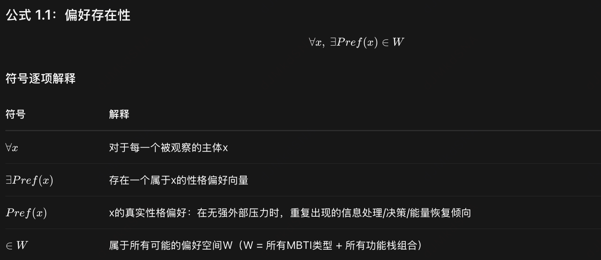
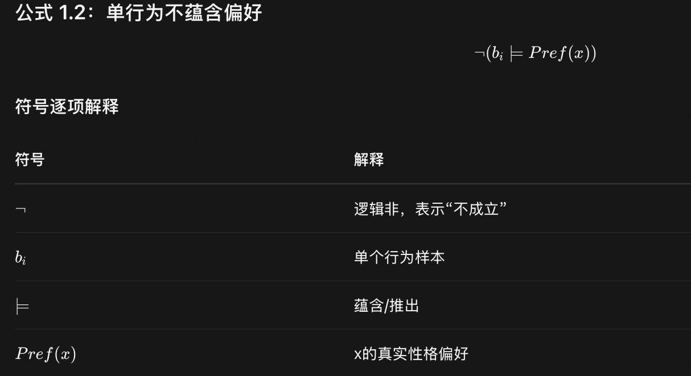
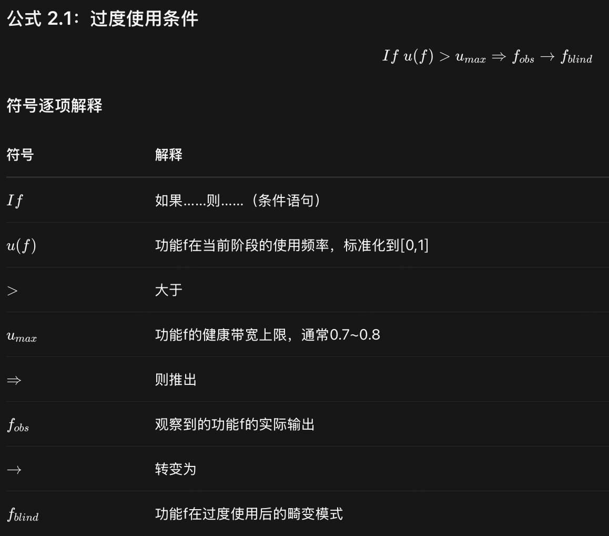
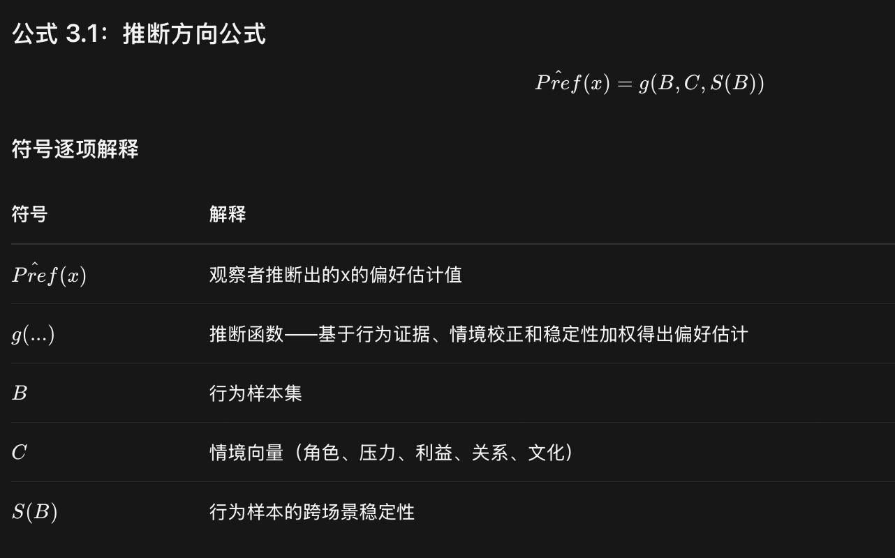
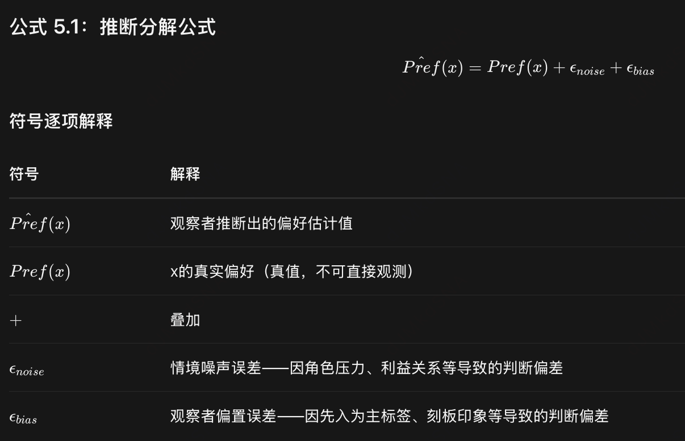
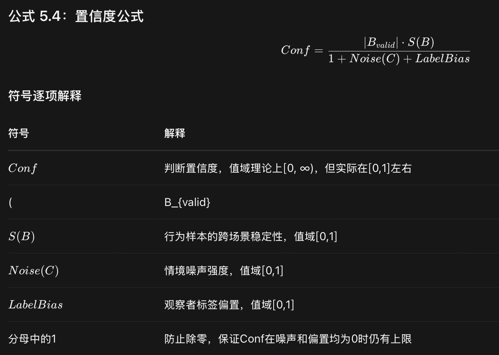

# 感知P vs 判断J
感知型的人更愿意去感知 —— 总在搜集新的信息，而不是对事物下结论。
相反地，判断型的人更愿意去判断 —— 主动作出决定，而不是消极地回应新信息，
即使（也许碰巧如此）这条信息可能改变他们的决定。

# mbti性格类型推理第一性原理

[公理 1：偏好存在但不还原为单一行为]

公式含义

每个人都有一个稳定的性格偏好结构，它不是随机波动的，而是有内在一致性的。这是MBTI和荣格八维理论的基本前提。

实战判据
你不会今天像ENTJ明天像ISFP——你的偏好有基线
但注意：这个基线不可直接观测，只能通过行为间接推断



公式含义

不能从单个行为推断出整体性格偏好。​ 一个人今天主动发言，不代表他是E；一个人今天迟到，不代表他是P。

实战判据
看到一次外向行为，不判E
看到一次感性表达，不判F
看到一次计划周密，不判J
至少3个独立场景的同向行为才纳入证据


[公理 2：优势功能过用即转盲区]


公式含义

任何功能如果被过度使用（超过健康带宽），它就会从“资源”退化为“畸变模式”——原本的优势变成了盲区和弱点。
```aidl
Se 过度（外倾实感）

行为画像
当场刺激驱动，无缓冲：看到、听到、摸到什么就反应什么
追求新鲜、强度、即时反馈：新餐厅、新恋情、新消费、飙车、通宵
厌恶延迟满足、计划、抽象讨论
身体先于大脑：先动再想，事后不记得为什么
对长期后果、他人情绪、未来风险生理性屏蔽

典型台词
“先爽了再说”
“想那么多干嘛，现在开心就行”
“我当时没想，就那么做了”

Se 的盲区不是“不感知”，而是“只感知当下，把时间轴压扁成一点”。
结果：冲动消费、危险行为、关系快餐化、承诺后秒悔、对枯燥积累（学习/储蓄/维护）极度不耐。
```

```aidl
Si 过度（内倾实感）

行为画像
把“过去这样”当成“必须这样”，经验库变成监狱
抗拒任何新刺激：新路线、新工具、新人、新规则都触发警报
过度依赖惯例/流程/熟悉感，哪怕效率极低也不改
用“以前吃过亏”解释一切，形成防御性保守
对模糊、未定义、突发状况产生生理性不安
典型台词
“我们一直这么干的”
“上次就是这么翻车的”
“别改了，改了会出事”

盲区本质
Si 的盲区不是“记性差”，而是“把记忆当真理，把熟悉当安全”。
结果：流程僵化、拒绝创新、对新信息过敏、用怀旧逃避当下、把个人习惯上升为普世规则。
```

```aidl
Ne 过度（外倾直觉）
行为画像
脑洞永动机：一个话题跳十个方向，自己不收口
厌恶锁定选择，任何决定都“再看看有没有更好的”
把可能性当现实：“我们可以做X、Y、Z……”但 X/Y/Z 都没落地
对新项目兴奋三天，第四天凉透，再找新刺激
难以区分“有潜力的想法”和“妄想链”
典型台词
“或者我们也可以……”
“等一下，还有个角度”
“现在定太早了”
盲区本质

Ne 的盲区不是“没创意”，而是“只展开不收敛，用可能性逃避承诺”。

结果：启动狂魔、完结废柴、选择恐惧症、承诺恐惧、用脑洞掩盖执行力缺口。
```

```aidl
Ni 过度（内倾直觉）

行为画像
把“内心意象”当“绝对真理”，不解释推导（也解释不出）
过度预言：“这公司三年必倒”“这人以后会害你”
厌恶细节和过程，只盯终态，中间步骤全跳
用隐喻/宿命感解释一切：“一切都是安排好的”
压力下出现“隧道视”：只信自己看到的那个核心，其余全噪点
典型台词
“我看透了，不用说了”
“早晚会……”
“你没到那个层次不懂”
盲区本质

Ni 的盲区不是“没远见”，而是“把收敛意象当成不可证伪的神谕”。

结果：刚愎自用、忽视反例、用玄学替代数据、孤立感极强、把偏执包装成洞察。
```

```aidl
Te 过度（外倾思考）
行为画像
效率即正义，任何“低效”都是原罪
用目标-步骤-ROI 砍掉一切：关系、情绪、仪式、闲聊
不容忍模糊责任，“谁负责？什么时候交？”挂嘴边
把人当资源/节点，不爽就重组流程
对情感表达极度不耐：“说重点，别绕”
典型台词
“这没用，砍了”
“你到底要什么结果？”
“别抒情，给方案”

盲区本质

Te 的盲区不是“没效率”，而是“把人性和时间都压缩成 KPI”。
结果：团队窒息、亲密关系被流程化、自己长期高压透支、用忙碌掩盖意义真空。
```

```aidl
Ti 过度（内倾思考）

行为画像
定义洁癖：先吵定义再谈事，定义不清不进场
分析回路自锁：A→B→C→反例→重定义→再分析
用逻辑拆情绪：“你这个感受在结构上不成立”
逃避行动，因为“系统还没自洽”
对权威/数据不盲从，但对“逻辑美感”上瘾
典型台词
“你先定义清楚……”
“这里有个反例”
“逻辑上不通，所以我不接受”
盲区本质

Ti 的盲区不是“没逻辑”，而是“用逻辑系统替代现实系统和情感系统”。

结果：决策瘫痪、社交冷感、把关系当论证、自己憋出内伤不求助
```

```aidl
Fe 过度（外倾情感）
行为画像
群体气氛即呼吸，场子一冷就自救式暖场
过度读取他人情绪，把自己的边界让出去换和谐
不敢说“不”，用含糊、转移、自我贬低避险
在关系里做“情绪保姆”，积怨后突然爆发或躯体化
用“大家都觉得……”替代“我觉得……”

典型台词
“没事没事，我都可以”
“别让他难堪”
“是不是我哪里没做好”
盲区本质

Fe 的盲区不是“没善意”，而是“把关系存续置于自我存续之上”。
结果：讨好型人格、被吸血不敢逃、群体里失去声音、私下 Fi 反噬（突然绝情）
```

```aidl
Fi 过度（内倾情感）

行为画像
内心价值尺无限放大，外界标准全无效
小事升格为“原则问题”：“这违背我的底线”
对人不苛但对己严，自我审判循环
用“我不认同”终止讨论，不解释为什么认同/不认同
被冒犯后表面平静，内心判对方“永久出局”
典型台词
“这不对，我说不清但就是不对”
“我没法违背自己”
“有些事不能碰”

盲区本质

Fi 的盲区不是“没原则”，而是“把内在价值标尺绝对化到不可协商”。
结果：孤立、关系脆断、道德洁癖、错过可妥协的合作、用“真实”当攻击武器。

```

[公理 3：行为证据优先于类型标签]

公式含义

正确的推断流程是：先收集行为证据 → 再考虑情境噪声 → 然后评估稳定性 → 最后形成偏好判断。绝不能反过来。

实战判据
正确流程：看到3次主动发言（B）→ 确认他在工作、聚会、陌生场合都如此（S高）→ 判断E倾向


[公理 4：类型解释力有界]

公式含义

观察者的推断 = 真实偏好 + 情境噪声 + 观察者偏置。​ 后两项会污染判断，必须主动扣除。

实战判据
面试中表现外向 → 可能是角色要求（Noise高），不一定是真E
第一印象觉得他像销售 → 后续所有行为都被往E解释（Bias高）
必须主动问：“这个行为有多少是角色/压力/利益驱动的？有多少是我自己的偏见？”


公式含义

置信度 = (有效样本数 × 跨场景稳定性) ÷ (1 + 噪声 + 偏置)
样本越多、越稳定 → 置信度越高
噪声越大、偏置越大 → 置信度越低
