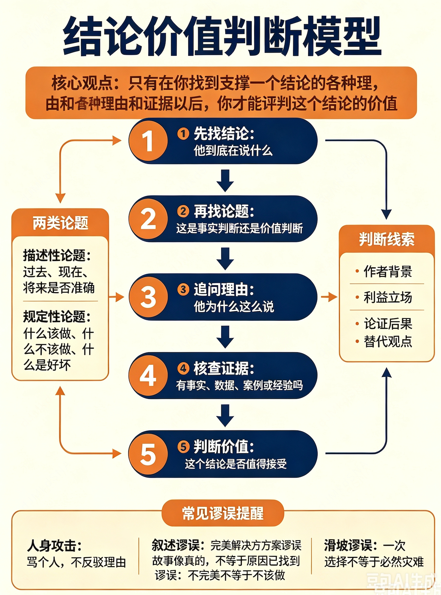

# 寻找论题和断言
## 描述性论题
描述性论题是指对物理世界和经验的描述,关于各种对过去、现在或将来的描述准确与否的问题。
## 规定性论题
规定性论题是指心理价值观问题,关于什么该做、什么不该做、什么是对、什么是错、什么是好、什么是坏的问题

## 寻找论题和断言
可惜的是，论题中涉及的问题并不总是被直截了当地提出来，很多时候需要我们从其他线索中去推断。
问一问“这个人是在对什么事进行回应”常常能帮你找出文章或发言的中心论题
还有一个比较好的线索是作者的背景，例如他所属的组织机构。所以在你想要确定论题的时候，有必要去查一查写作者的背景信息。

# 明确理据和支撑
[只有在你找到支撑一个结论的各种理由和证据以后，你才能评判这个结论的价值]
在一个聪明人和另一个聪明人说话时，他们都总是会先说“等一等”。花点时间找准论证之所在，然后再去评价我们听到或看到的那些话

# 明确符号
多义词，关键词，歧义，语境
写作者和发言者才是努力要说服你接受某些观点的人。身为说客，他有责任回答你对可能存在的歧义的各种疑问。
谁想说服你，谁就要负责解释清楚

# 识别价值观
[把立论者的背景作为寻找价值观假设的线索]
要找到价值观假设，一个比较好的起点就是检查一下作者的背景。尽量找出像写作者或发言者这样的人通常持有的价值偏好，越多越好。
他是公司高管、工会领导、共和党官员、医生，还是公寓的一个租客？这样的人最希望保护的是什么利益？追求自身利益本身自然没什么错，
但是这样的追求常会限制一个作者所能包容的价值观假设
[把可能发生的后果作为寻找价值观假设的线索]
要判断一个人的价值观假设，一个重要的方法就是注意他用来证实结论的各种理由，
然后判断哪些价值倾向会导致作者认为这些理由比其他理由更可取，那些被抛弃的理由本可以从论题的反面进行论证

# 识别谬论
[人身攻击型谬误] (指针对个人进行人身攻击，而不是直接反驳其提供的理由)
[叙述谬误] (错误地假设因为我们能讲出一个貌似可以解释一系列正在发生的事实的故事，所以我们已认识到事实和现象之间的全部联系)
[追求完美解决方案谬误] (错误地认为如果尝试某种解决方案后还有遗留问题未解决，那么这种解决方案根本就不该被采用)
[滑坡谬误] (假设采取某种做法会引发一连串不可控的不利事件)