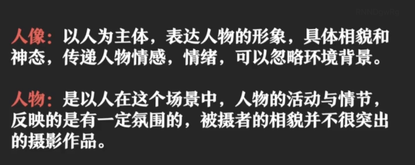

# 人景合拍
平衡拍摄法:9宫格，人四格，景四格

# 人物摆拍
三角形拍摄法
人物站九宫格中间,防止变形
人物和花:仰拍,避免杂物,背景虚化,人四格,花四格
# 建筑
## 胡同
前景,增加纵深度

## 武侯祠
两张照片，一张左边留白写字，一张右边留白写字

## 古建筑门
屋内往外拍摄景色，人路过门中间，保留门的对称性

# 剪影
马路剪影

# 花草
仰拍,避免杂物,背景虚化

# 小动物
蚂蚁视角拍摄

# 手机镜头
## 长焦
大于1, 边缘不会拉长

## 微距
## 广角
=1,相机四周图像容易变形,边缘拉长
## 超广角
<1 ,边缘拉长

# 相机常见功能
## 对焦
锁定对焦
## 曝光
白加黑减
## HDR
## 50mp
5000w高清像素
## 全景
## 定时
## 闪光
## 人像光圈
## 人像光效
## 人像摇摄
## 长曝光
## 专业模式
## 滤镜

# 手机辅助工具
 八爪鱼三脚架
 自拍杆
 遥控器
 补光灯
 
# 构图
从混乱中找到秩序

## 中心构图

## 九宫格构图

## 三角形构图

三角构图让人物很自然
三角沟通让食物位置比较自然，但要有主次之分

## 上下对称沟通

手机反射，镜子反射

## 框架构图

## 留白构图

# 光影
利用光影，营造氛围
## 顺光
平面光
## 逆光
剪影，侧逆光

## 侧光
立体光

## 顶光

# 拍照角度

## 平拍
## 俯拍

## 仰拍

蚂蚁视角
# 如何让照片聚焦有层次感

## 前景
选定主体和陪体。主体清晰陪体模糊，主体全，陪体局部

主体

陪体

## 背景

# 什么是好照片？
## 主题明确
照片表达了什么

## 主体突出
视觉焦点

## 合理构图

## 画面简洁

## 新鲜感
改变拍摄角度
改变拍摄距离
改变拍摄时间

# 人像拍摄
## 背景选择
1. 纯色，墙，天空，地面，草坪，暗光
前景增加画面层次感

2. 主体突出

3. 背景分离(让人物脱颖而出)
色彩分明
4. 背景虚化

## 拍人角度
广角问题，不靠边
仰角更干净

**显腿长**:仰拍显腿长  
**显脸瘦**:自拍45度仰角，一个鼻孔对镜头，更立体，显瘦  
**眼睛不好看**:眼镜挡,手挡,衣服挡  扬长弊端  
**嘴巴不好看**:吃东西  

## 显苗条
**遮挡法**:头发挡住脸两侧拍照用景色挡住小肚子,挡住胖脸  
**对比法**:寻找比较大的物体
**视觉效果**:胳膊改变姿势，拍侧面，多拍斜线，少拍直线，交叉腿

## 拍照姿势
三角形构图:最远端构成三角形，寻找最远端，头手脚肘构成的最远端
寻找可以使用的姿势

## 景别
人像截取位置

**远景**:氛围感  

**全景**:展示人物的动作

**中景**:突出人物上肢动作

**近景**:突出人物面部特点

**特写**:突出心理活动

## 男士拍照

倚靠着其他建筑,护栏
仰角拍
走起来,跑起来
## 人像与人物

# 自然风光
## 三分线
远中近

## 引导线

## 框架构图
选择合适的前景

## 黄金时刻