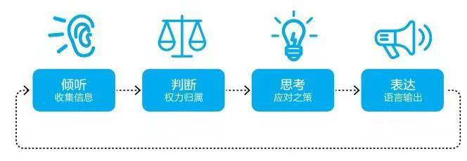
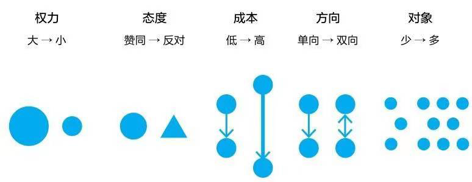

# 五大说话场景

学会识别不同的场景,学会识别不同场景的形势关系(权力关系),产生安全感和信任感

## 沟通
权力的流动(共同掌控权力的方向)
## 说服
权力在对方(无权的一方要改变有权的一方)
## 谈判
权力在双方,(合作才能解决)
## 演讲
权力在形成(吸引产生信任)
## 辩论
权力在他方(中立方决定裁决)

# 让别人做选择,而不是帮别人选择
## 想让家人做家务
选项1:
选项2:
## 销售人员想让客户购买商品
支持7天无理由退货,让别人有选择的权力.主动权在他们那里
## 商品砍价&情侣纠正
1.甜咸比,说明自己的好感感受,以及自己的顾虑
## 邀请别人参加聚会
1.合作思维,自我中心,可以中途退出,聚会本身的内容
