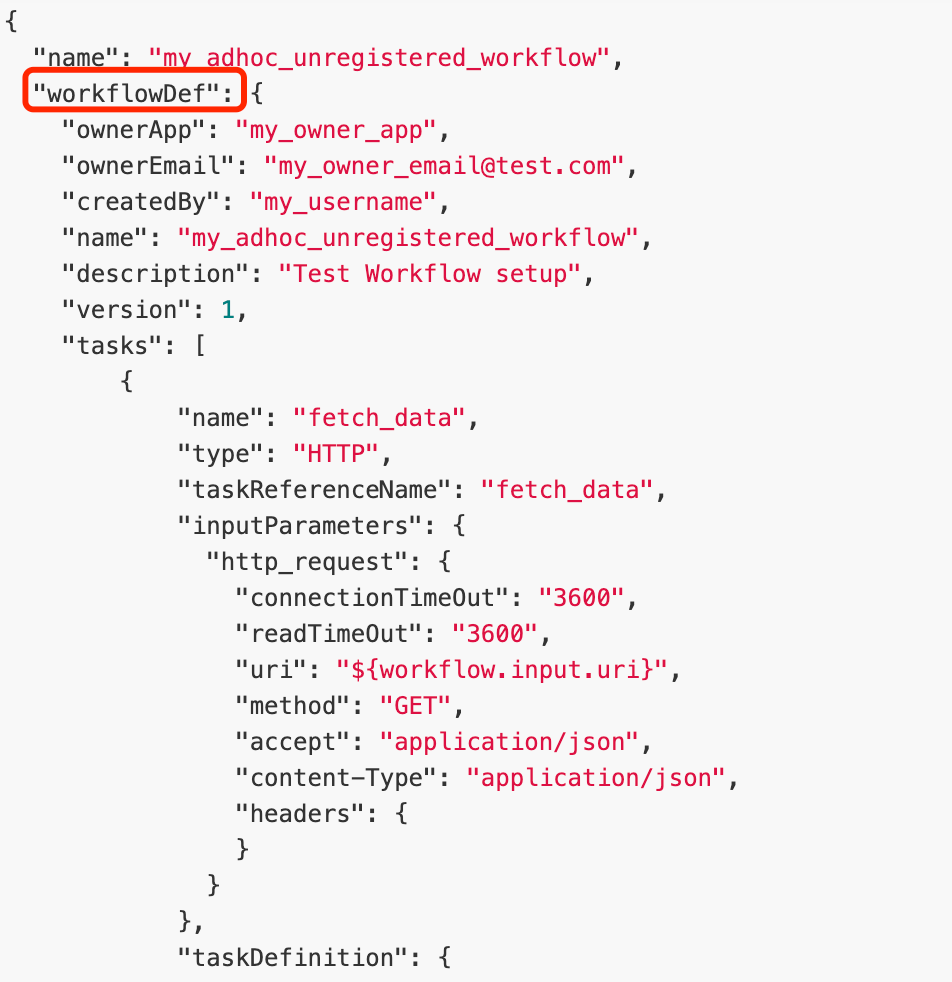

#临界知识
任务以函数形式执行
任何任务配置化
#对象模型
##task
###任务类型
####System tasks 
System tasks are executed within the JVM of the Conductor server and managed by Conductor for its execution and scalability.
Conductor provides an API to create user defined tasks that are executed in the same JVM as the engine. See WorkflowSystemTask interface for details.
####Worker tasks
Worker tasks are implemented by your application(s) and run in a separate environment from Conductor. The worker tasks can be implemented in any language. 
These tasks talk to Conductor server via REST/gRPC to poll for tasks and update its status after execution.
Worker tasks are identified by task type SIMPLE in the blueprint.

Conductor tasks that are executed by remote workers communicate over HTTP endpoints/gRPC to poll for the task and update the status of the execution.

Workers are language agnostic, allowing each microservice to be written in the language most suited for the service.
[](https://conductor.netflix.com/how-tos/Workers/build-a-java-task-worker.html)

[TaskRunnerConfigurer]:register the worker(s) and initialize the polling loop
[TaskClient]:communicate to the Conductor server

####Sub-Workflows
###任务定义
inputs,
outputs,
[timeouts](https://conductor.netflix.com/how-tos/Tasks/task-timeouts.html)
[retries](https://conductor.netflix.com/how-tos/Tasks/extending-system-tasks.html)

All tasks need to be registered before they can be used by active workflows
[task input](https://conductor.netflix.com/how-tos/Tasks/task-inputs.html)
##Workflow
inputs
outputs
```asp
{
    "name": "encode_and_deploy",
    "version": 1,
    "correlationId": "my_unique_correlation_id",
    "input": {
        "param1": "value1",
        "param2": "value2"
    }
}
```
###动态workflow


###工作流状态存储
A distributed server ecosystem, which stores workflow state information efficiently

Full operational control over workflows with the ability to pause, resume, restart, retry and terminate.

User interface to visualize, replay and search the process flows


###抽象队列

###可视化debug

###work支持多语言

###速率控制

###多种交互模式http/grpc

###监控任务队列
